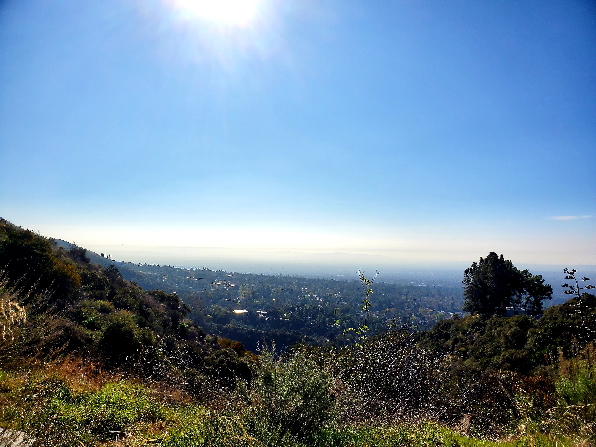

Hello! welcome to the travel blog. I am currently living in Los Angeles, California. One of my goal in the year of 2020 is to travel more hence I am starting to do 1 hike a week every Saturday aka **#1hikeaweek**. On February 16, my friend and I went to Dawn mine and sunset trail loop that is estimated for 6 miles.

Within half mile of hiking from the parking lot, we can see a really nice view like the one below.

<figure>
    
    <figcaption>View at Sunset Trail</figcaption>
</figure>

[//]: <> (Add picture)

There are not many people on the trail and we stepped through many stones as well as small waterfall here and there.

After couple miles in, one of the spot to see for this trail is the Dawn mine as shown below.

<figure>
    
    <figcaption>Dawn Mine</figcaption>
</figure>

It is so hard to navigate around this trail since the direction and the sign is not very clear. We ended up hiking a total of 8 miles but it was definitely worth it (see more pictures below).

<table><tr>
    <td>  </td>
    <td>  </td>
    <td>  </td>
</tr></table>

After the hike, my friends and I went to Kai Ramen in Alhambra to recharge. We ordered Kai's Yellow ramen which is spicy miso thick thonkotsu ramen, topped with cheese, pork chasu, flavored egg, corns, and scallions (see picture below). Pro tip: Leave a review in Yelp for a free egg or a soda.

<figure>
    
    <figcaption>Kai's Yellow Ramen</figcaption>
</figure>

Stay tune for another blog post for another hike next week.

