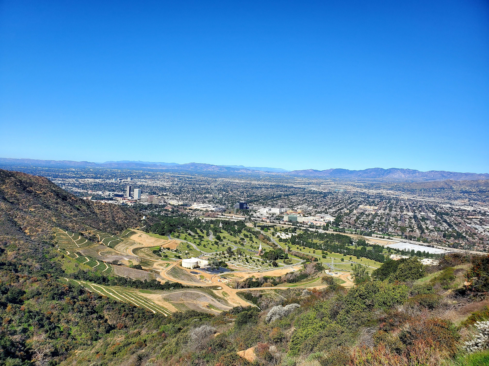
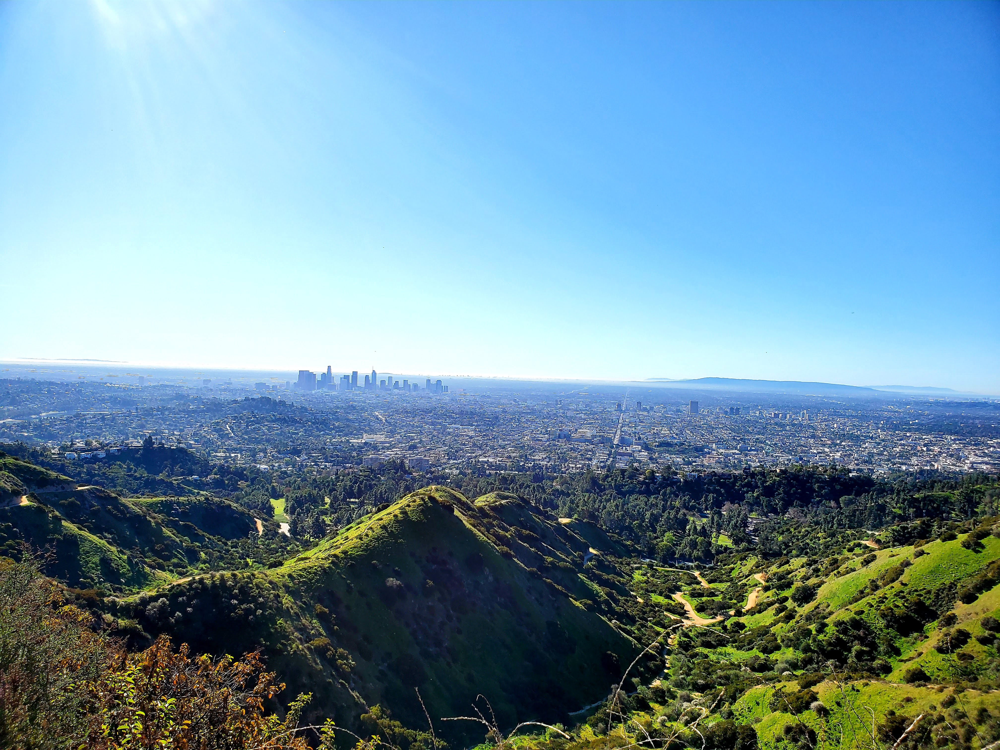
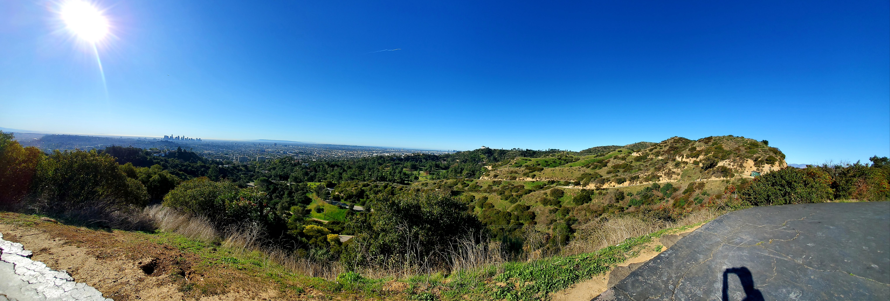
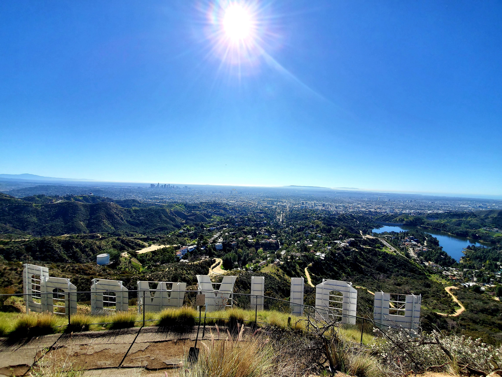
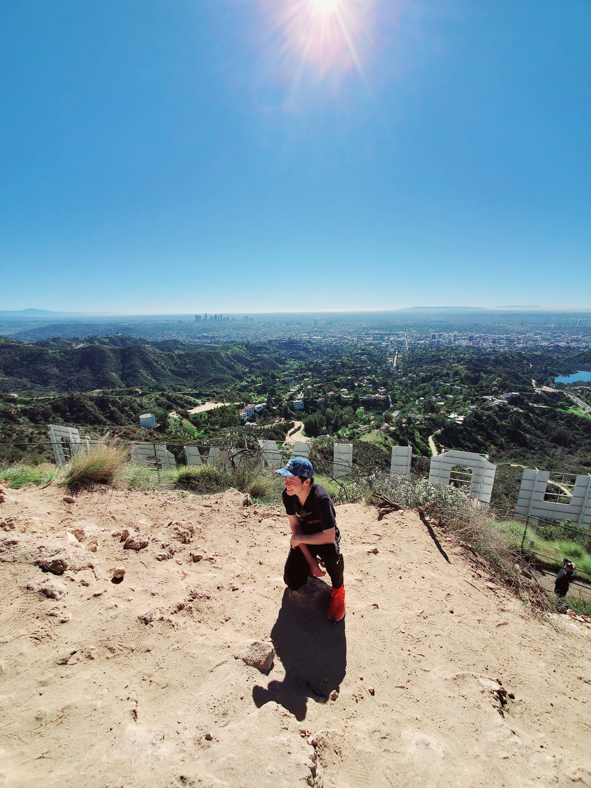
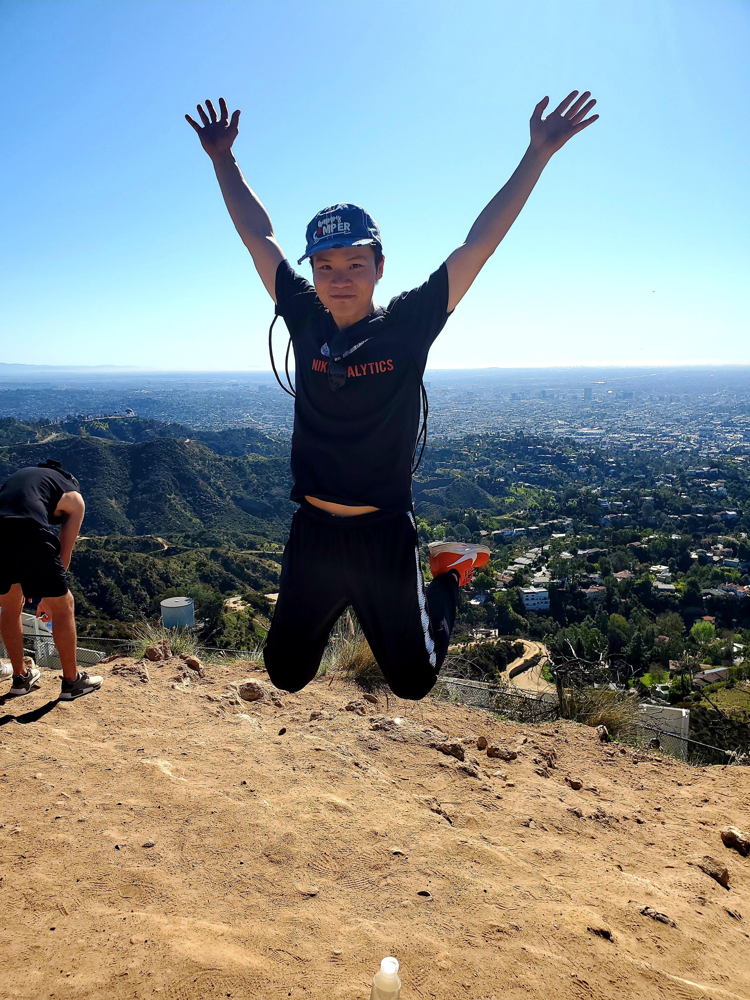
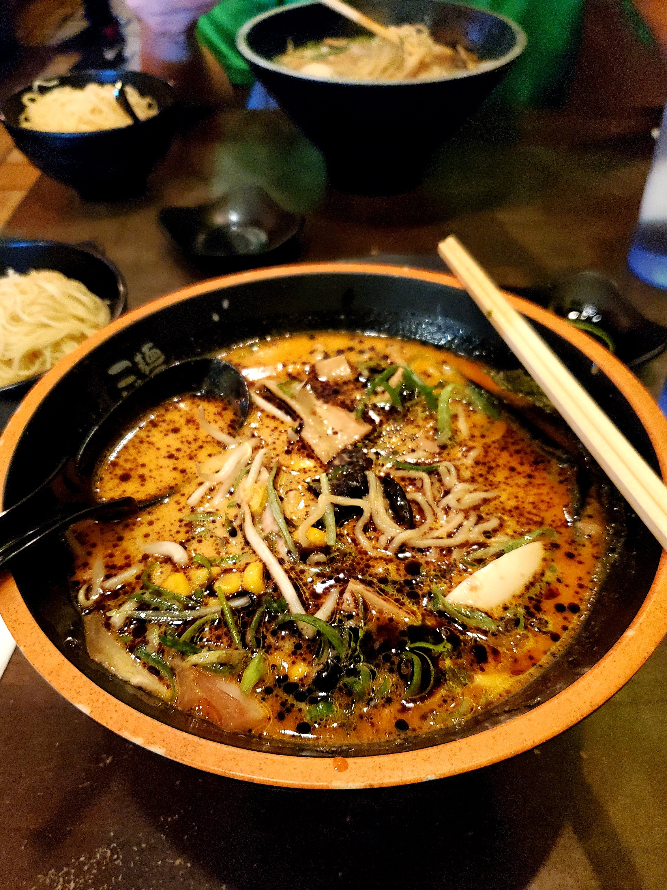
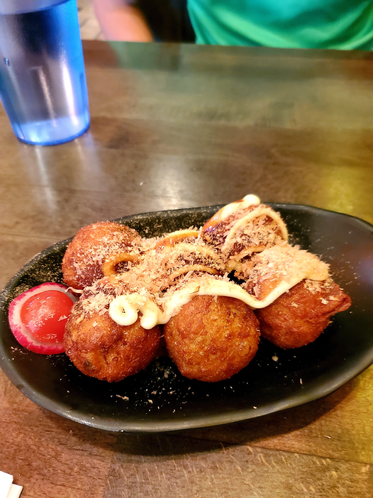

Hello! As you might have noticed, I am trying to write a travel blog for the hike that I did for the past several weeks (trying to play the catch up game). Let's digest the **#1hikeaweek** for the hike that I did on February 1st, the day before the Super Bowl LIV showdown between San Francisco 49ers and Kansas City Chiefs.

At this point, I have been living in Los Angeles for two weeks so why not try one of the famous hikes that LA is known for. Upon doing research on which hike to do at Hollywood (mind you that there are many hikes around the Hollywood area), I decided to go for [Griffith Park Hollywood Sign trail](https://www.alltrails.com/trail/us/california/griffith-park-hollywood-sign-trail?u=m).

According to [AllTrails](https://www.alltrails.com), it is 8.7 miles loop hike that starts from the Griffith Park area all the way up to the peak of the Hollywood sign. Luckily, one of my friends was visiting LA at the time and decided to join me for the quest. Below are some of the views on the way hiking up to the sign.

<table><tr>
    <td>  </td>
    <td>  </td>
    <td>  </td>
</tr></table>

Several hours later, my friend and I reached the peak right behind the Hollywood sign and the weather is perfect to pose for pictures.

<table><tr>
    <td>  </td>
    <td>  </td>
    <td>  </td>
</tr></table>

Afterward, we stopped by Kopan Ramen to grab lunch. By now, you probably noticed that I love ramen and anything that is made out of noodles.

<table><tr>
    <td>  </td>
    <td>  </td>
</tr></table>