Welcome back to the **#1hikeaweek**. I am slowly catching up with all of my hiking posts. Without further ado, I bring you the most amazing trail that I have hiked in Los Angeles, [Backbone trail to Sandstone Peak and Mishe Mokwa trail](https://www.alltrails.com/trail/us/california/backbone-trail-to-sandstone-peak-and-mishe-mokwa-trail-loop) near Malibu area. The hike is around 5.7 miles loop where one can take the clockwise route (Backbone to Sandstone to Mishe Mokwa) or counter-clockwise route (Mishe Mokwa to Sandstone to Backbone). My friends and I did the clockwise route starting from the Backbone trail.

Couple minutes into the hike, we were greeted a cool landscape with the U-shape road the plenty of trees as shown below.

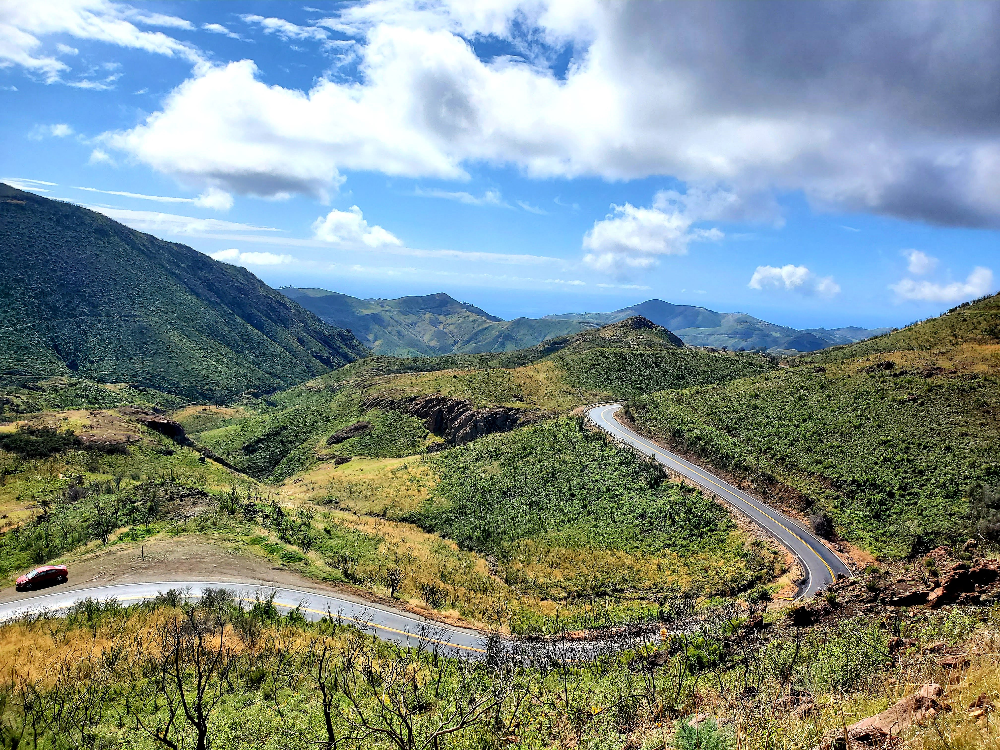

Besides the landscape, there are plenty of flowers at this hike which was refreshing to see.

<table><tr>
    <td> 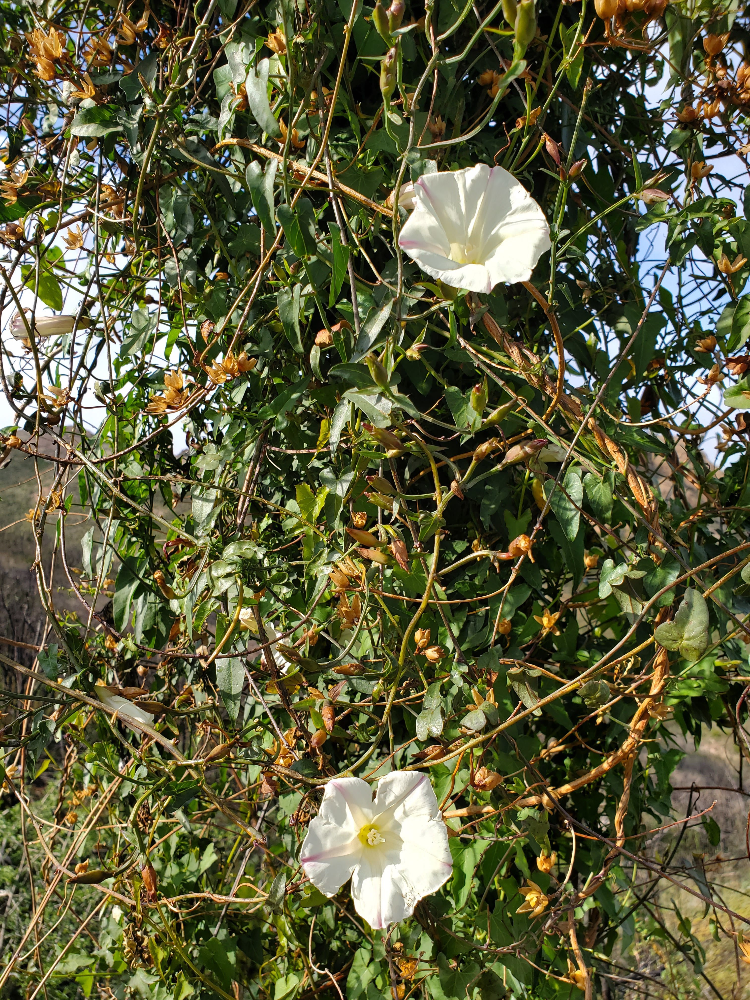 </td>
    <td> 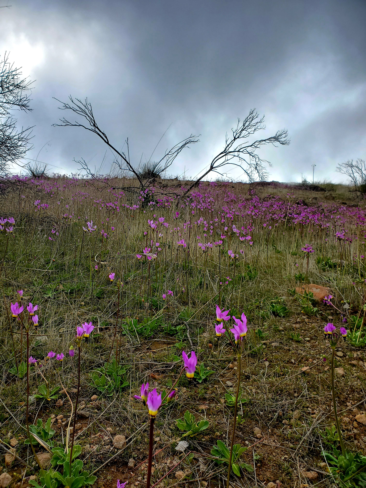 </td>
</tr></table>

After breathing in lots of fresh air and half way in, we were at the sign pointing the halfway point from Backbone trail to Mishe Mokwa with Sandstone Peak in sight as shown below.

<table><tr>
    <td> 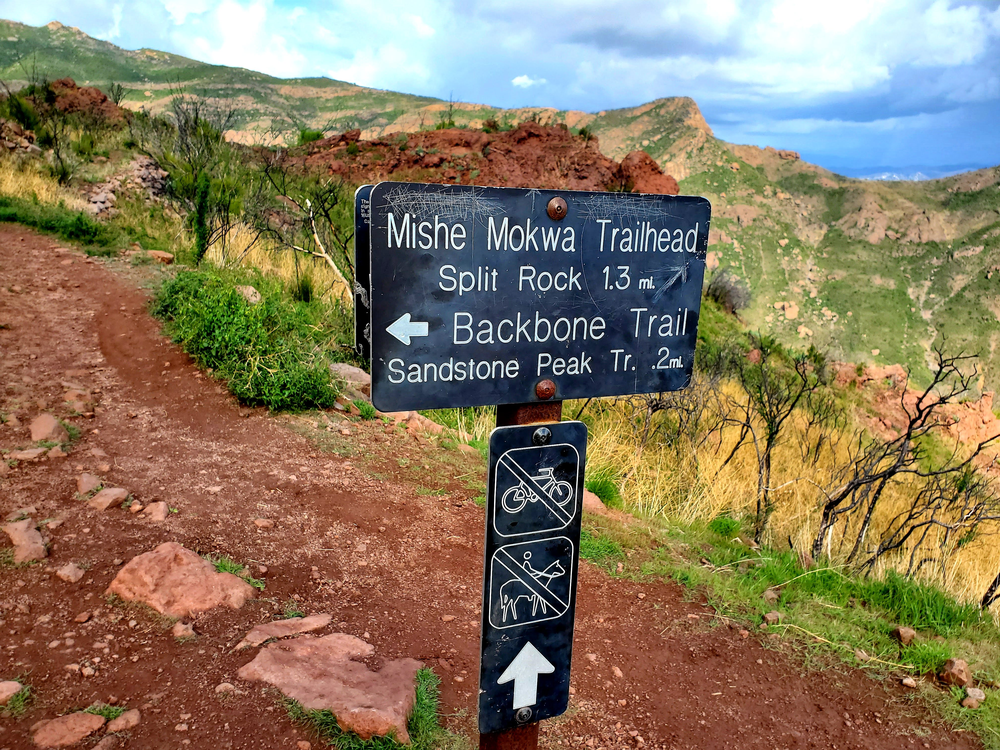 </td>
    <td> 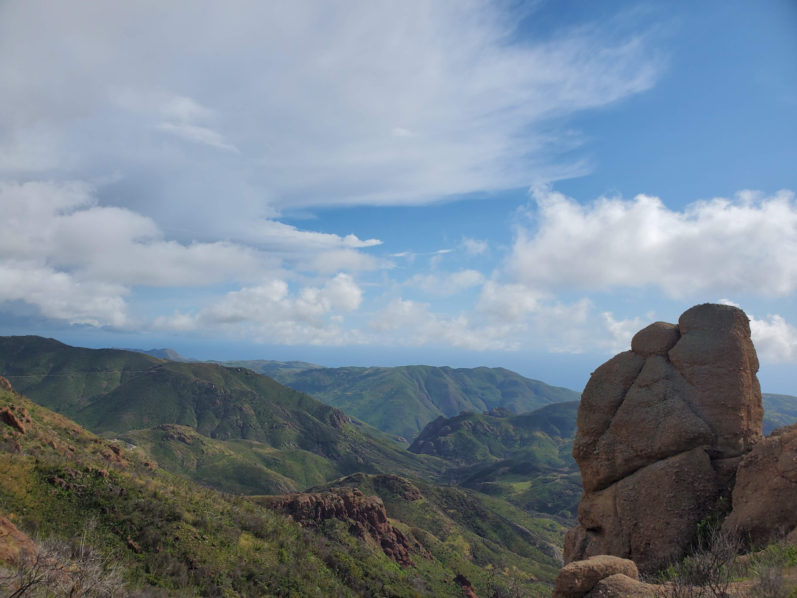 </td>
</tr></table>

Now onto the Mishe Mokwa trail, the feeling of close to the finish line while taking in the breathtaking views (honestly I couldn't ask for more). See pictures below if you don't believe me 😃. Honestly, the view resembles [Machu Picchu](https://www.google.com/imgres?imgurl=https%3A%2F%2Flp-cms-production.imgix.net%2F2019-06%2F16641625.jpg%3Ffit%3Dcrop%26q%3D40%26sharp%3D10%26vib%3D20%26auto%3Dformat%26ixlib%3Dreact-8.6.4&imgrefurl=https%3A%2F%2Fwww.lonelyplanet.com%2Fperu%2Fmachu-picchu&tbnid=64jcDrZuCMuIIM&vet=12ahUKEwj-vqbH0K7oAhVWFzQIHZ_kBR0QMygBegUIARCTAg..i&docid=YbiO2RzzqZVbBM&w=5601&h=3713&q=machu%20picchu&hl=en&ved=2ahUKEwj-vqbH0K7oAhVWFzQIHZ_kBR0QMygBegUIARCTAg) and the [hike](https://www.google.com/imgres?imgurl=https%3A%2F%2Fs29081.pcdn.co%2Fwp-content%2Fuploads%2F2016%2F07%2Fhawaii-images-08316-1-1024x683.jpg.optimal.jpg&imgrefurl=https%3A%2F%2Fwww.journeyera.com%2F10-best-hikes-on-oahu%2F&tbnid=Oo3t5HzrO-2RbM&vet=12ahUKEwiqnJjR0K7oAhWSAzQIHQM3Bt0QMygBegUIARCLAg..i&docid=xARFO2lnwDopYM&w=1024&h=683&q=hike%20in%20hawaii%20&hl=en&ved=2ahUKEwiqnJjR0K7oAhWSAzQIHQM3Bt0QMygBegUIARCLAg) in Oahu, Hawaii (although I would love to visit these 2 places soon). In the end, somehow we managed to do 8.5 miles in total (we keep exploring different views and that adds up)

<table><tr>
    <td> 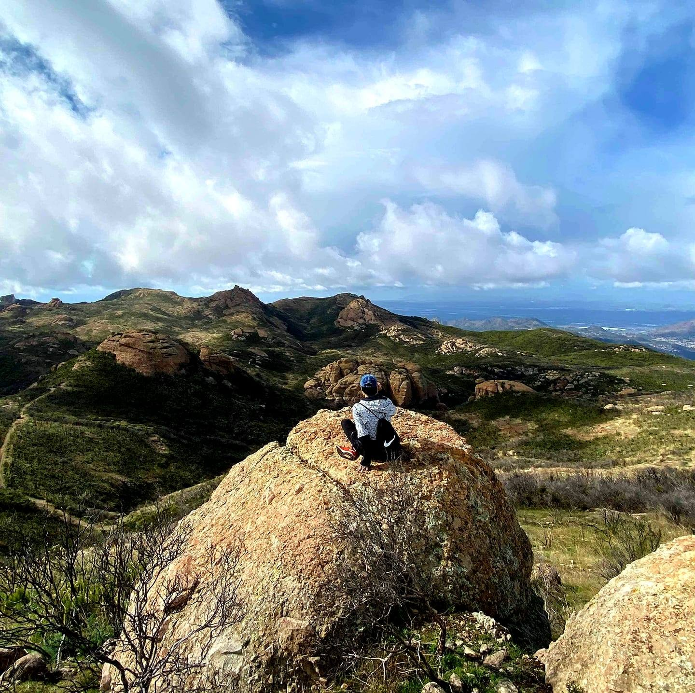 </td>
    <td> 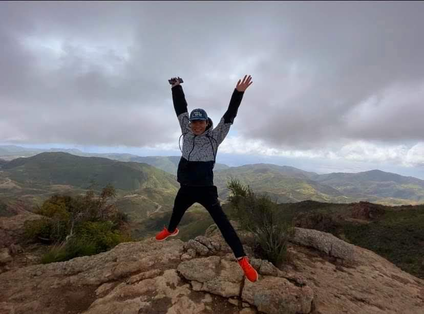 </td>
</tr></table>
<table><tr>
    <td>  </td>
    <td> 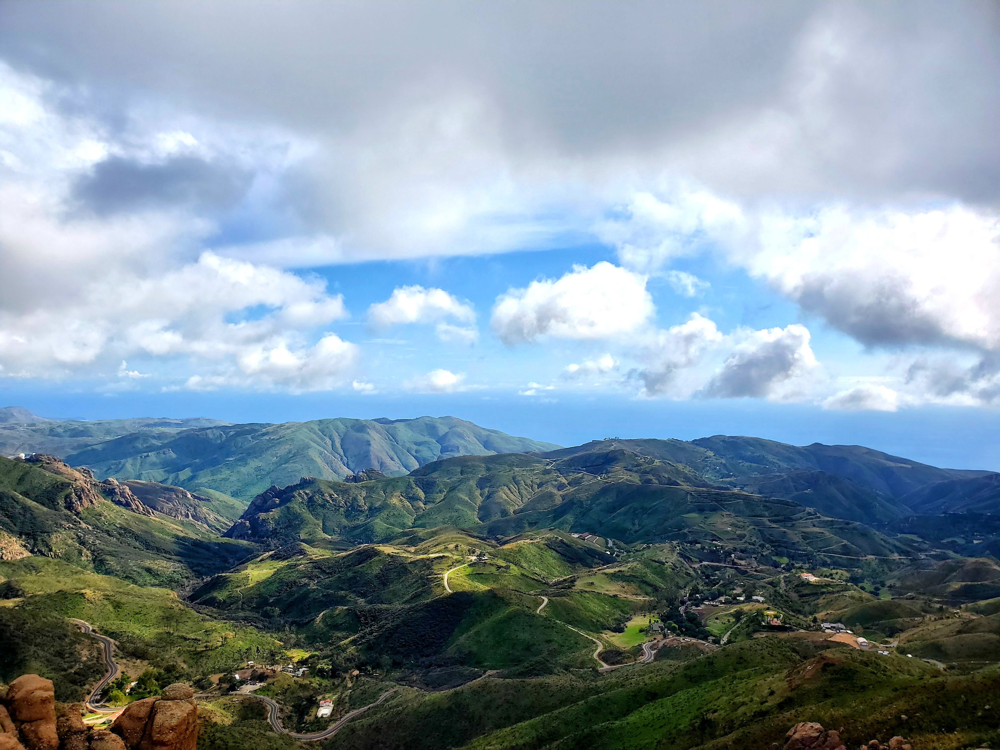 </td>
</tr></table>

Couple tips that I have after hiking these trails:
* Remember to pack your lunch to eat at the peak (trust me that your food will taste more delicious than ever with this view)
* Plenty of water and sunscreen
* Hike early morning for the fresh air

By now you should know the drill. After the hike we rushed to [Sichuan Impression](https://www.sichuanimpressions.com/) to get an early dinner after quite a long hike.

<table><tr>
    <td> 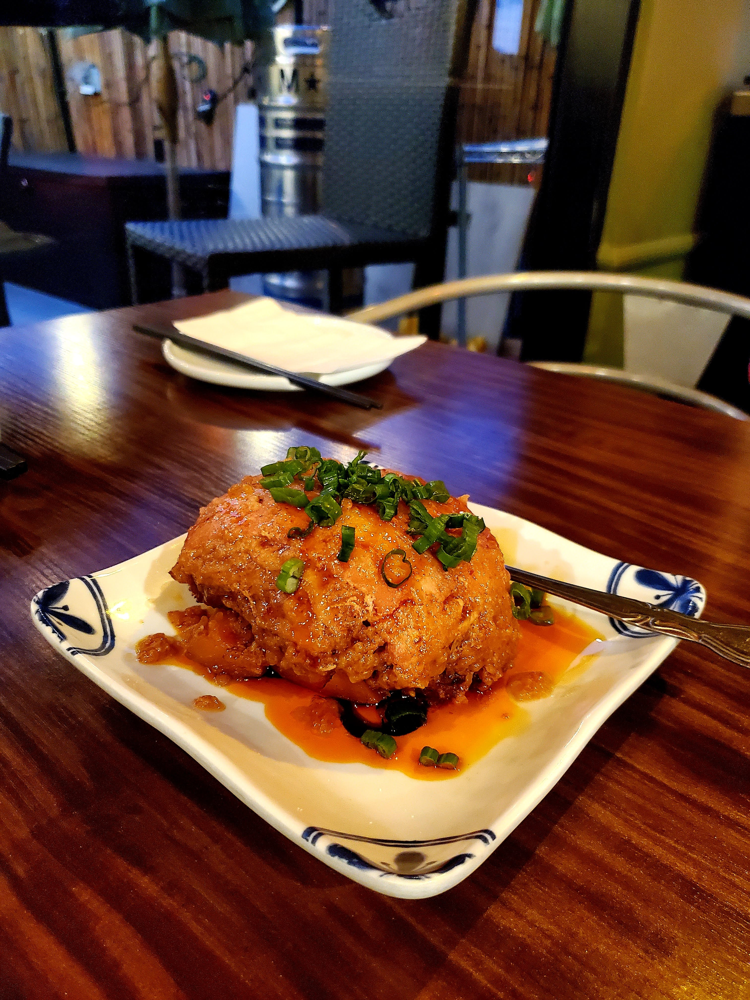 </td>
    <td> 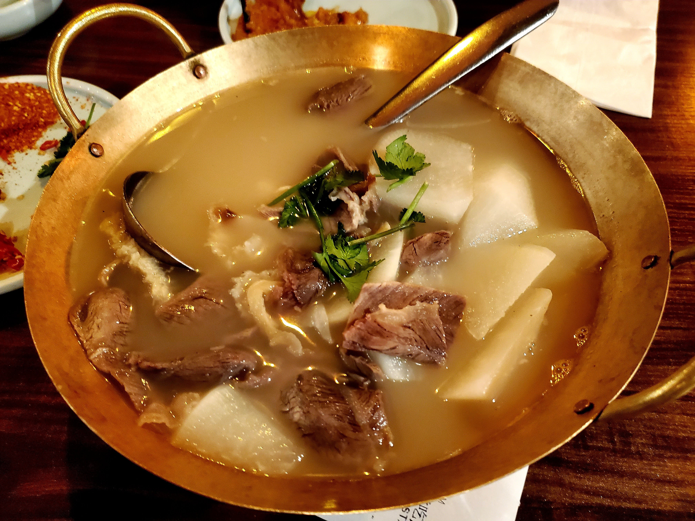 </td>
    <td>  </td>
    <td> 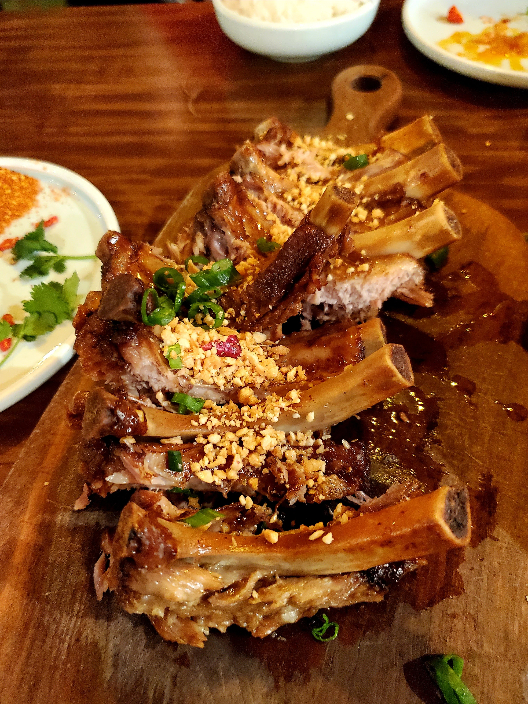 </td>
</tr></table>

With that, I conclude the reporting for this week and looking forward to the hike next week. **Adios!**
