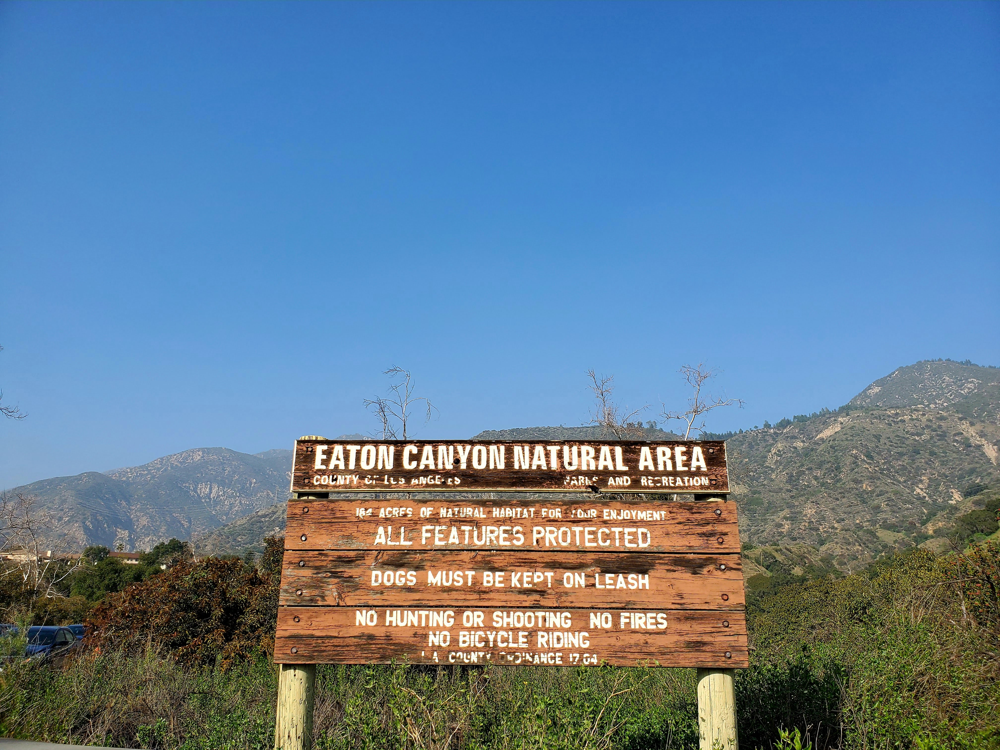
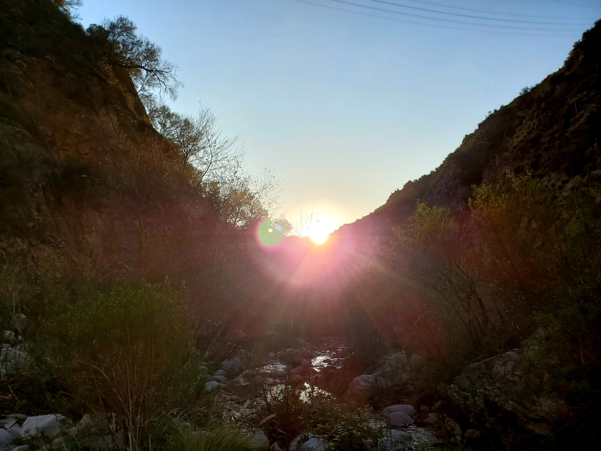
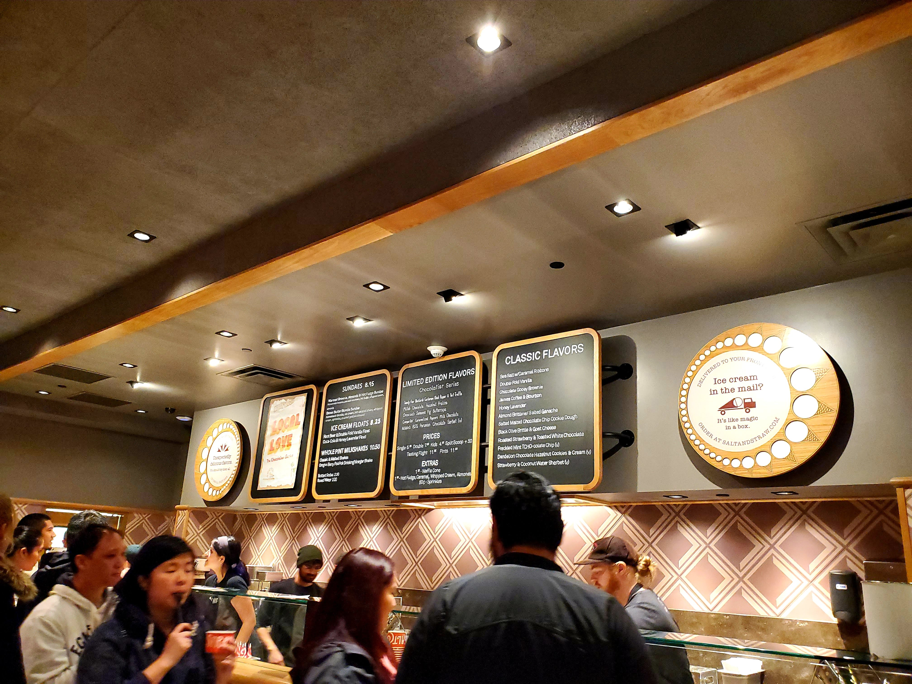
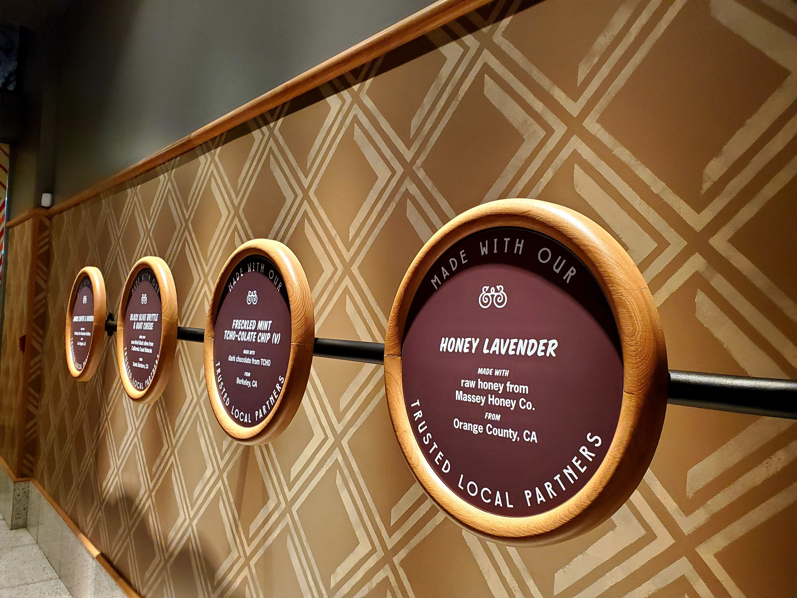

Hello again! I am a little behind in terms of getting all of the posts up but here we are with another week of **#1hikeaweek**. For this week, we are doing a slightly easier hike near the Pasadena area. The distance for the hike is 3.5 miles with very low elevation gain (436 feet). I hiked with friends starting around 2 PM although I prefer morning hike but more friends the merrier.

At the entrance of the trail, we were greeted with the big sign for the Eaton Canyon trail.

The hike is relatively easy but with many stepping stones (which makes this hike much more adventurous and enjoyable). Halfway to the waterfall, I spotted this view that was quite amazing with the sun blazing through the trees. 

After hiking for a while and many chatter and jokes with friends, finally we are greeted with a gorgeous 40-foot waterfall as seen below.

What a better way to recharge ourselves than a boiling hotpot at [Boiling Point](https://www.bpgroupusa.com/) and ice cream at the famous chain in Oregon [Salt & Straw](https://saltandstraw.com/).

<table><tr>
    <td>  </td>
    <td>  </td>
    <td>  </td>
</tr></table>

With that, we conclude the wrap up for this week and stay tuned for the future hike!