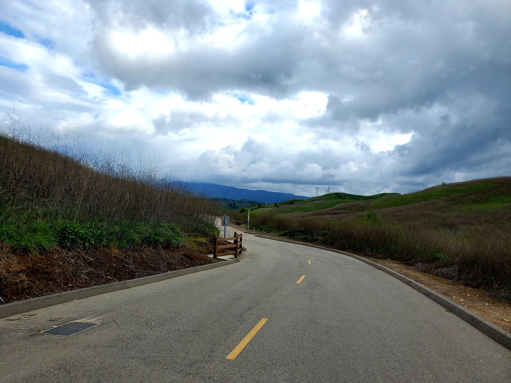

Hello! Welcome back to another week of **#1hikeaweek**. Today, we are adventuring out to [Bane Canyon Loop Trail](https://www.alltrails.com/trail/us/california/bane-canyon-loop-trail) in Chino Hills state park.

The loop itself is a 5.8 miles and tagged as moderate by Alltrails. Before the hike, we are doing pre-hike eatery at [Fujin Ramen](https://www.yelp.com/biz/fujin-ramen-west-covina?osq=fujin+ramen). We got dumplings and the ramen as shown below.

<table><tr>
    <td>  </td>
    <td>  </td>
</tr></table>

The trail is in Chino Hills State Park and we have to walk a little to reach the trail since there's no direct parking at the trail.

<table><tr>
    <td>  </td>
    <td>  </td>
    <td>  </td>
</tr></table>

It was raining a little in the morning before the hike so it was quite muddy. I remembered that I had to peel off the mud with a stick while hiking. As per usual, there are many kinds of flowers at the trail as shown below.

<table><tr>
    <td>  </td>
    <td>  </td>
    <td>  </td>
</tr></table>

<table><tr>
    <td>  </td>
    <td>  </td>
</tr></table>

Finally the views were amazing and there was no more than 7 people on the trail which made the hike much more relaxing.

<table><tr>
    <td>  </td>
    <td>  </td>
    <td>  </td>
</tr></table>

After the hike, we went to one of the popular boba shop called [Omomo](https://www.omomoteashoppe.com) in Chino Hills. The shop is small but got a chic style to it. Being a big fan of matcha (green tea), I got the signature Omomo matcha and my friend got the strawberry flavor.

<table><tr>
    <td>  </td>
    <td>  </td>
    <td>  </td>
</tr></table>

<table><tr>
    <td>  </td>
    <td>  </td>
</tr></table>

We cook our food again. Remember the spicy fish soup that I ate at Sichuan Kungfu Fish after [Sturtevant and Hermit Falls hike](https://dsboba.github.io/sturtevant-and-hermit-falls/)? One of my friends is trying to replicate it and honestly, it is not too far off and tasted great.

<table><tr>
    <td>  </td>
    <td>  </td>
    <td>  </td>
</tr></table>

We were eating while watching the professional badminton tournament held in the United Kingdom called [Yonex All Englands](https://www.allenglandbadminton.com/).

With that, we conclude the weekly **#1hikeaweek** and 
**Auf Wiedersehen!**