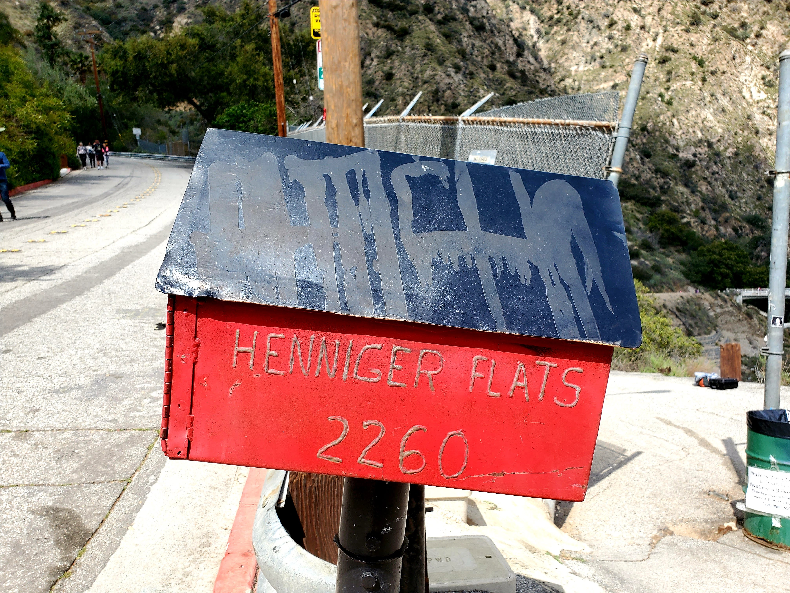
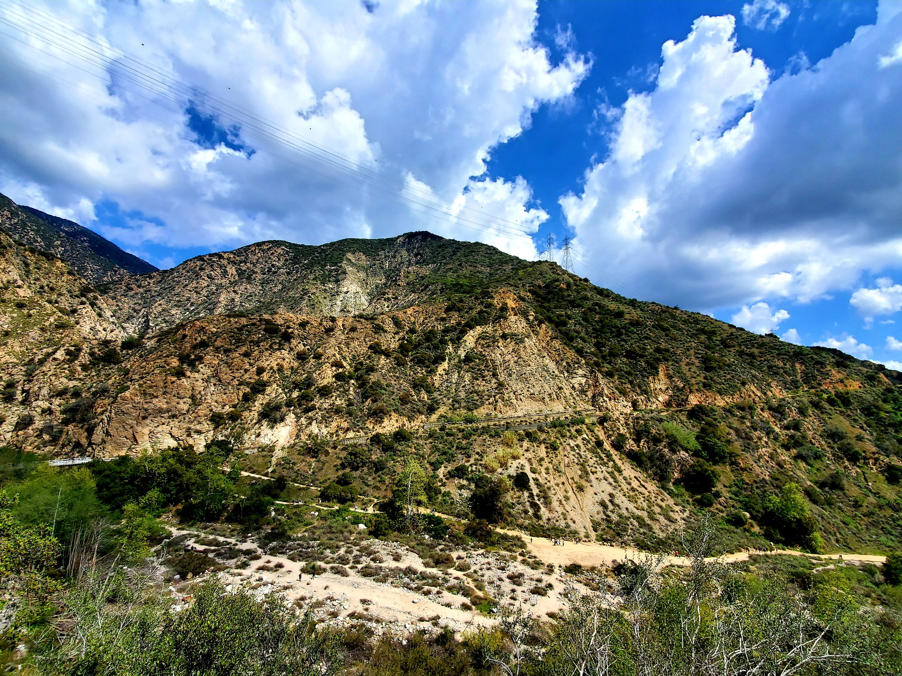
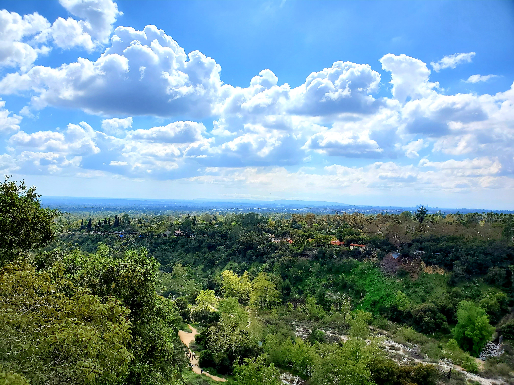
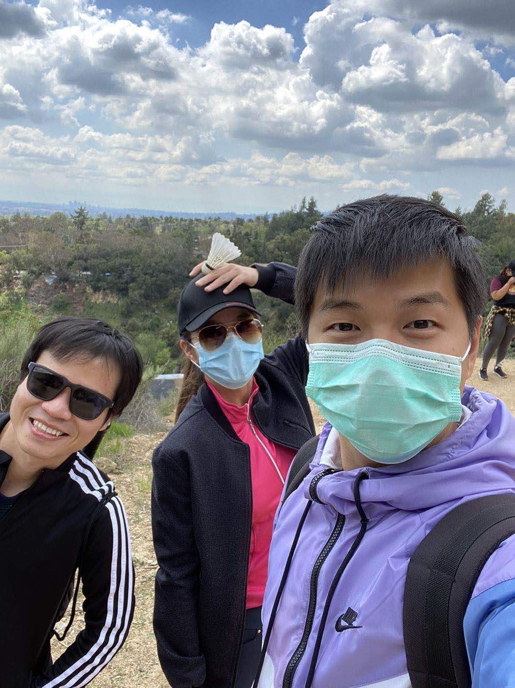
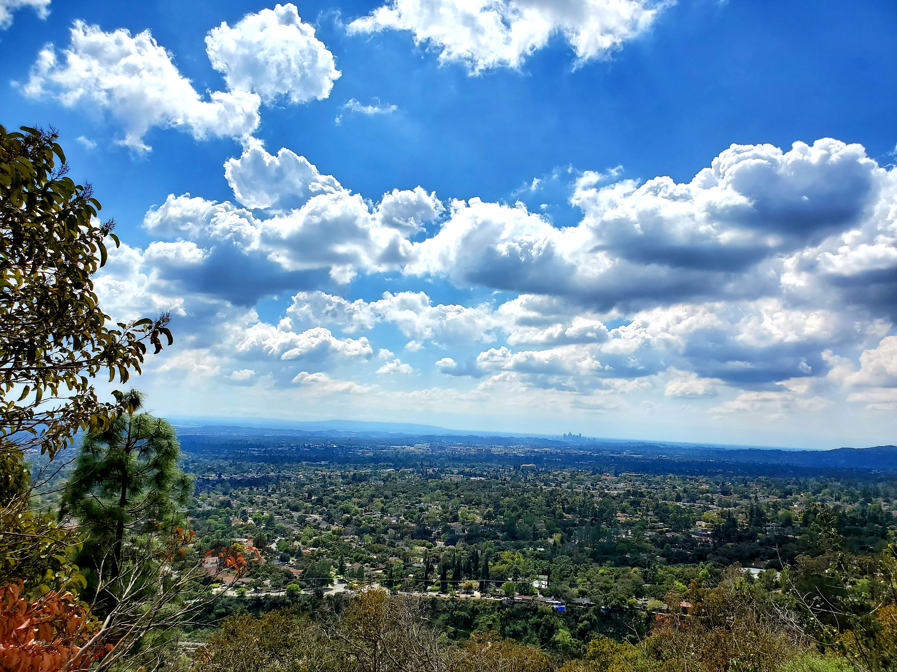
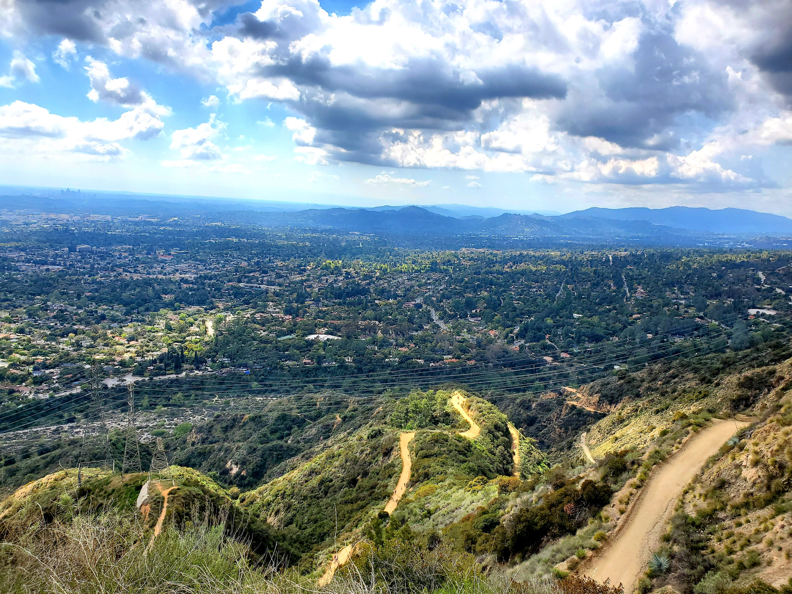
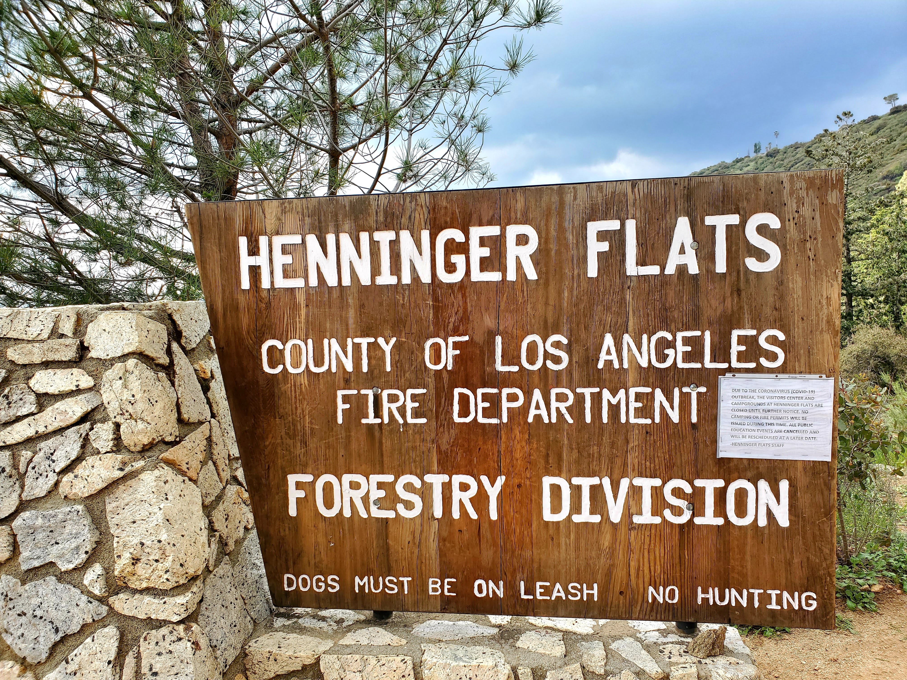
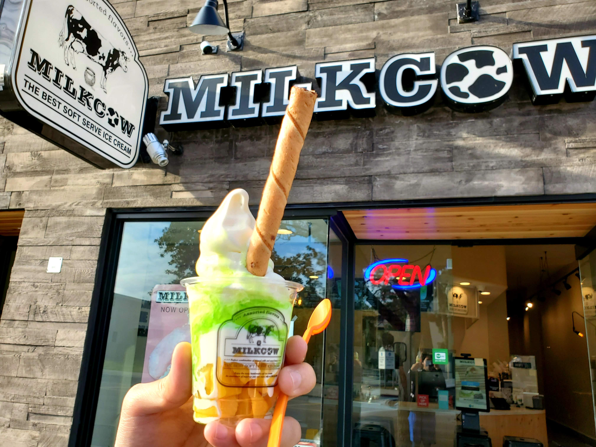

Hello! Welcome back to another round of **#1hikeaweek**. This week during the Covid-19 fiasco and being confined indoor for the majority part of the week, we ought to get out and breathe some fresh air.

Previously, we hiked at Eaton Canyons trail for the waterfall. The hike we did this week is called [Henningers Flats trail](https://www.alltrails.com/trail/us/california/henninger-flats-trail). This trail is a 5.5 mile heavily trafficked trail located near Pasadena, California. 

I thought not a lot of people would be there but boy I was wrong. There were quite a few people at the trail (although probably not as many as usual). Below is the entrance of the trail and a mailbox is displayed.

For your information, the trail is actually above the Eaton Canyons trail that we hiked several weeks ago. Immediately after 2-3 minutes of walk, we were greeted with these amazing views.

<table><tr>
    <td>  </td>
    <td>  </td>
    <td>  </td>
</tr></table>

In the middle of the trail, we snapped a selfie of ourselves. Note that we wear a mask for protection (not that we are sick or anything).

The hike was as if we were circling a mountain going up in elevation. The longer we walk the better the view. We saw several people that meditate and reading a book somewhere near the peak which can be quite a relaxing and cool experience. I certainly would love to try it at the future hike. 

When I reach the peak, immediately there is a big sign of **Henninger Flats**. The sense of achievement is definitely satisfying when you are at the top.

<table><tr>
    <td>  </td>
    <td>  </td>
    <td>  </td>
</tr></table>

With the Covid-19 creating the disruption everywhere including the closure of the badminton courts. My friends and I thought it would be cool to play at the peak with social distancing involved. Below is the small clip of the play that we did.

<video width="700" height="420" controls autoplay loop>
      <source src="../assets/img/travel/henninger_flats/badminton.mp4" preload="auto" type='video/mp4'>
</video>

After the hike, we were exhausted and needed a shot of sugar in our body. Hence, we made the trip to [Milk Cow](https://www.yelp.com/biz/milkcow-cafe-pasadena-3). I got the mango tree but since they don't have cotton candy, they were kind enough to put a small honey cube.

That's it for the **#1hikeaweek**. Until next time, **Tchau!**