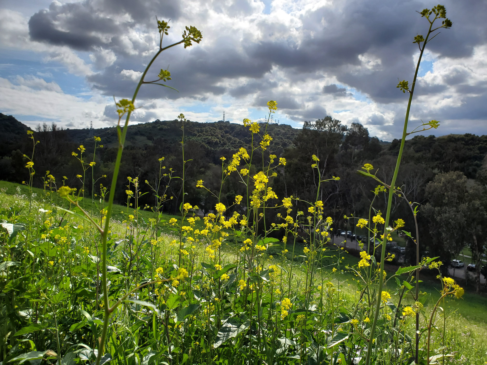
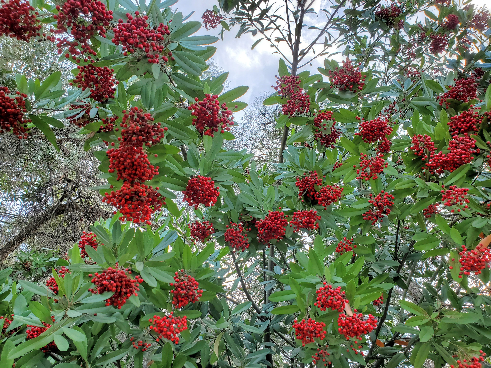
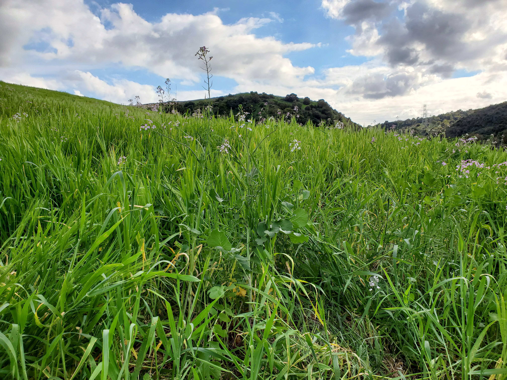
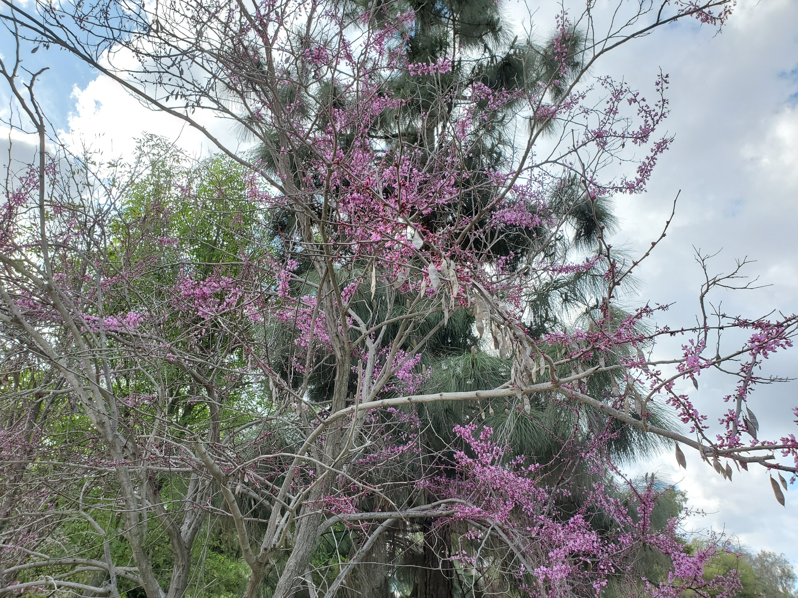
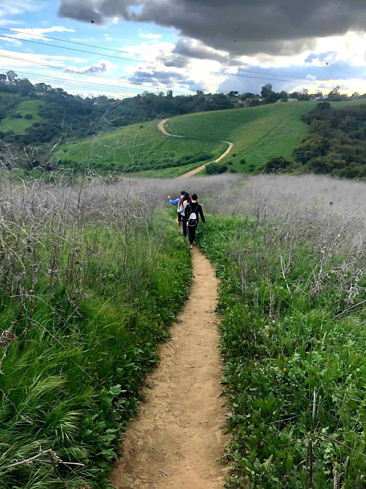
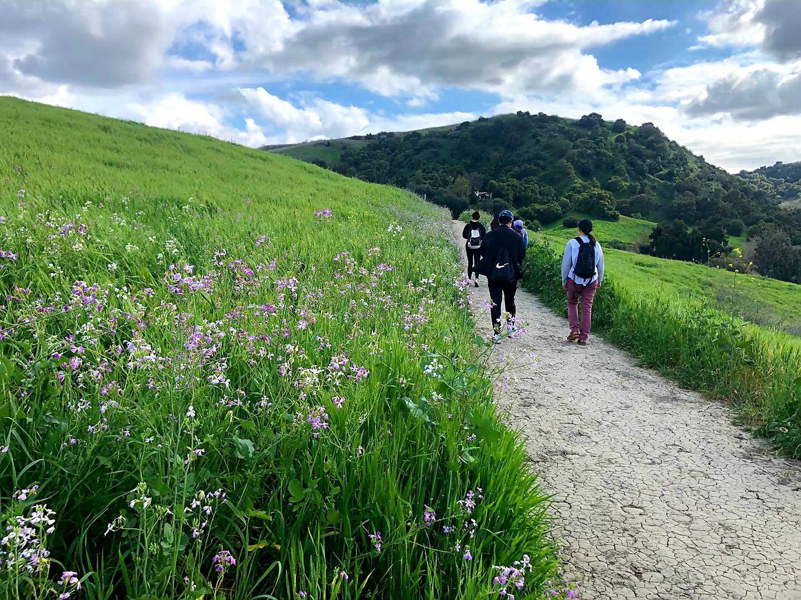
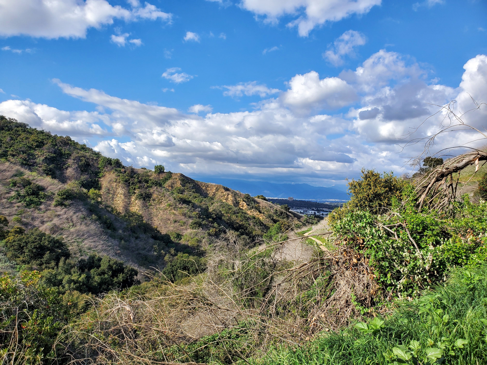
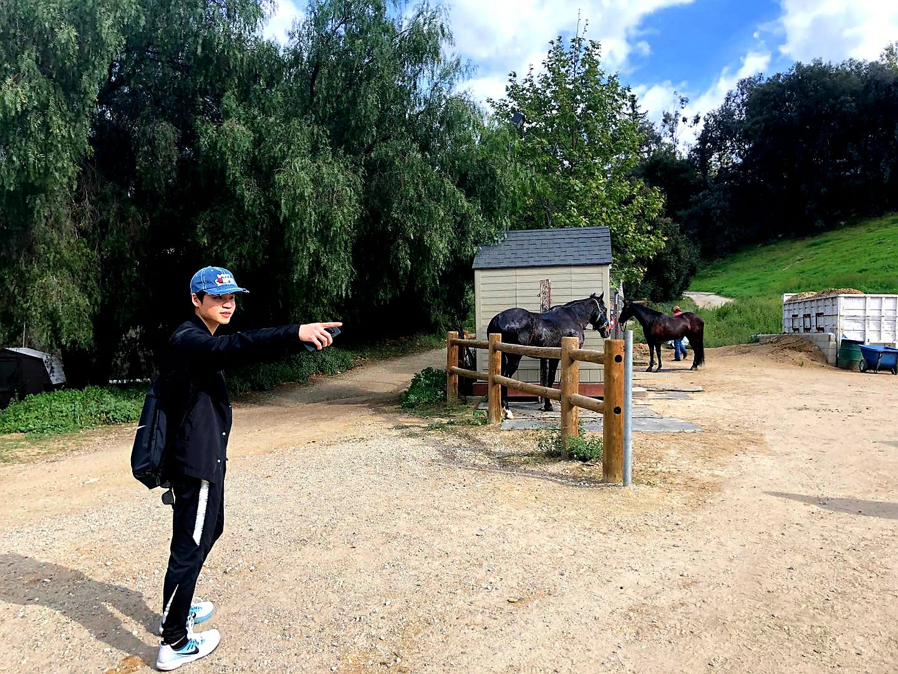
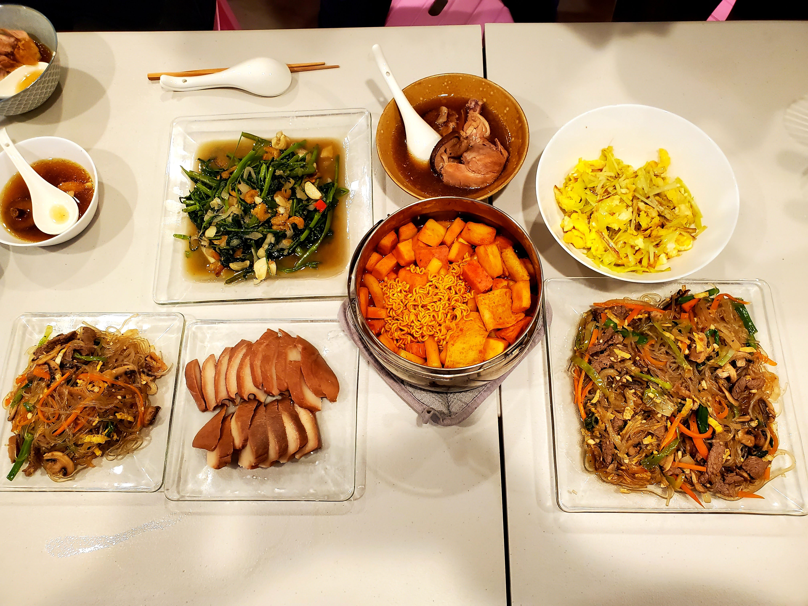

Hello! Welcome back to the weekly **#1hikeaweek**. For this week, with the Covid-19 virus looming internationally and the spread starting as well in the U.S., we are still on the roll for the hike.

For this week, we take it easy and go for the easier hike, [Schabarum Trail Loop](https://www.alltrails.com/trail/us/california/schabarum-trail-loop). It is a 2.3 miles loop trail located near Rowland Heights (of course we won't end with just 2.3 miles).

Throughout the trail, there were a lot of different kinds of flowers as seen below.

<table><tr>
    <td>  </td>
    <td>  </td>
    <td>  </td>
    <td>  </td>
</tr></table>

Here are some of the highlights of the views of the trails. There were stables and horses where one can pay to have some fun riding a horse.

<table><tr>
    <td>  </td>
    <td>  </td>
    <td>  </td>
</tr></table>

As a bonus, I shall provide you with a natural picture of mine (I didn't know this picture was taken until after the fact).

As mentioned earlier, it was a pretty chill hike and sometimes it is good to relax a little. This time around, my friends and I settled to cook own food rather than eating out. I am more of an eater rather than the cook.

Hope you enjoyed the post and stay tune for the hike next week. **Au revoir!**