Hello, welcome back to **#1hikeaweek**. This week, I present to you the [Sturtevant Falls Trails](https://www.alltrails.com/trail/us/california/sturtevant-falls-trail). It is estimated to be 3 miles according to [Alltrails](https://www.alltrails.com), but of course YMMV since we did more than 3 miles.

The trail that we hiked is located near the Sierra Madre, California that features a giant fifty-foot waterfall. Below are several views and inspiring signs before we reached the waterfall.

<table><tr>
    <td> 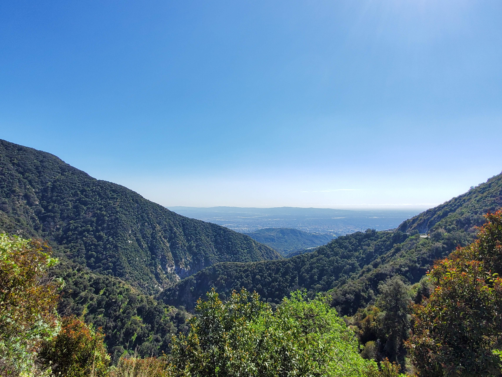 </td>
    <td> 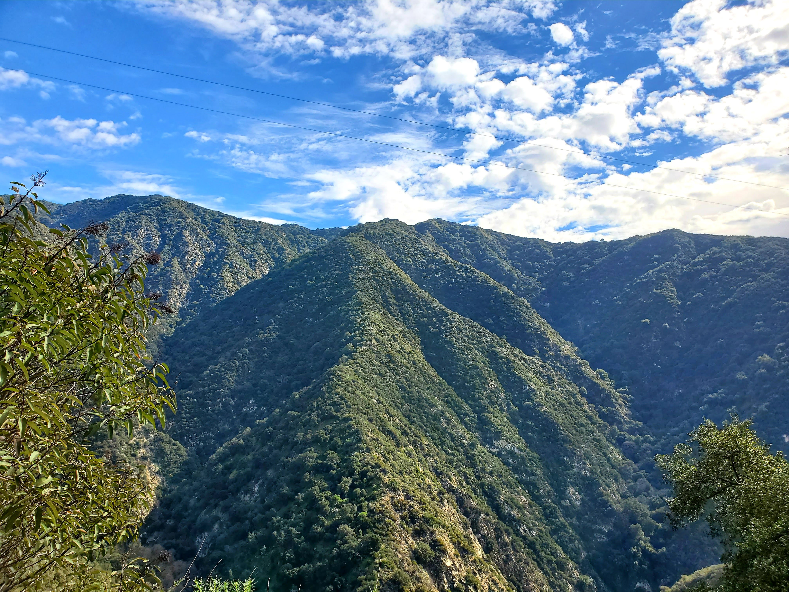 </td>
    <td> 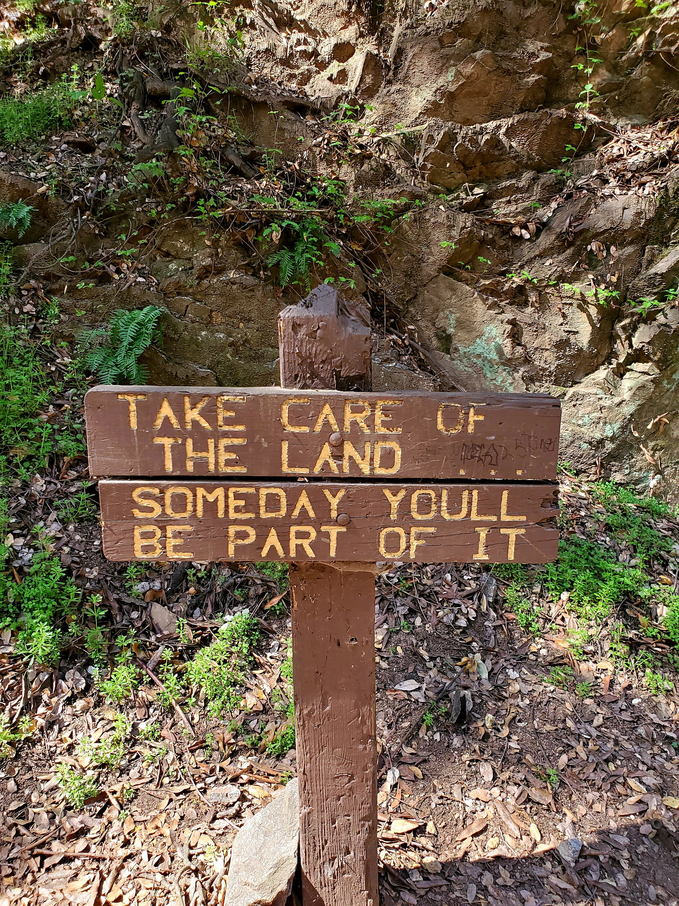 </td>
    <td> 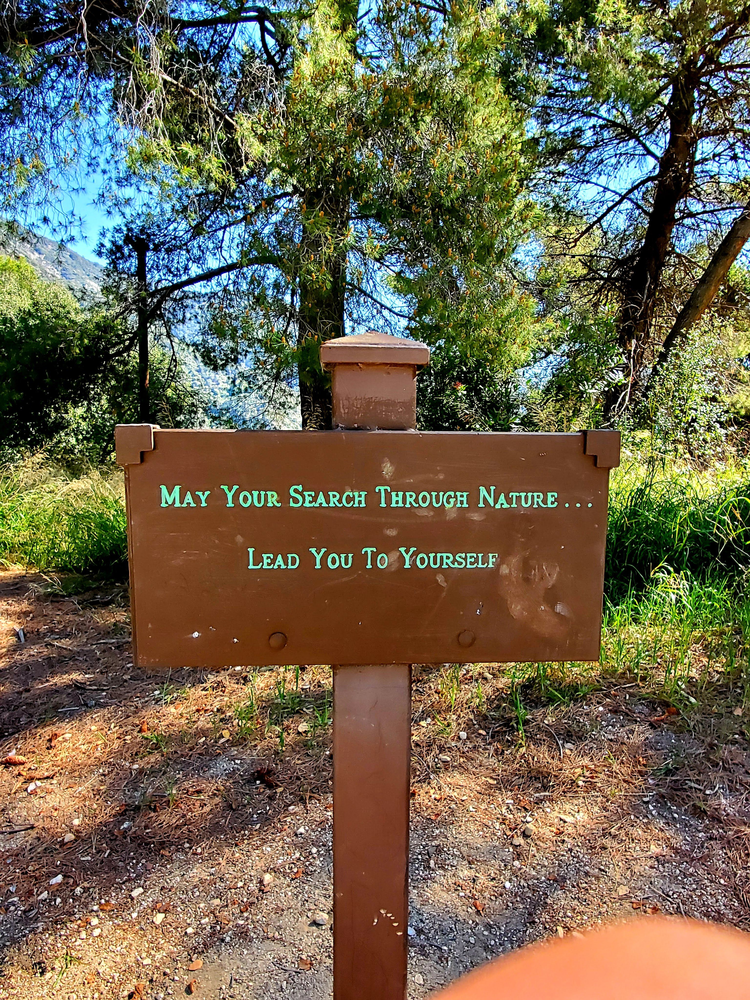 </td>
</tr></table>

After a while, standing upon us is the giant waterfall that we came out for. In all honesty, I would love to run in like a little kid and have the freshwater from the waterfall fall upon me but there were many people at the scene so I didn't do it. If you are looking to have a cool profile picture or picture with lots of likes on your Instagram, I highly recommend coming to this hike.

<table><tr>
    <td>  </td>
    <td> 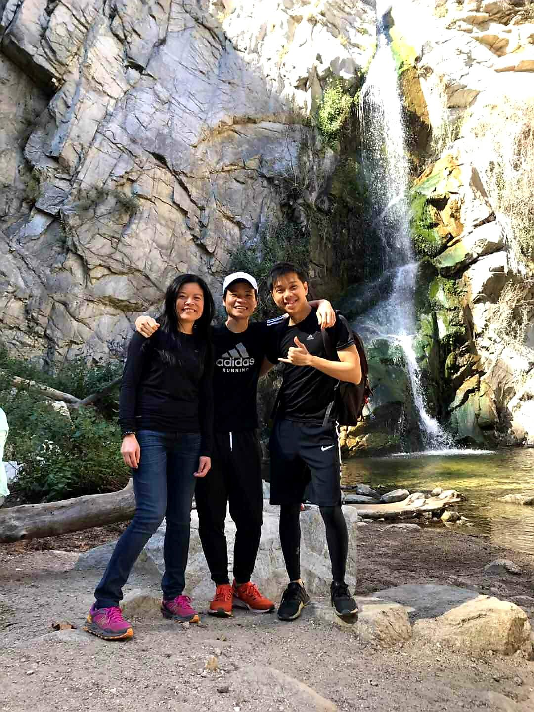 </td>
    <td> 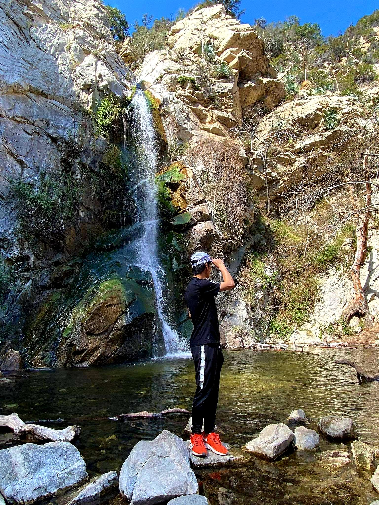 </td>
</tr></table>

I thought we were done with the hike but on the way back, we spotted another trail, [Hermit Falls Trails](https://www.alltrails.com/trail/us/california/hermit-falls-trail), that leads to another waterfall. Guess what we did? Of course, we are going to it. In case you are wondering, the cute toy with the sunglasses on is a bluetooth speaker that my friend brought with him.

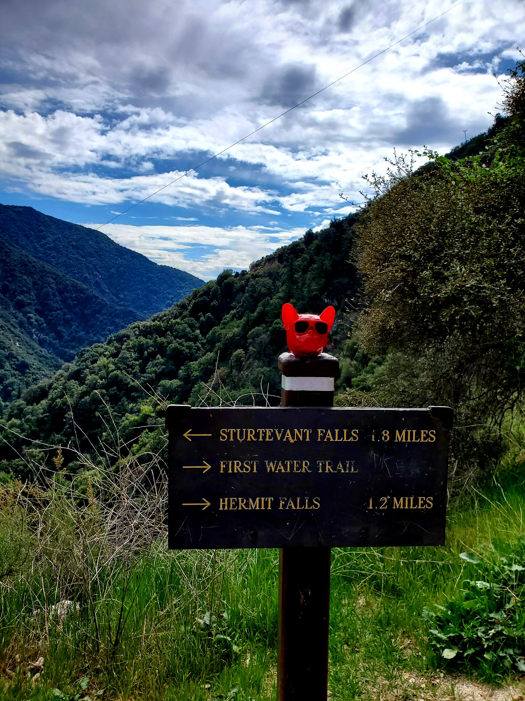

After a bit of walking, we reached the falls but we are actually behind it and it is quite hard to get to in front of it unless you know how to swim. Notice that the number **24** is painted over the big rocks because the basketball superstar, [Kobe Bryant](https://en.wikipedia.org/wiki/Kobe_Bryant), from LA Lakers has just passed a couple days ago (sad I know). This event also taught me that life is too short so enjoy the moment and go travel as much as you can because we don't know what is going to happen the next minute, hour, tomorrow, a month, and a year from now.

<table><tr>
    <td> 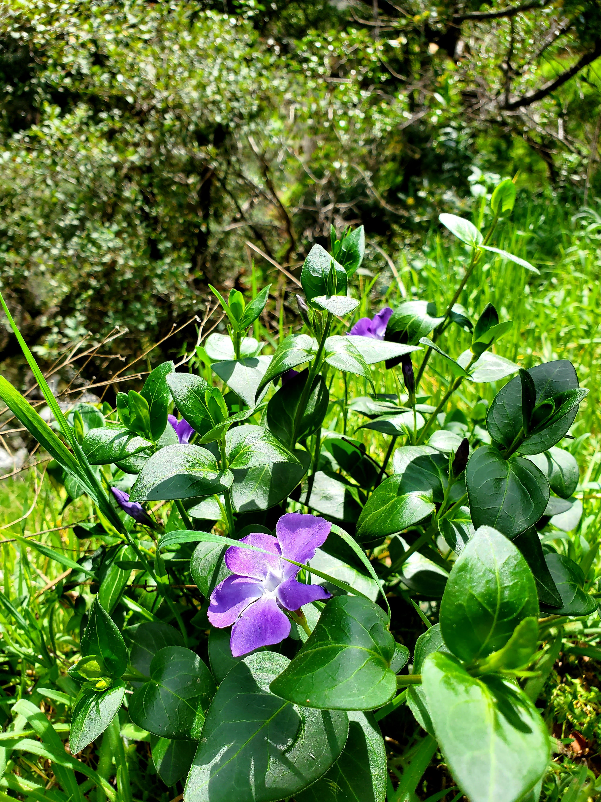 </td>
    <td>  </td>
    <td> 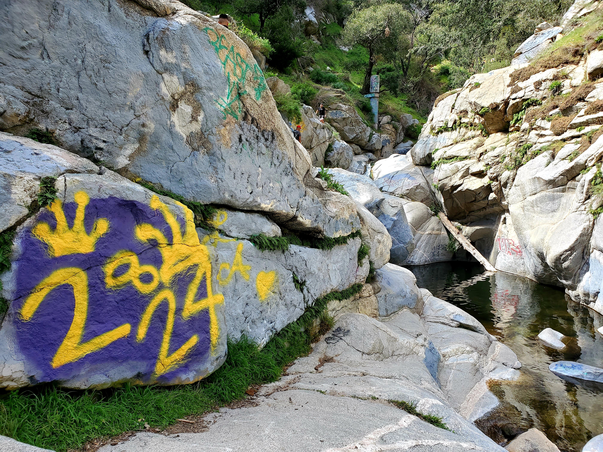 </td>
</tr></table>

After the hike, we drove to Arcadia mall in search of tasty food. This restaurant, [Sichuan Kungfu Fish](https://www.sichuankungfufish.com/), caught our eyes so we went in to give it a shot. You must be thinking, wow Mario you are having Sichuan dishes every week. Unfortunately, I do like spicy food and with slightly cold weather, the spicy food tends to warm my body. We were greeted and introduced with a suggestion from the owner so I highly recommend trying out this place after the hike (trust me that you won't be disappointed).

<table><tr>
    <td> 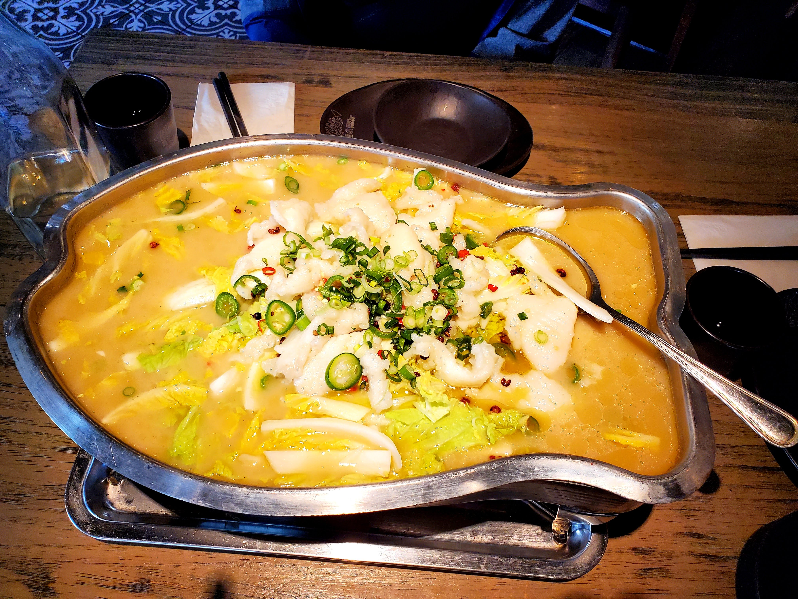 </td>
    <td> 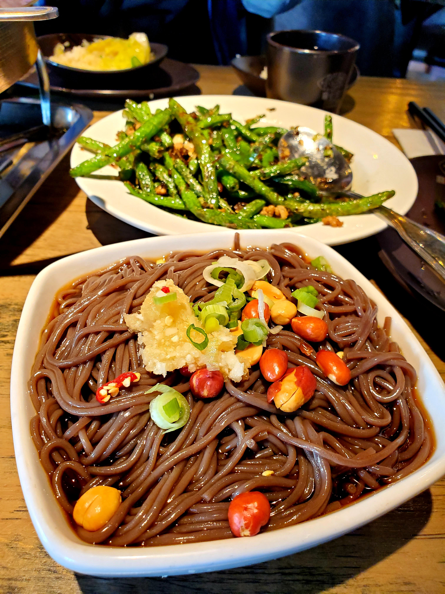 </td>
    <td> 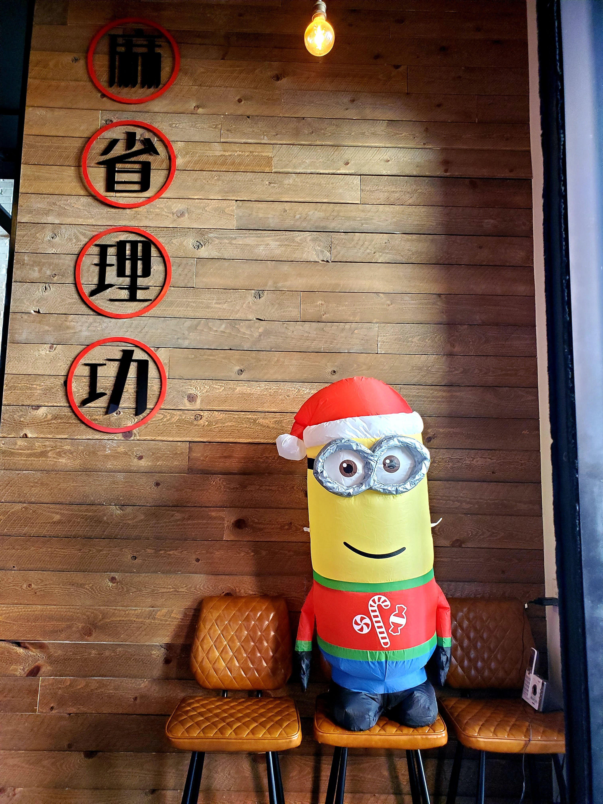 </td>
</tr></table>

With that, I conclude this week **#1hikeaweek**. See you next week!
