Hello! I hope everyone is doing well amid stressful time aka Covid-19 aka Coronavirus. We are back with the **#1hikeaweek** (well kinda...). The U.S. was projected to have a high number of cases and the trajectory seem to be the case. State and local governments encourage everyone to stay indoors and only go out for essential matters. Social distancing needs to be practiced when you are outside. 

I have to do my weekly grocery shopping to keep myself afloat but here we are with a very short hike at [Edison trail](https://www.alltrails.com/trail/us/california/edison-trail--4) today. Most of the trails in Los Angeles is closed (perhaps it is for the best since last week at Henninger Flats trail was so crowded). 

Before the hike, my friend and I bought a take out order from [P P Pop](https://qmenu.us/#/p-p-pop-monterey-park). Honestly, I have been eating home-cooked noodles for the entire week but another noodle dish won't hurt, right? So be it, I ordered spicy braised beef noodle soup as shown below. This noodle soup was 10 times if not 100 times better than the noodle that I cooked with the amateur skill of mine.

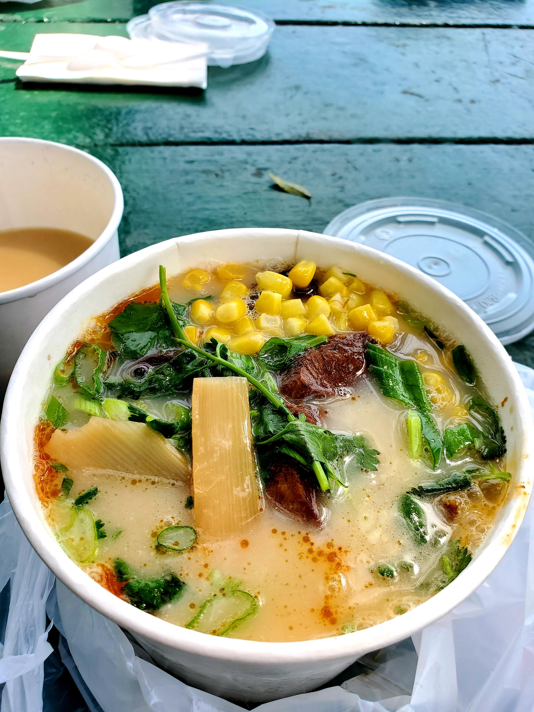

With our tummy filled, we head out to the trail and luckily there is no one at the trail so that makes our routine much easier. This trail is very short compared to all of the hikes that I did previously but beggar can't be chooser, am I right? To my surprise, the flowers are blooming and I can hear birds singing and chirping (oh, how I miss nature).

<table><tr>
    <td> 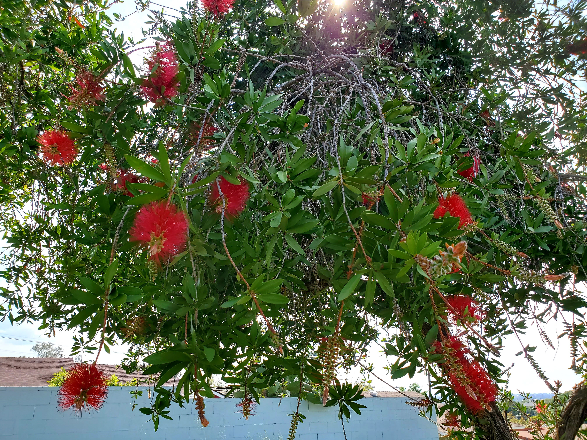 </td>
    <td> 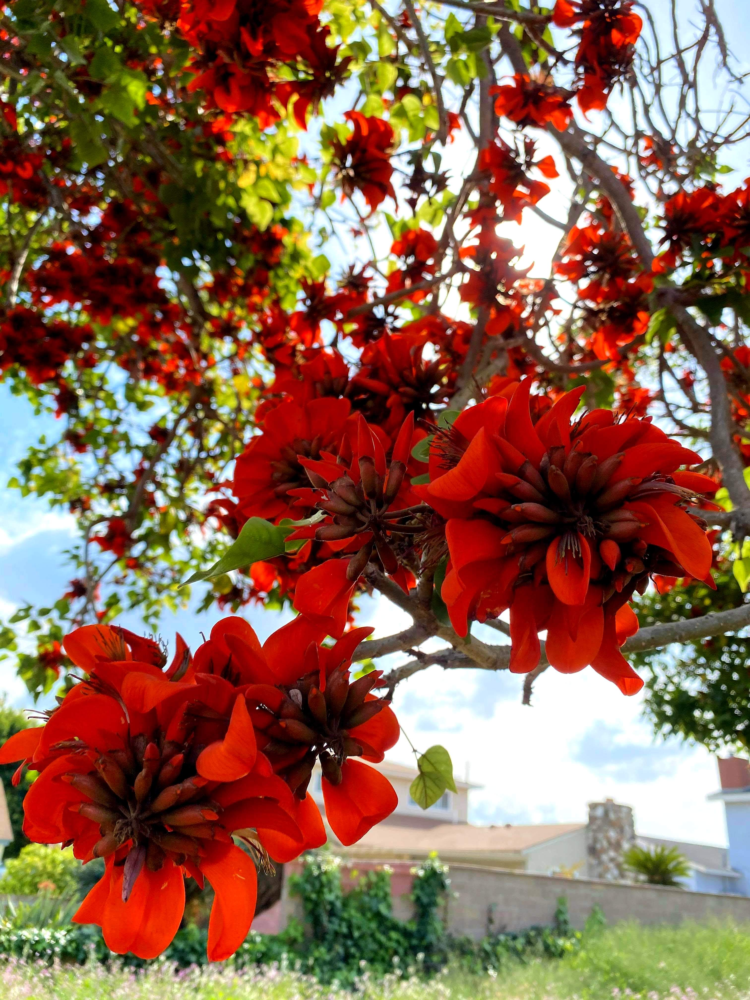 </td>
    <td> 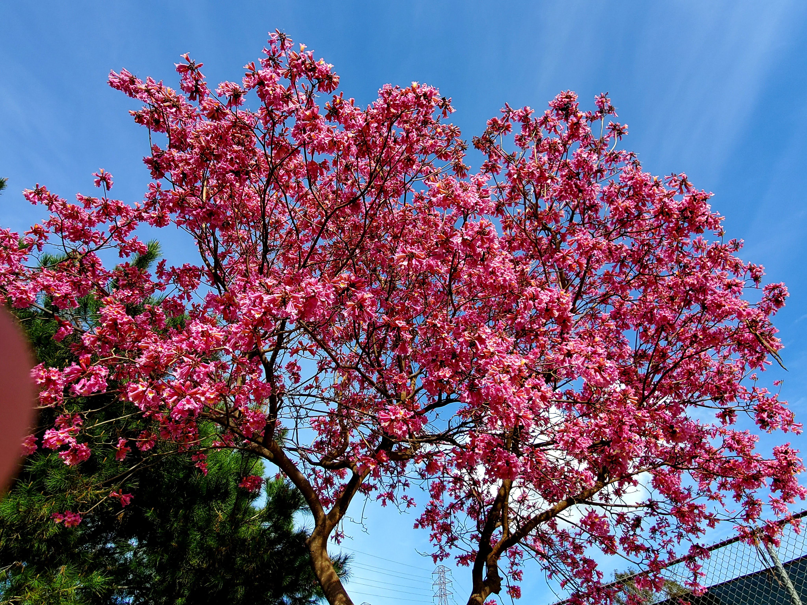 </td>
</tr></table>

Of course, we have to give some love to the view of the trail path and the city view.

<table><tr>
    <td> 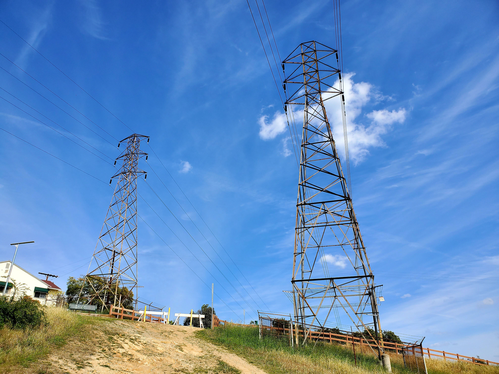 </td>
    <td> 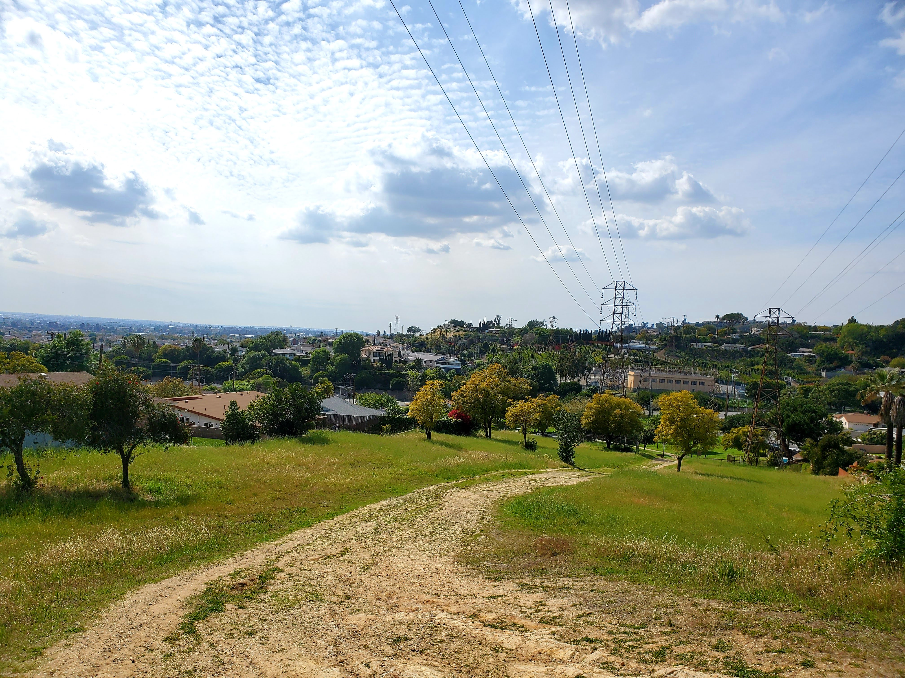 </td>
    <td> 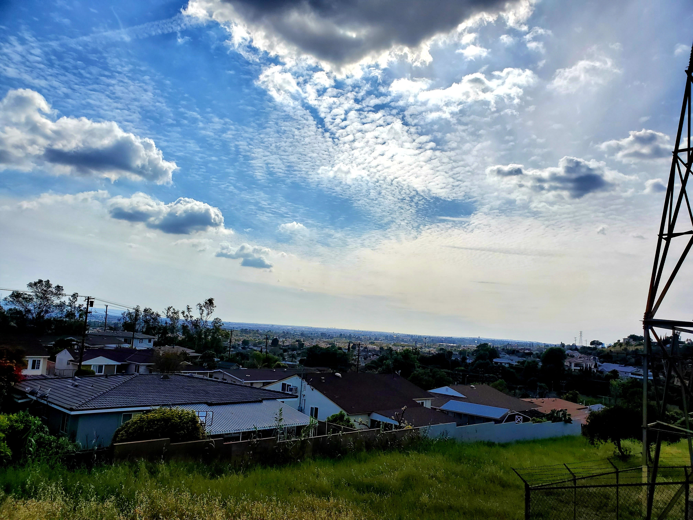 </td>
</tr></table>

Even though the trail is estimated to be 1.3 miles, we somehow walked ~4 miles (according to my Samsung Health). The running joke among my friends is that my app would multiply the distance by 2 or 3 or 4. After the hike, I went to [Daiso](https://www.daisojapan.com/) to get a bowl, couple stainless steel chopstick, and air freshner (the beads kind if you know what I mean). 

Afterward, we proceed to a famous bubble tea shop called [Wushiland](https://www.yelp.com/biz/wushiland-boba-san-gabriel) to get the milk tea with grass jelly (I would like to think that I earned it after a somewhat warm day). My friend likes the fruity drink and so he got the orange yogurt.

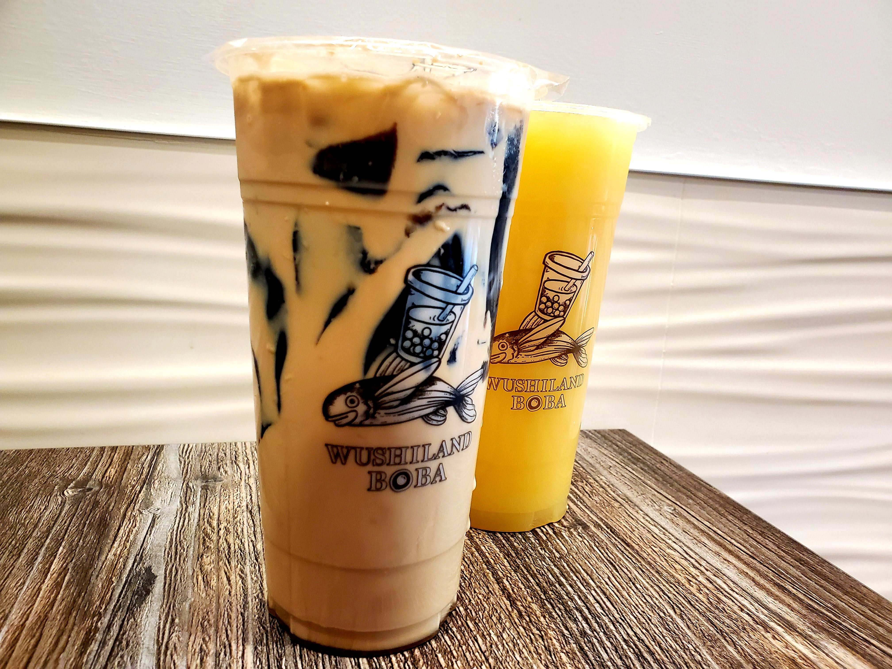

For dinner, I tried out this new restaurant called [Yang's Braised Chicken](https://ymyusa.com/). I have never heard of this place but it has 6,000 locations worldwide. There's only 1 item (Yang's braised chicken bowl) on the menu so I got the spicy version of it.

<table><tr>
    <td> 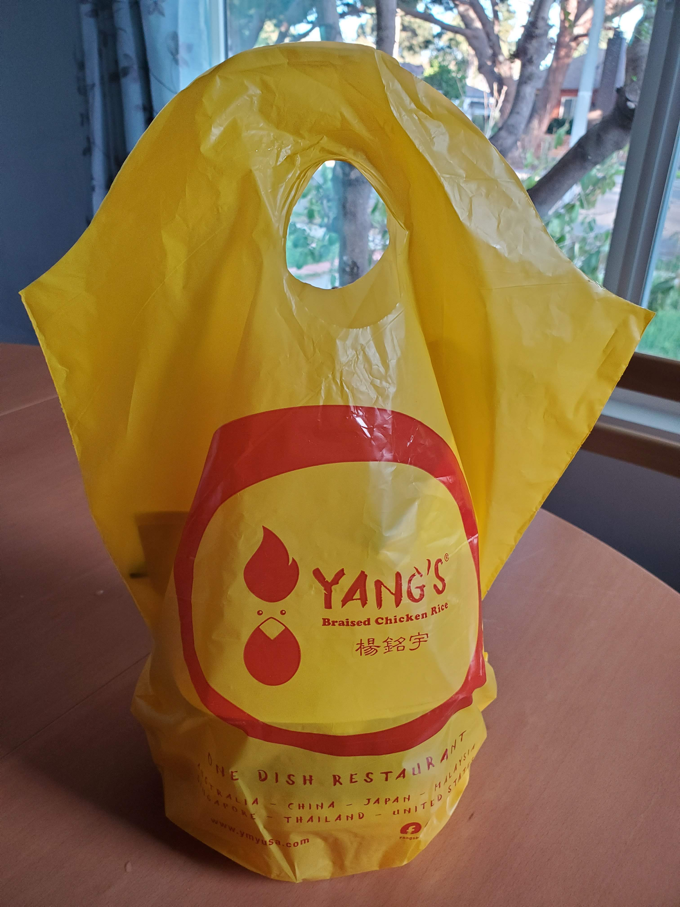 </td>
    <td> 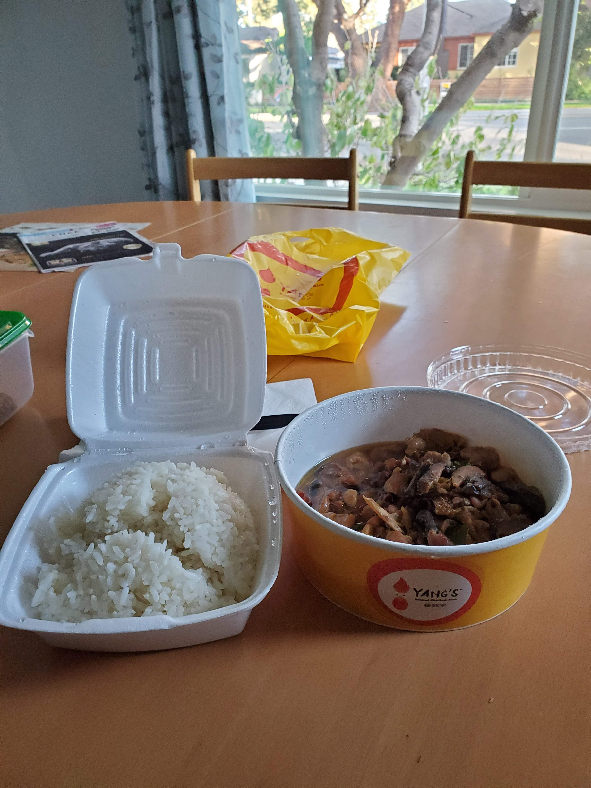 </td>
    <td>  </td>
    <td> 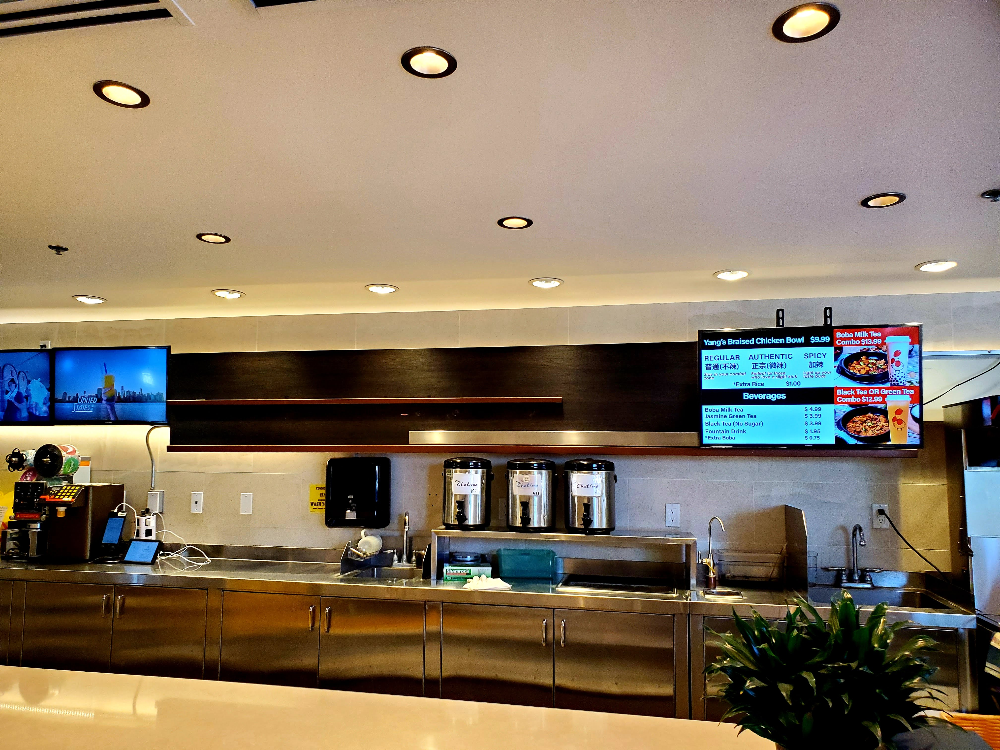 </td>
    <td> 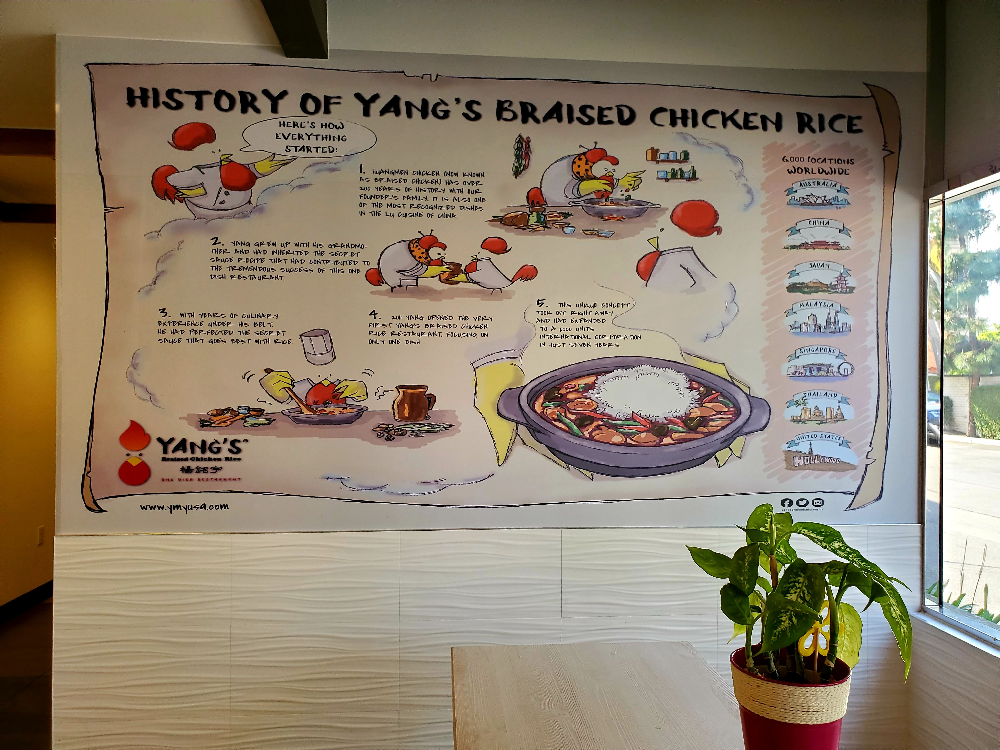 </td>
</tr></table>

I truly hope this pandemic is over soon so people can be more active but all we can do now is to be creative on how we live our lives. Stay active and healthy! 

Until next time and **adjö!**