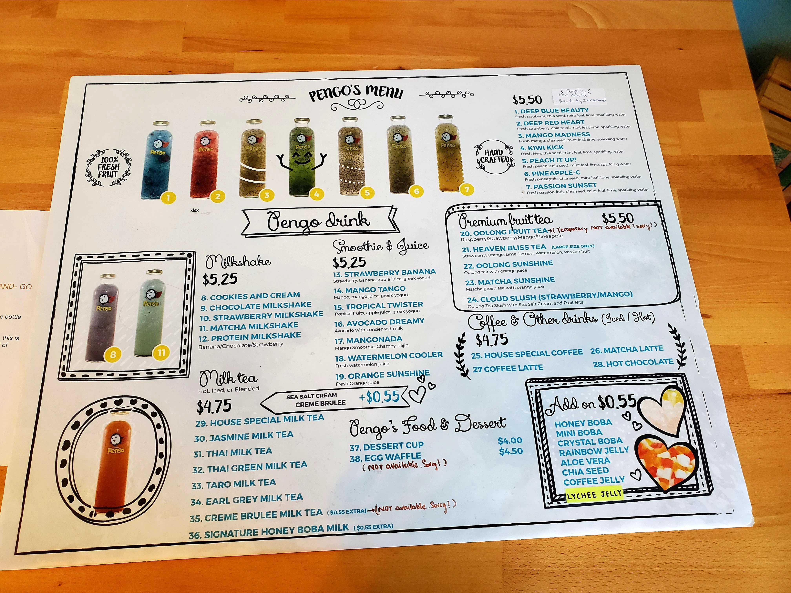

Hello everyone! It has been a while and finally, I can go back to my groove of hiking life. My friend and I drove about 1 hour south of Los Angeles near the Laguna Niguel area for the hike. We did quite a few hikes so let's get to it.

Before that, we needed to fill our tummy with food from [P P Pop](https://www.yelp.com/biz/p-p-pop-monterey-park-7) so we can survive the hike. I got the fish noodle soup and the soup is super rich and lots of ingredients such as salted vegetables, onions, corns, and the fish. I highly recommend checking out this place.

The first trail that we visited is the [Alison Creek and Wood Canyon Loop Trail](https://www.alltrails.com/trail/us/california/aliso-creek-and-wood-canyon-loop-trail). We didn't do the entire loop but the trail is relatively flat with lots of refreshing views such as the unique hill that is filled with yellow grass/flower and small water puddle (honestly the pictures will do them justice).

<table><tr>
    <td>  </td>
    <td>  </td>
    <td>  </td>
</tr></table>

More pictures!

<table><tr>
    <td>  </td>
    <td>  </td>
    <td>  </td>
</tr></table>

Of course the water and the prove that I was there :).

<table><tr>
    <td>  </td>
    <td>  </td>
</tr></table>

After the relaxing hike, ~~we go on for a food~~ we go for another hike (how much I missed being outside and the outdoor smell is so refreshing) near the Laguna Niguel Regional Park. The trail is circling the Laguna Niguel lake where a lot of people are fishing there. The water is so blue and how I wish I could swim because I would definitely jump down since it was a hot day.

<table><tr>
    <td>  </td>
    <td>  </td>
    <td>  </td>
</tr></table>

All in all, my friend and I hiked 10 miles according to my Samsung Health app (I am not sure how reliable the app is). After the hike, we went for a bubble tea chain called [Pengo](https://www.pengodrink.com/order) to hydrate ourselves. We got this drink called Mangonada where it contains mango smoothie, chamoy, and tajin. The drink reminded me of the pineapple that I had in my hometown on a small island in Sumatra, Indonesia where spicy red salt is spread on top of the pineapple.

<table><tr>
    <td>  </td>
    <td>  </td>
    <td>  </td>
</tr></table>

<table><tr>
    <td>  </td>
    <td>  </td>
</tr></table>

Everything about Pengo just clicked and I fell in love with this place. Look at the decoration (who doesn't like a penguin as a superhero?) and the drink is very unique (I am saddenned that there is no Pengo near where I live).

With that, we conclude our adventure in Niguel Park. Until next time, **doei!**.

