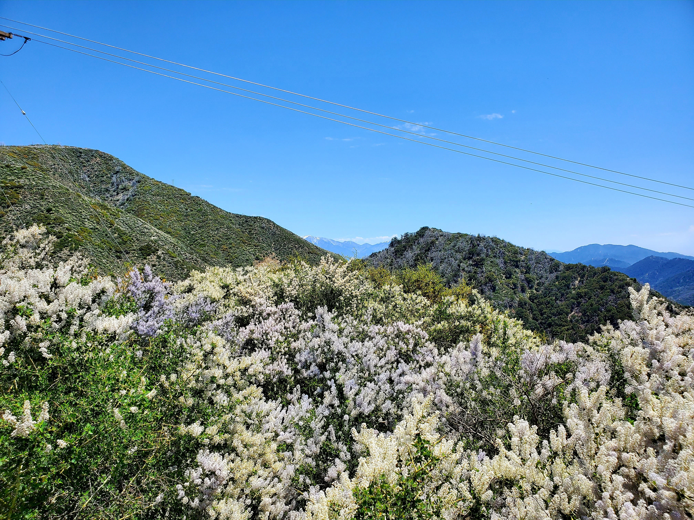
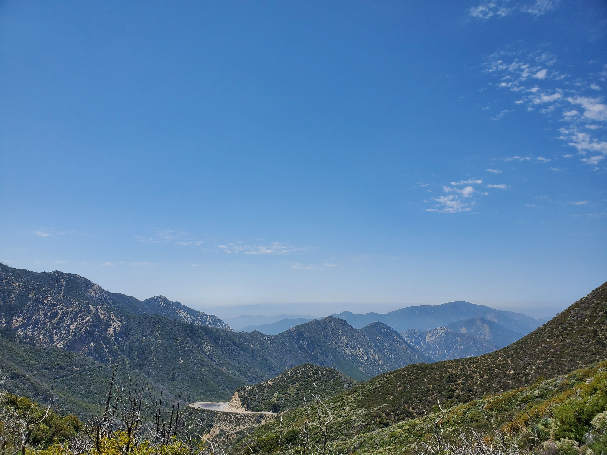
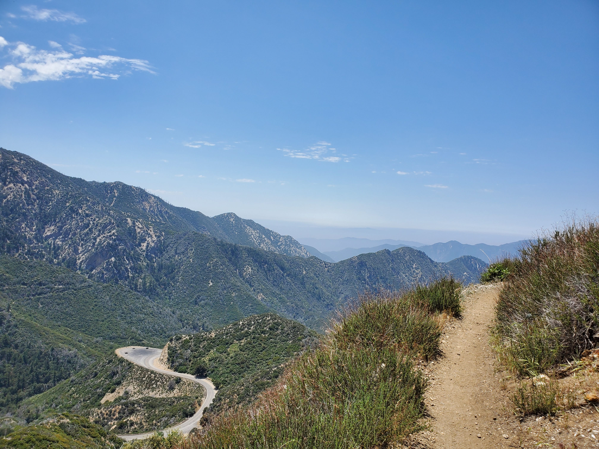
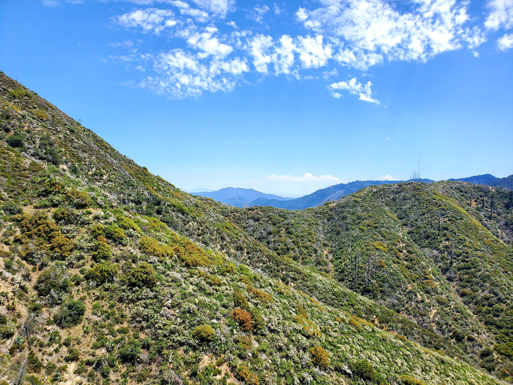
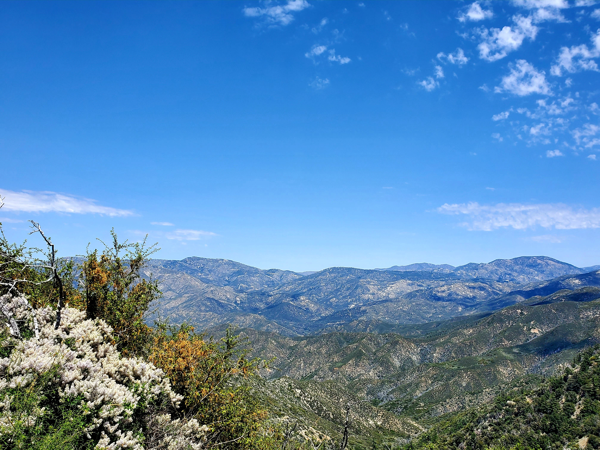
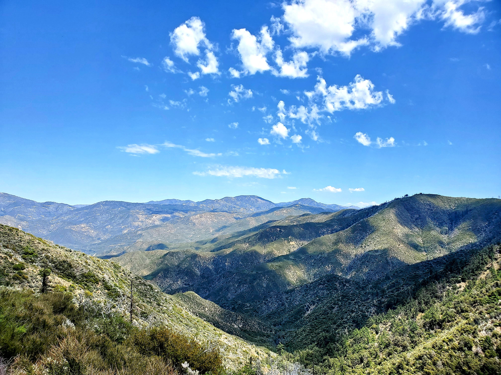
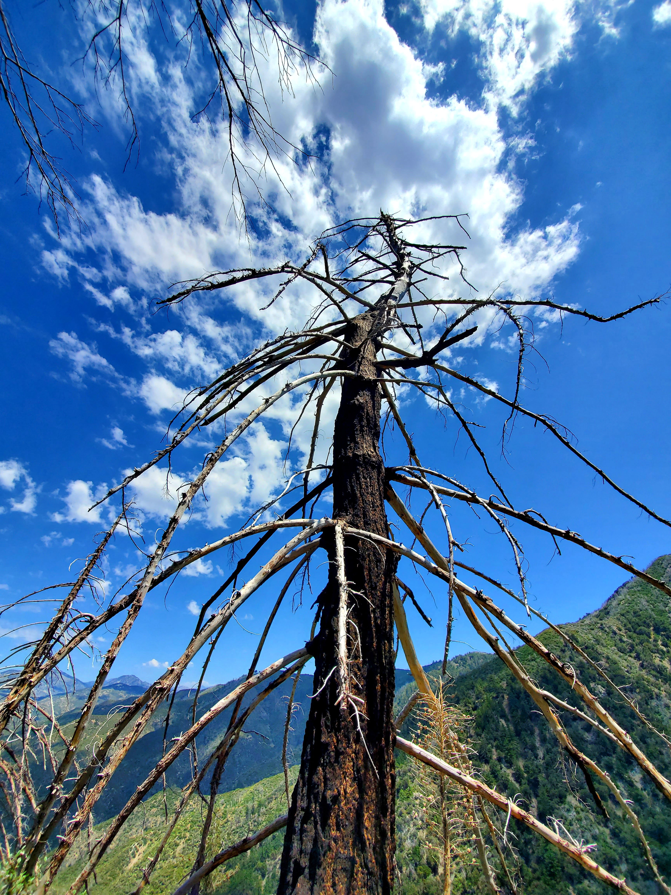
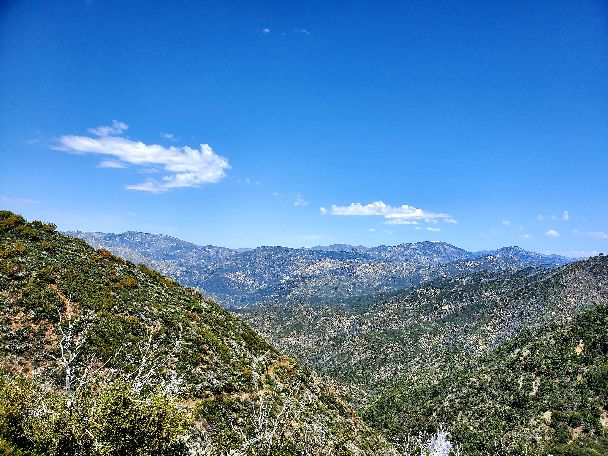
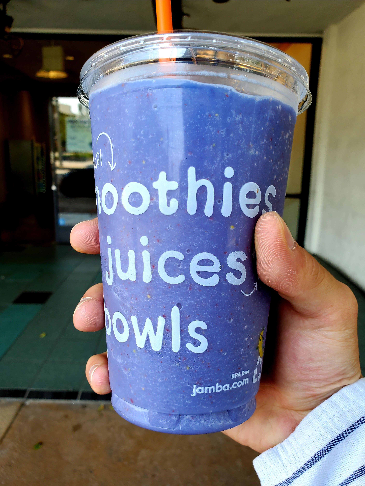

Hello! Welcome to another week of my routine of **#1hikeaweek**. The trail we are going to this week sounds very appetizing. It is none other than [Strawberry Trails](https://www.alltrails.com/trail/us/california/strawberry-peak-trail-via-redbox-canyon). 

This week, LA county has transitioned to phase 2 of reopening so the trail is open but precaution such as social distancing is still necessary.

The trail is rated as **hard** by Alltrails standard but it is not as bad as I imagine it would be. Yes, the elevation gain goes up to 1,788 feet but it is still manageable.

There are so many kinds of flowers throughout the entire trails as shown below.

<table><tr>
    <td>  </td>
    <td>  </td>
    <td>  </td>
</tr></table>

The trail reminded me of [Backbone and Mishe Mokwa Trails](https://dsboba.github.io/backbone-and-mishe-mokwa-trails/) that I did previously. It has a lot of hills and you have to be there in person to appreciate the view even more.

<table><tr>
    <td>  </td>
    <td>  </td>
    <td>  </td>
</tr></table>

<table><tr>
    <td>  </td>
    <td>  </td>
    <td>  </td>
</tr></table>

Look at the cool and the scary-looking tree with branches branching out like those we would see in a horror movie.

<table><tr>
    <td>  </td>
    <td>  </td>
    <td>  </td>
</tr></table>

Unfortunately near the branching of the road, we went to the right instead of the left so we didn't arrive at the Strawberry peak but we will save that for the future adventure. Overall, we hiked 8 miles and were thirsty so we went to [Jamba Juice](https://www.jamba.com/) to recharge our energy with a smoothie (everything tastes good when you are thirsty and hungry but in all honesty, it was good).

With that, we conclude the **#1hikeaweek**. Until next time, **บาย**!

