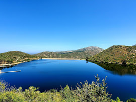
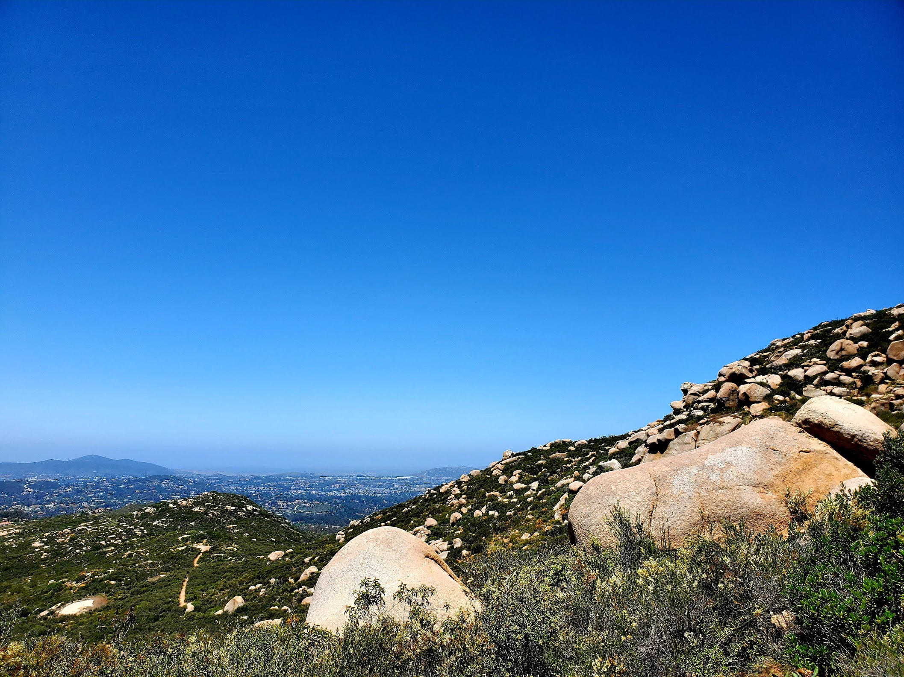
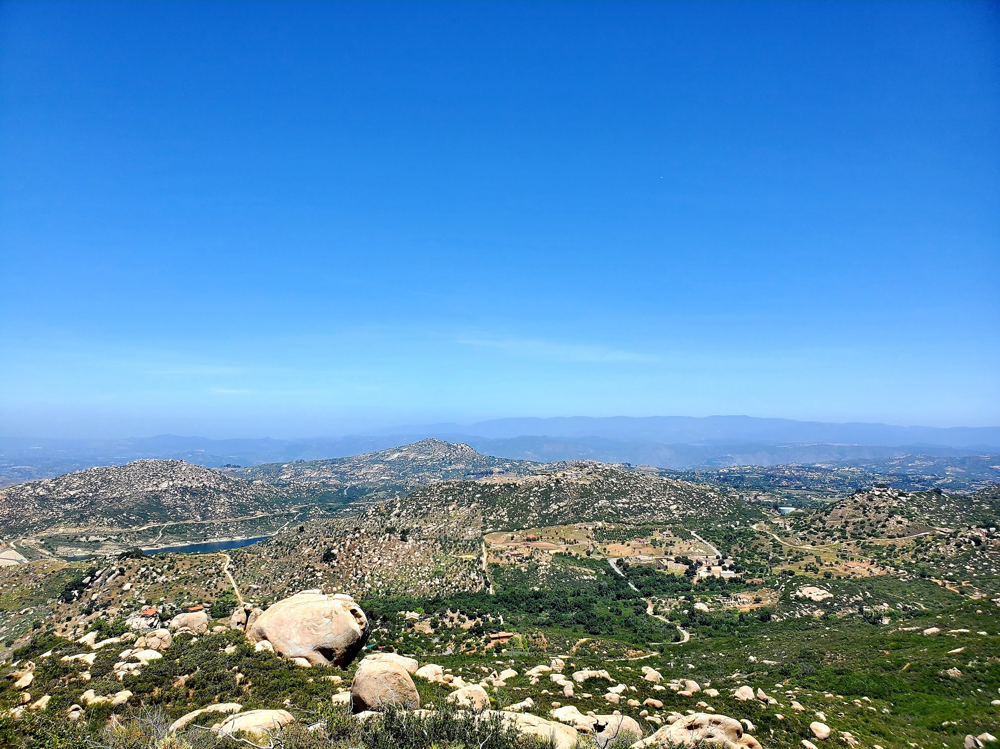
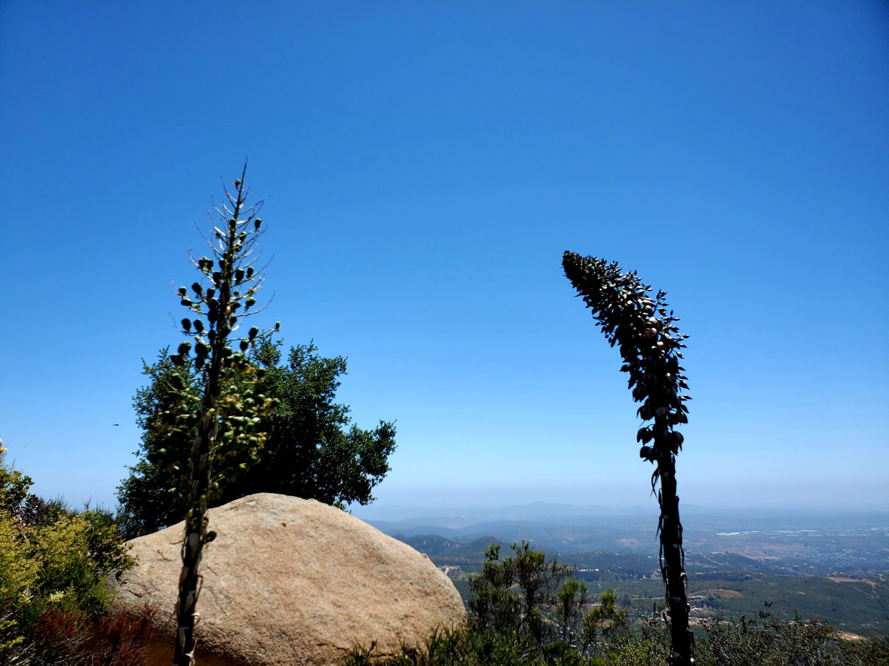
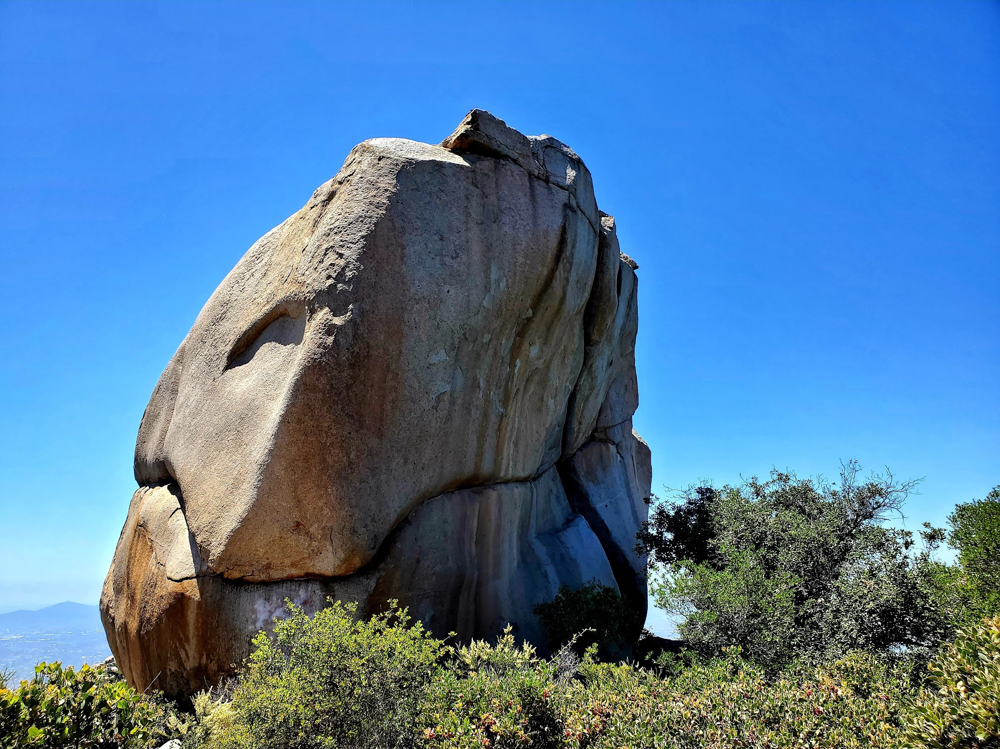
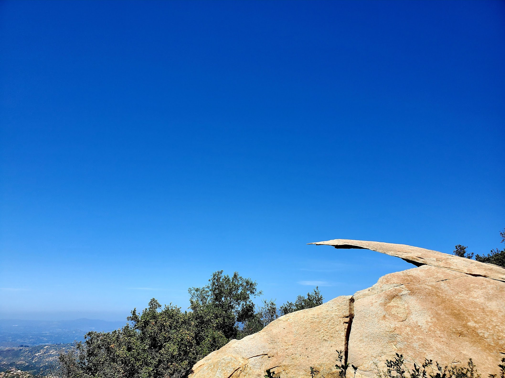
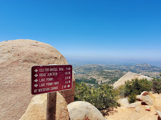
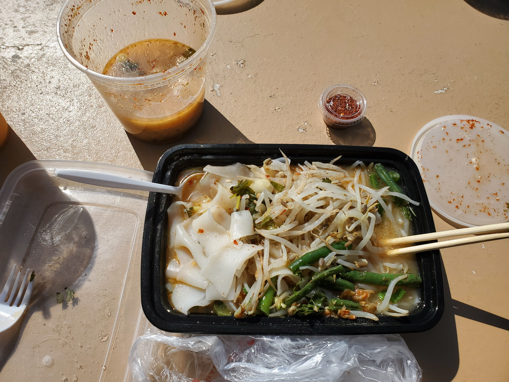

Hello! I felt like a stranger to my site - how weird is that? In case you are wondering if I stopped my routine of **#1hikeaweek**, the answer is **no**. School and work got the best of me so I didn't have time to update the site (excuses I know..).

Without further ado, let's get to it! On May 24th, my friend and I were curious about a famous place to take a picture for the gram (you know what I am saying..). The place is called Potato Chip Rock (it is 2 hours away from Santa Monica area) and there are 2 trails that lead up to the rock. With the weekly hike tradition, we took the harder and longer route via [Mt. Woodson Trail](https://www.alltrails.com/trail/us/california/potato-chip-rock-via-mt-woodson-trail).

The hike itself is ~7.6 miles out and back with 2,106 elevation gain. The elevation gain is one thing but there is literally no shade for us with the beloved sun shined upon us. A half-mile into the hike, we were greeted with the Lake Poway and it was one of the bluest lakes I have ever seen (perhaps Crater Lake in Oregon is bluer but I have yet to visit it). 

There were many occasions where my friend wanted to quit but I suggested we pressed on for that *sweet sweet* Instagram profile picture. Along the way, the view was amazing with a lot of rocks and green (when I say a lot, I truly mean it - see pictures below).

<table><tr>
    <td>  </td>
    <td>  </td>
    <td>  </td>
    <td>  </td>
</tr></table>

After hours of hiking and fully exhausted (mostly from the sun), we landed at the potato chip rock structure is located. However, it was Memorial's Day weekend so the place was super packed. A lot of people line up with the same intention as we were to take a picture at Potato Chip Rock.

<table><tr>
    <td>  </td>
    <td>  </td>
</tr></table>

With the long line and each person take 100 pictures of different poses, we decided to go back down the trail and come back to visit another day. What a better way to celebrate the strenuous hike than getting food from a Thai restaurant called [Charm Thai Kitchen](https://charmthaisd.com/). I got chicken Tom Yum soup and it was one of the best Tom Yum soup I have ever eaten thus far in the U.S. I truly recommend coming here after the tiring hike at Potato Chip (unless you take another route that is easier - just kidding).

With that, we conclude the **#1hikeaweek**. Until next time, **tạm biệt**!
