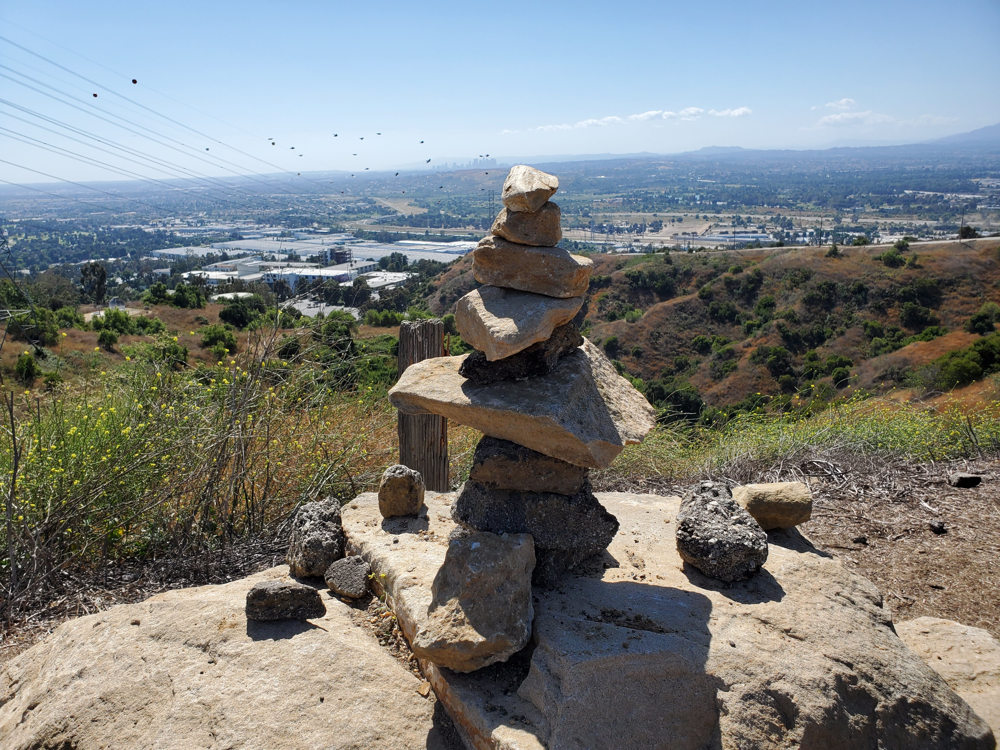
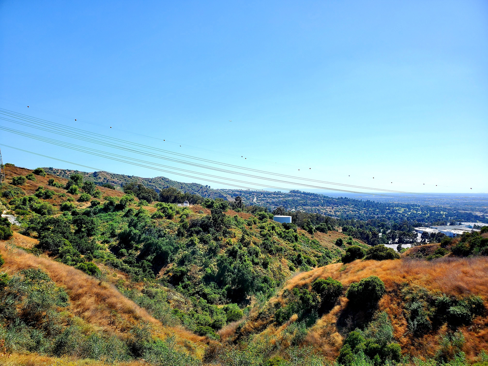
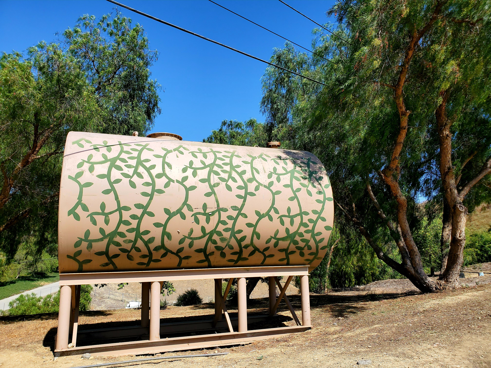
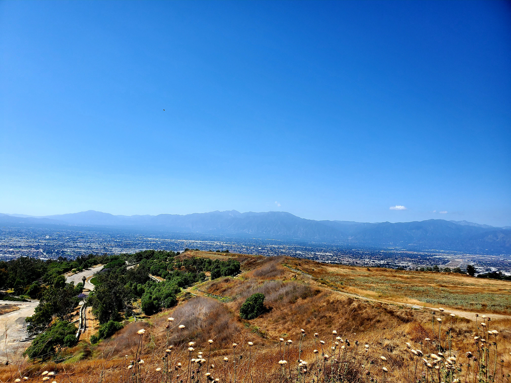
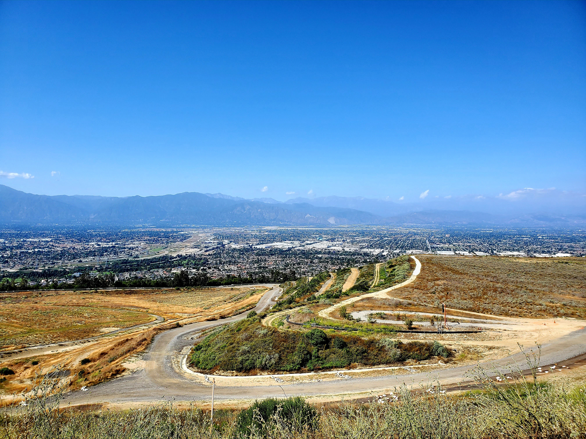
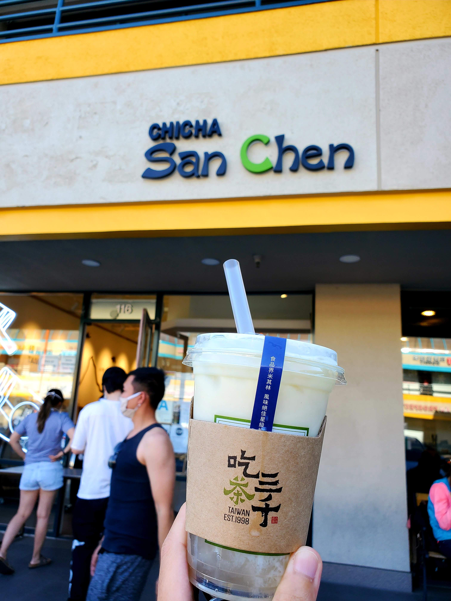

Back at it again with **#1hikeaweek**. On June 7th, my friends and I hiked at [Nike Hill](https://www.alltrails.com/trail/us/california/nike-hill). I thought this place somehow related to [Nike](https://www.nike.com/) but it is not.

It is rated as a moderate hike according to Alltrails with a length of 3.8 miles and 987 feet elevation again.

We got to see the city landscape, a factory (not sure what kind), and other miscellaneous stuff.

<table><tr>
    <td>  </td>
    <td>  </td>
    <td>  </td>
    <td>  </td>
</tr></table>

<table><tr>
    <td>  </td>
    <td>  </td>
</tr></table>

At the top of Nike hill, the view consists of the cool road landscape, the town nearby, and mountains.

After the hike, we stopped by a famous boba place called [Chicha San Chen](http://www.chichasanchensocal.com/) and got my drink there. It was one of the smoothest boba drinks I have ever had.

With that, we conclude the **#1hikeaweek**. Until next time, **ביי**!