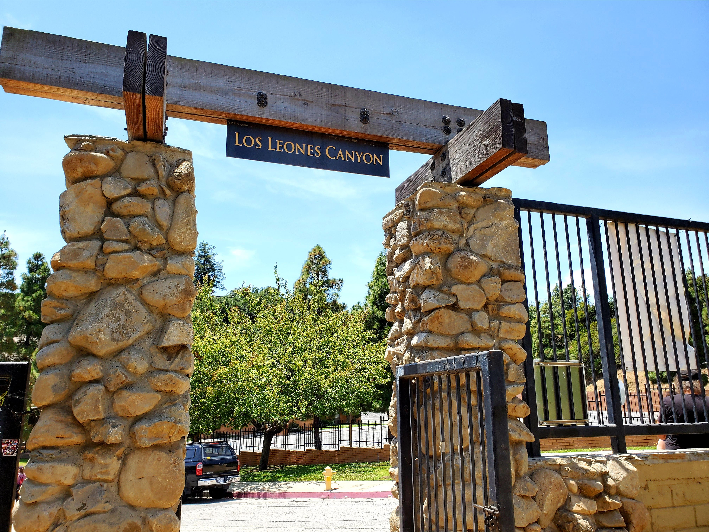
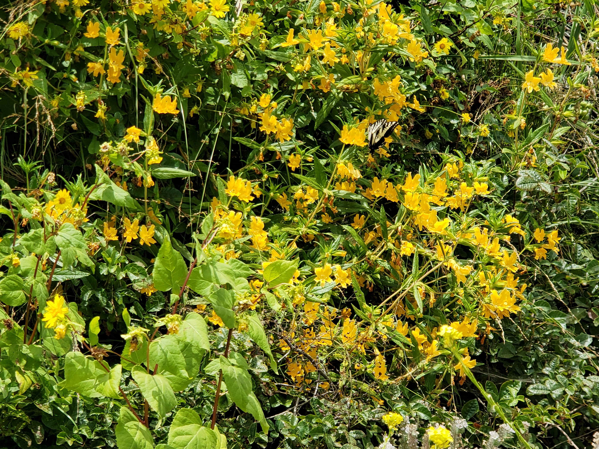
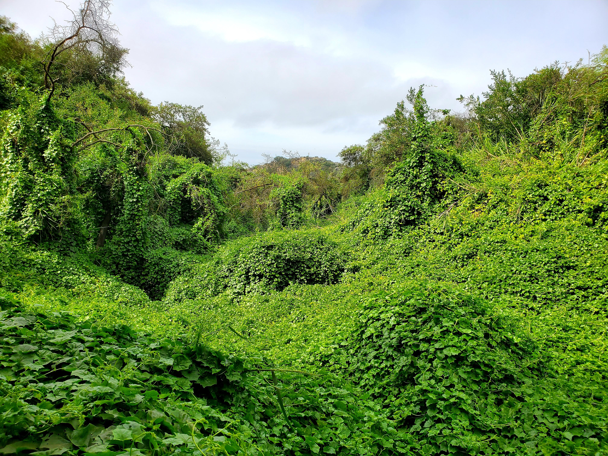
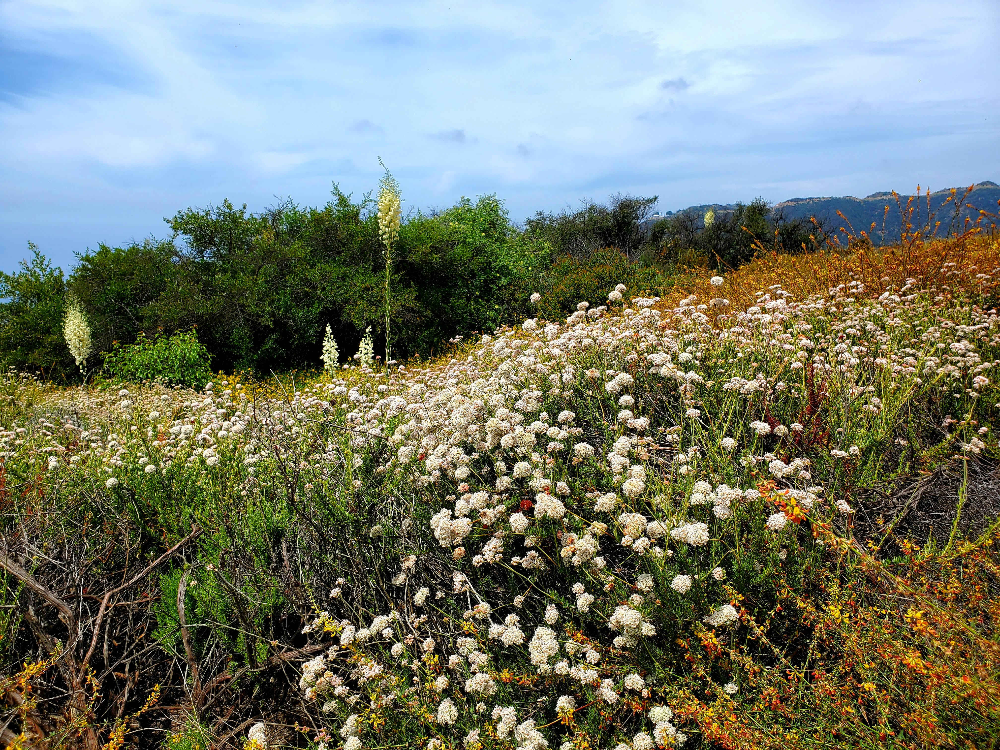
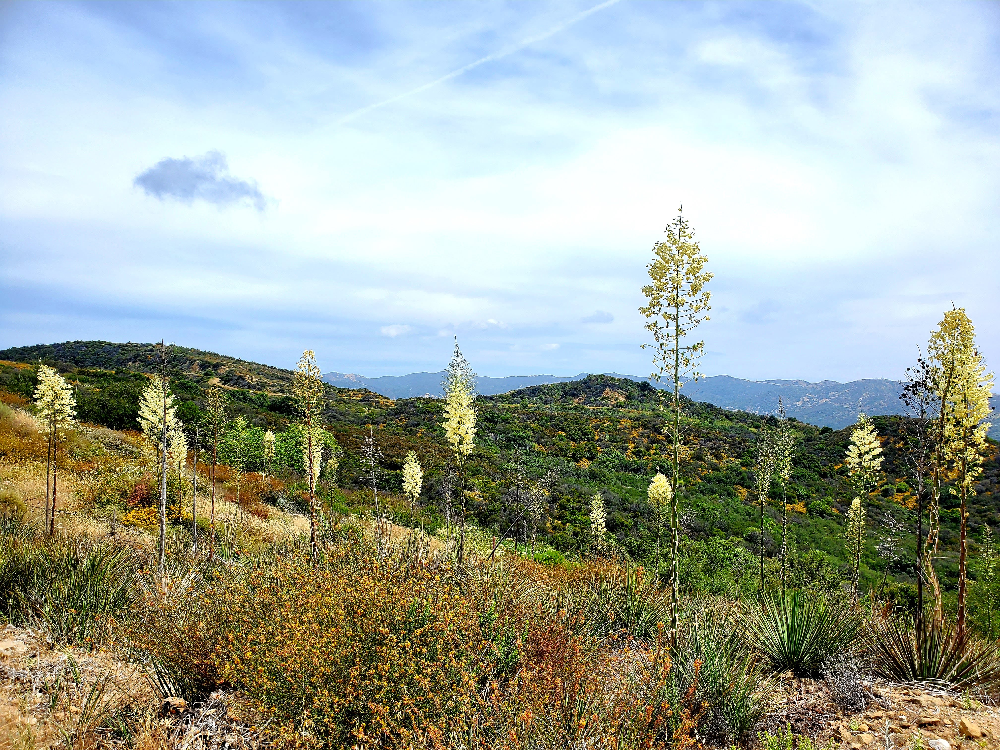
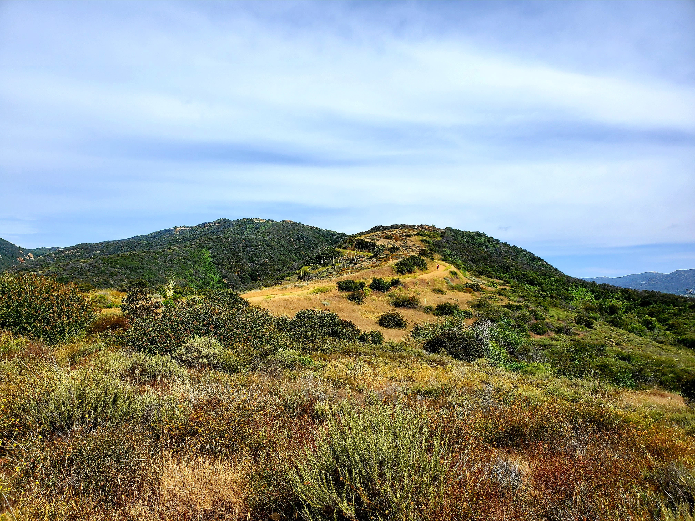
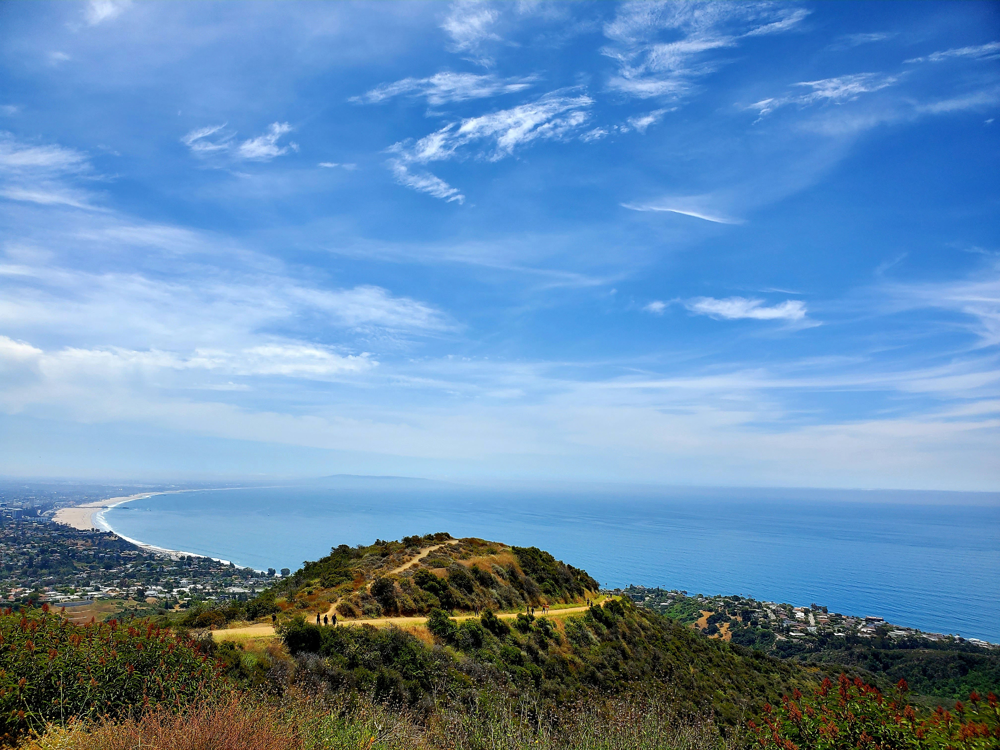
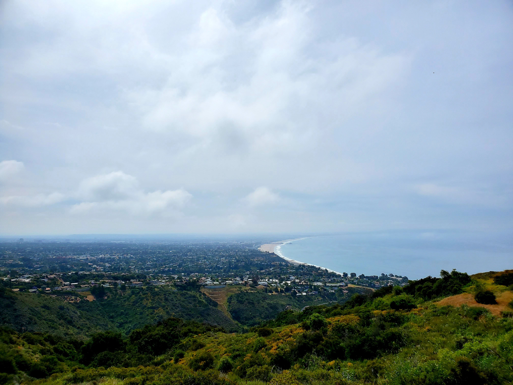

Hello again! Welcome to another week of **#1hikeaweek**. On May 31st, my friends and I (notice the plural - yes, more friends are joining me on the hike) hiked near the Topanga State Park at a place called [Parker Mesa via Los Liones Trail](https://modernhiker.com/hike/hiking-los-liones-trail-to-parker-mesa/). Phew, thanks to these friends that made the quarantine life less stressful.

Back to hike near my side of town after the tiring hike last week at Potato Chip Rock. At the start of the hike, we were greeted with a gated entrance of Los Leones Canyon.

To our surprise, this place has so many greens and flowery. To those that have been reading my blog post, you probably noticed that I took a lot of pictures of flower at the hike.

<table><tr>
    <td>  </td>
    <td>  </td>
    <td>  </td>
    <td>  </td>
</tr></table>

The trail offers a stunning view of hills upon hills.  There’s no shade, make sure to apply your sunscreen or risk getting a natural tan like me (although I don’t mind it at all).

Finally, after untrackable time spent hiking, we reached the view that we came for - Santa Monica Bay. It was worth the hike and you have to see for yourself - words can't do it justice.

<table><tr>
    <td>  </td>
    <td>  </td>
</tr></table>

With 7.3 miles roundtrip and over 1.2K of elevation gain, we are ready to head home and rest for the remaining Sunday.

With that, we conclude the **#1hikeaweek**. Until next time, **molo**!

