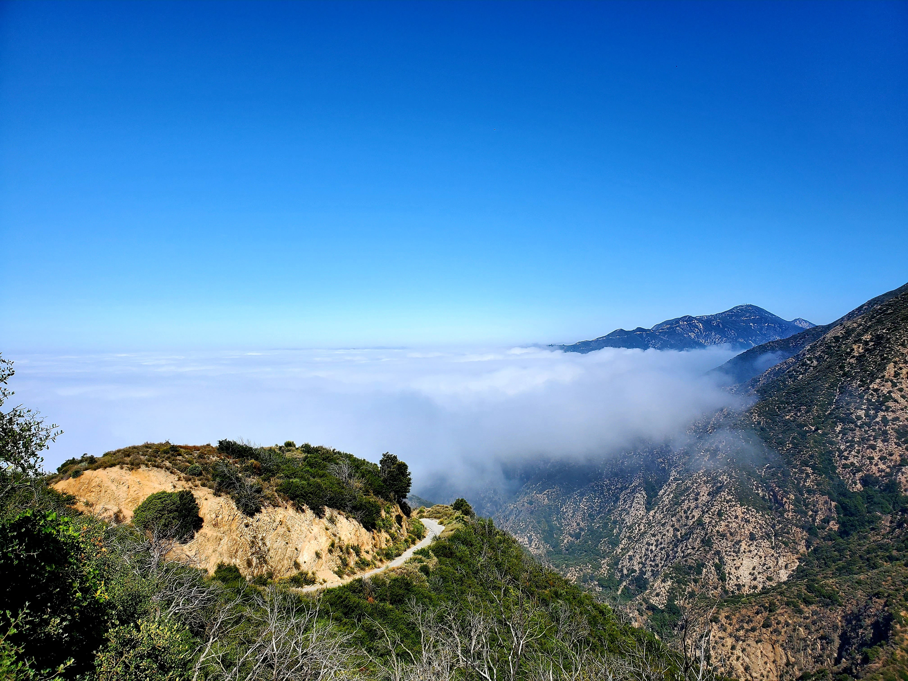
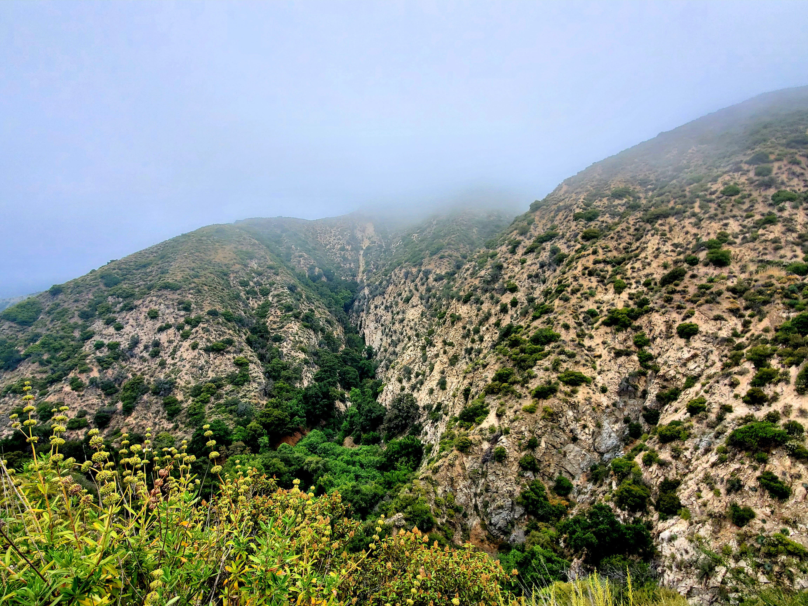
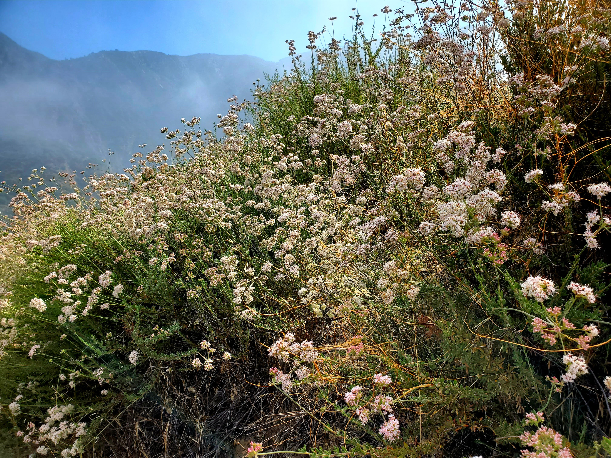
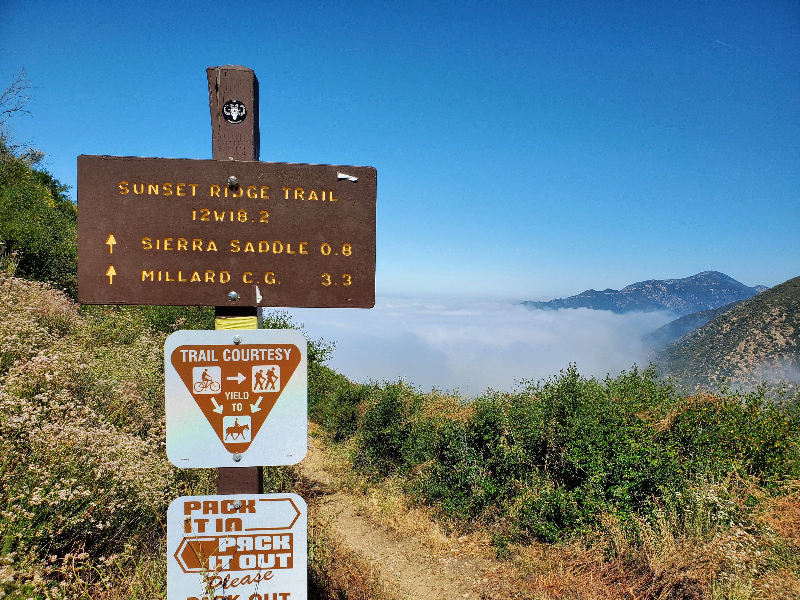
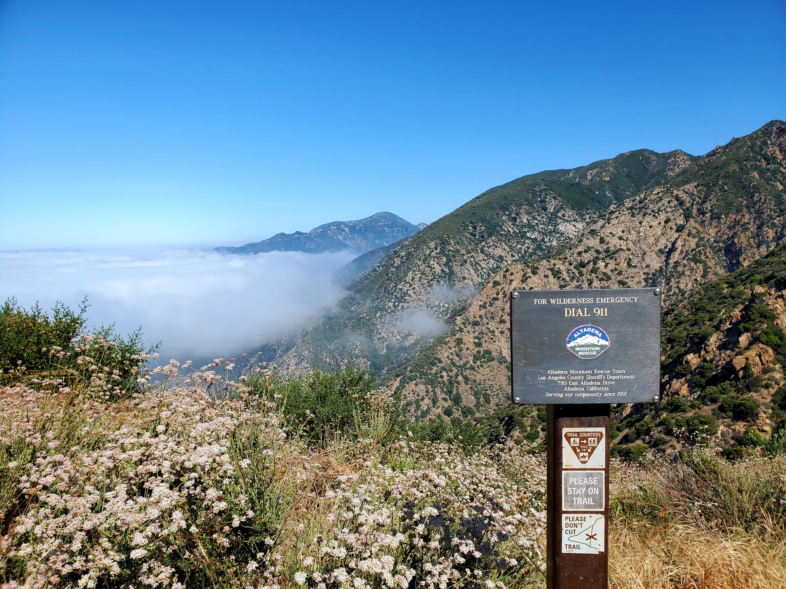
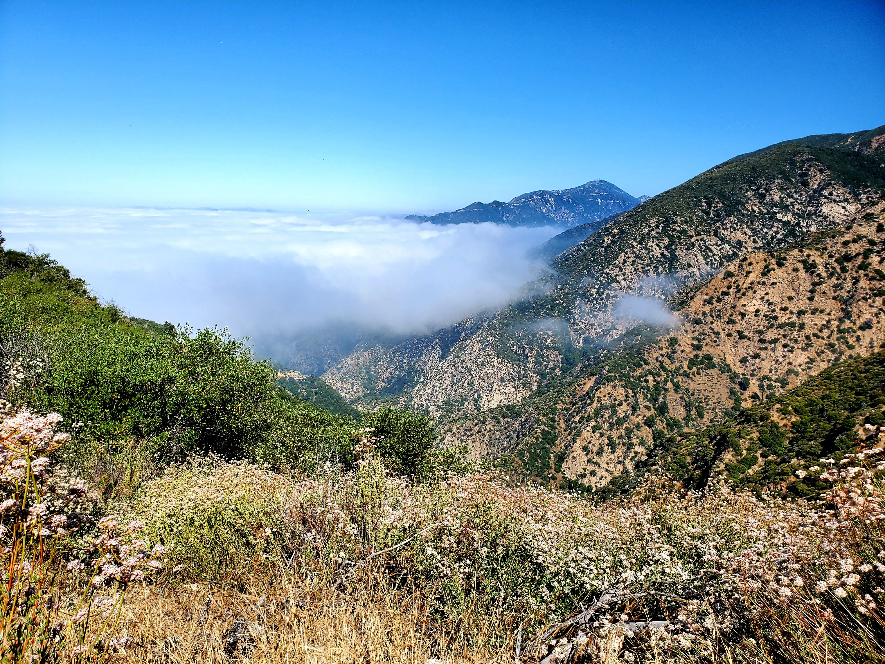
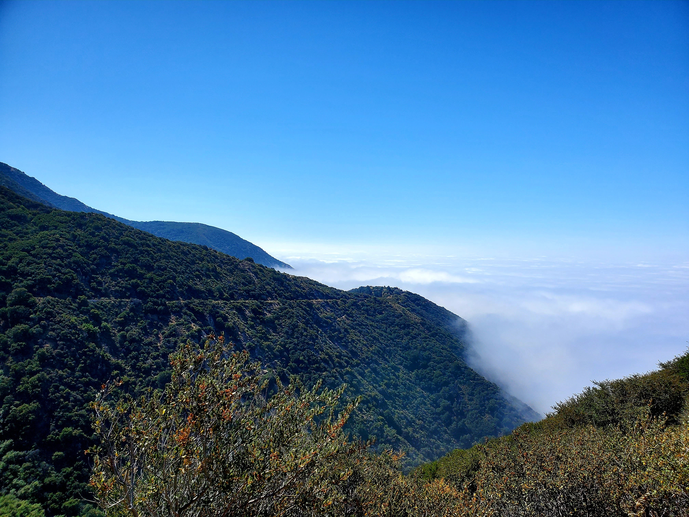
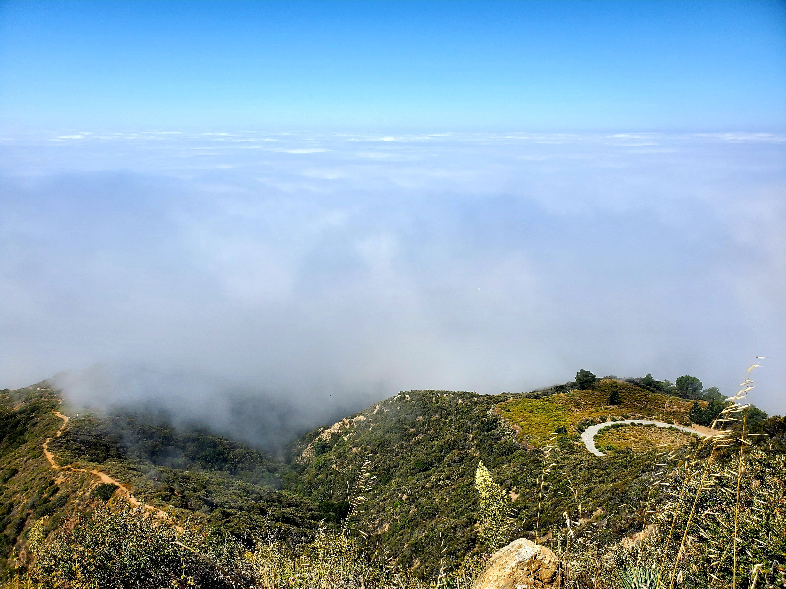

Hello again! I find it comforting to update these blogs at night (perhaps a good way to rewind about what I did for the past couple of months). Welcome to another week of **#1hikeaweek**.

On June 21st, my friends and I decided to hike the [Sunset Ridge Saddle Loop](https://www.alltrails.com/trail/us/california/sunset-ridge-saddle-loop). With how many times I referenced [Alltrails](https://www.alltrails.com/trail/us/california/sunset-ridge-saddle-loop), do I get a badge or sponsorship (**#nikesponsormepls**)?

According to Alltrails, the loop is 4.4 miles long with 1,348 ft elevation gain. I am quite sure that we got lost and ended up hiking longer than 4.4 miles for sure. 

I am known to get lost on purpose to prolong the hike 🤫. There was little to no cover but technically we stood above the cloud and with these kinds of views, I will let the sun shine upon me any day.

<table><tr>
    <td>  </td>
    <td>  </td>
    <td>  </td>
    <td>  </td>
</tr></table>

Do you see the clouds, flowers, and hills? Nature is where I can be myself. Hiking for the past 8 months has taught me several things:
* Suffer first and enjoy after (think about how hard one has to hike to reach the peak/summit to see the amazing views)
* Patience is the key to everything (I became more chill)
* Career is important but the play is much more important

It took me a while to realize the bullet point #3. Human lifespan is quite short and here is a famous quote from [Louis E. Boone](https://en.wikipedia.org/wiki/Louis_E._Boone)

> The saddest summary of a life contains three descriptions: could have, might have, and should have

Apology for the rant but my goal is to inspire others to have fun and cherish every minute of their time.

Hmm, where are we? Oh yes, the Sunset Ridge trail.. Do visit this trail because there are so many Instagram-esque pictures and views that you don't want to miss.

<table><tr>
    <td>  </td>
    <td>  </td>
    <td>  </td>
    <td>  </td>
</tr></table>

Last but not least, I saw this dude on the way down from the trails (thought I would share it with you all).

With that, we conclude the **#1hikeaweek**, Until next time, **adiaŭ**!