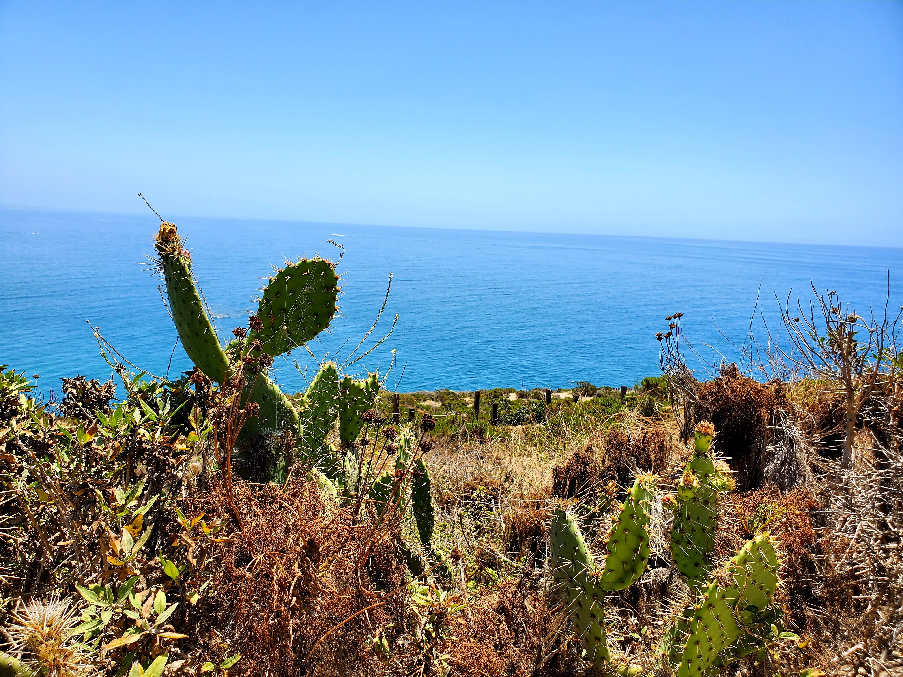

Hello all! Time for another update of **#1hikeaweek** (slowly catching up on the blogs). 

This week we went to a trail called [Escondido Falls Trail](https://www.alltrails.com/trail/us/california/escondido-falls-trail). Apparently, this hike is famous and the bonus is that there is a waterfall at the end of the hike.

The reason we chose this hike because it was the first time that my roommate joined the hike so I didn't want to scare him away.

It was relatively a chill hike and this is what I saw at the waterfall

I have heard many good things about Escondido waterfall but boy I forgot the waterfall does dry up sometimes.

You must be thinking that I am done with the hike and time to go home but the answer is no because that is just too short of a hike.

Next up, we visited [Point Dume](http://www.parks.ca.gov/?page_id=623). Again, it is a famous place with an awesome view. A lot of people were at the beach but luckily we are at high ground so there were not as many people.

<table><tr>
    <td>  </td>
    <td>  </td>
    <td>  </td>
</tr></table>

The view is amazing. Imagine closing your eyes hearing the laughter of the kids running around the beach, birds chirping, and the sound of the wave hitting the beach. I hope that I give you enough visual for you to realize that sometimes we don't have to follow the flow of the world.

Take a deep breath, close your eyes, and enjoy the moment. That's exactly what I did especially during the COVID time.

<table><tr>
    <td>  </td>
    <td>  </td>
</tr></table>

Another milestone that I reached was that I broke another record because my hair has never gotten so long. I looked like a Tarzan but the picture will be shelved for now.

With that, we conclude the **#1hikeaweek**. Until next time, **বিদায়**!

