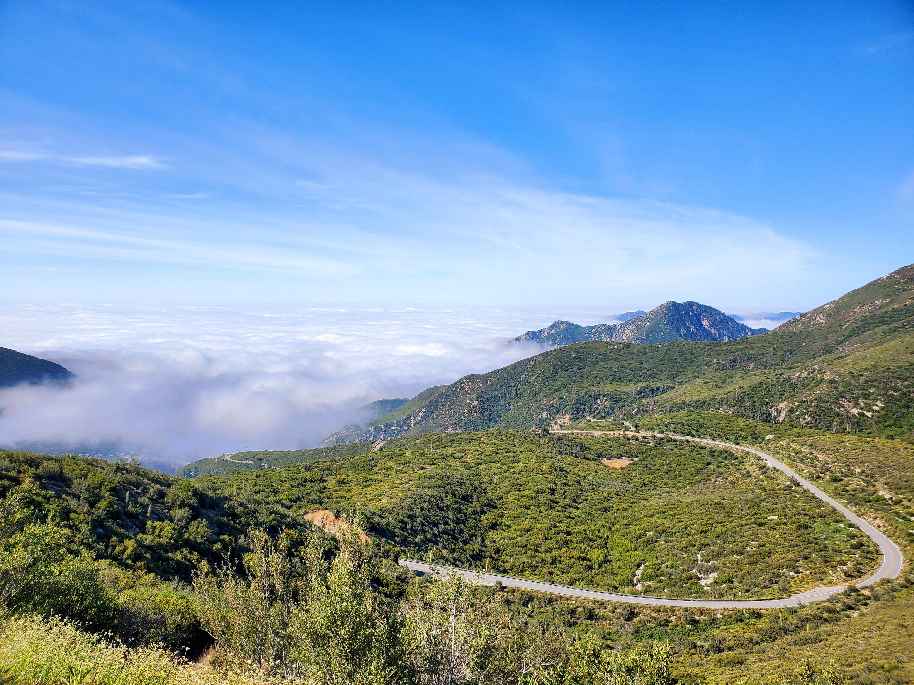
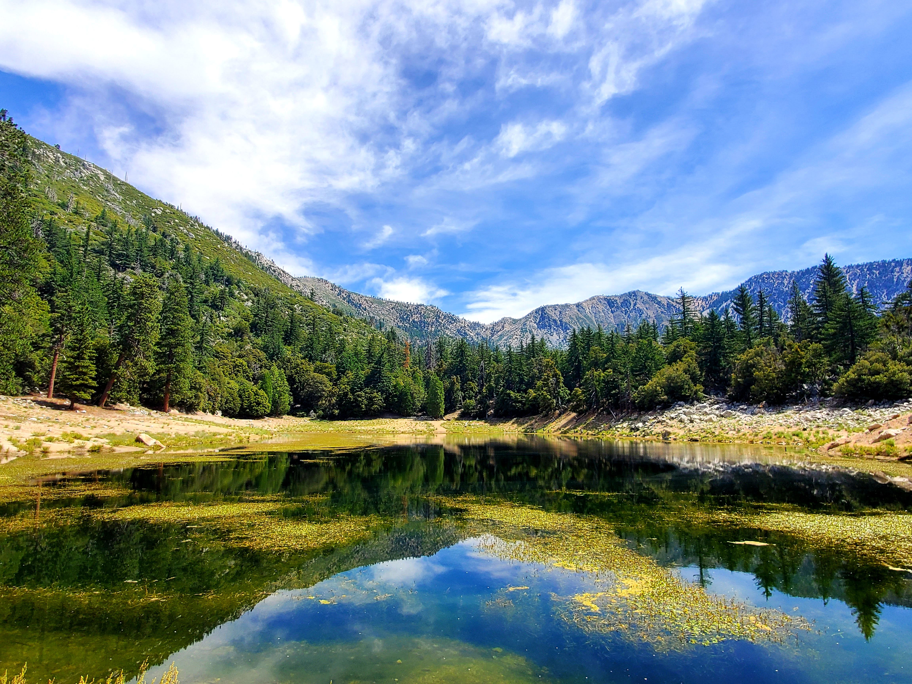

Hello, my comrades! Time to update for another week of **#1hikeaweek**. The plan for this week was to hike [Mt. Baden-Powell](https://www.alltrails.com/trail/us/california/mt-baden-powell-from-dawson-saddle), however, silly Google Maps took me to Highway 39 where the intersection to Highway 2 is closed.

No worries my friends, we were able to snap a picture near where the road is closed.

Although we couldn't hike Mt. Baden that day, we took a detour to [Lewis Falls](https://www.alltrails.com/trail/us/california/lewis-falls-trail) and [Crystal Lake](https://www.alltrails.com/trail/us/california/crystal-lake-trail).

<table><tr>
    <td>  </td>
    <td>  </td>
</tr></table>

I dipped my feet into the water at Lewis Falls and it was cold. If I brought a towel with me, I would've certainly let the waterfall fall upon my head.

By far, it was one of the biggest waterfalls that I have ever seen in the Los Angeles area. By biggest, I am referring to the amount of water.

Crystal lake is very pretty with trees and mountains on its background. It was super hot here since there is no cover at all so be sure to apply sunscreen if you come to this area.

It was a bummer that the road is closed on the route to Mt. Baden but we found two other gems.

With that, we conclude the **#1hikeaweek**. Until next time, **sveiks**!