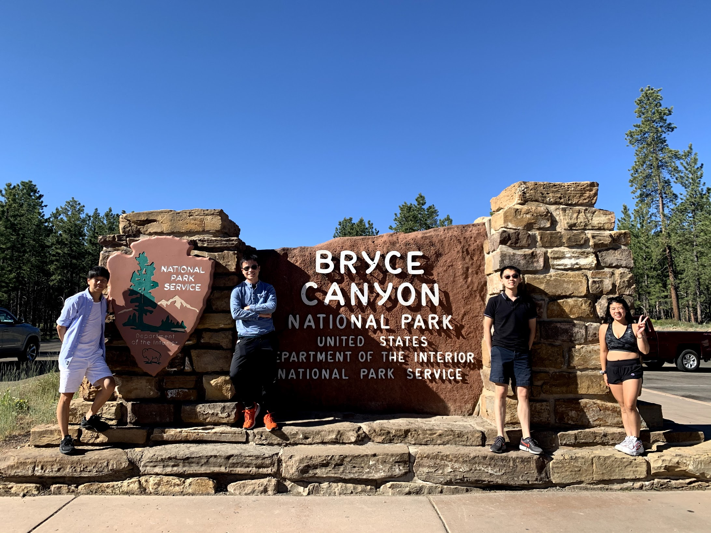

Hola, my friends! It has been a while since I updated my blogs.. I still have many posts to catch up but I will get there eventually.

I am excited to share the adventure that I did during Independence Day weekend. There is no better place than celebrating it at national parks (Zion and Bryce) and Las Vegas.

If my memory served me right, we started driving on Friday evening and arrived at our Airbnb around 2 AM but wait, we are going to hike in an hour (oh boy, we are so dead).

The plan is to hike Angels Landing at Zion National Parks and here are several views on the way there.

<table><tr>
    <td>  </td>
    <td>  </td>
    <td>  </td>
</tr></table>

With the famous hike (Angels Landing) closed due to Covid, we decided to go to an overlook that is at a higher elevation compared to the Angels Landing and it was awesome.

We ended the hike at around 1PM. You must be thinking that we probably wrapped up for the day since we slept for 1 hour but nope, here goes another hike at the Narrows.

Although we didn't have time to finish the entire hike, we pat ourselves on the back knowing that we had a lack of sleep but still going all out enjoying the national parks.

After getting some sleep that night, we set out to Bryce National Parks on the following day. I was blown away by the formation and the color of the landscape.

<table><tr>
    <td>  </td>
    <td>  </td>
    <td>  </td>
    <td>  </td>
</tr></table>

On the following day, we visited Last Vegas on the way back. It was a bit hot but feeling the different vibe.

With action packed weekend, we headed home recharged and ready for our next trip. Until next time, **до побачення**!

