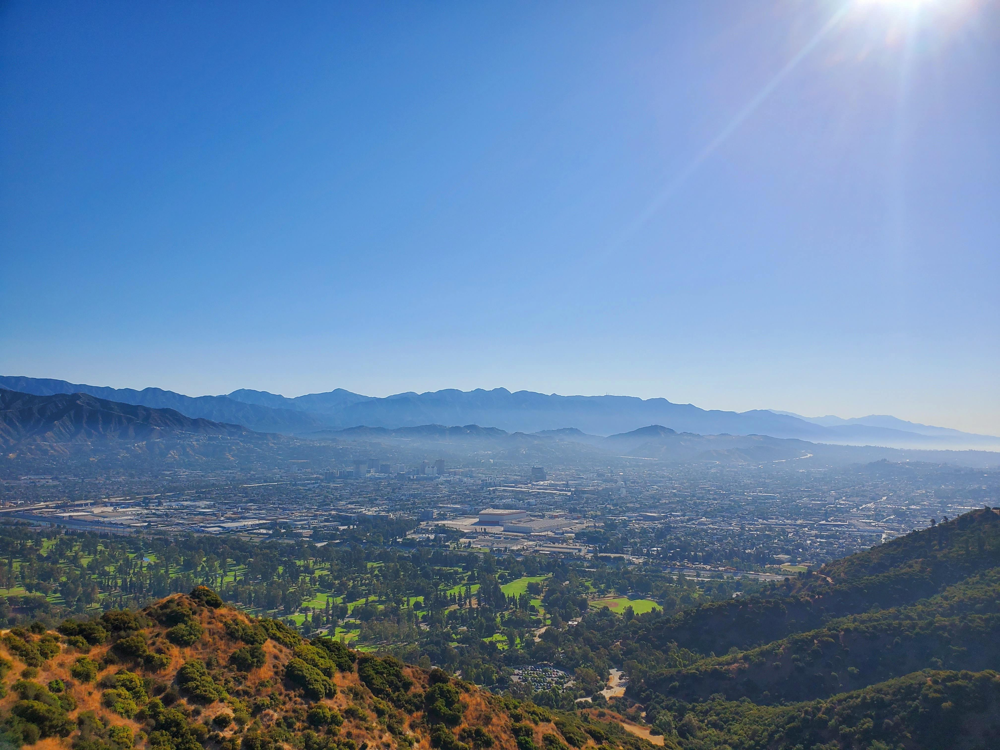
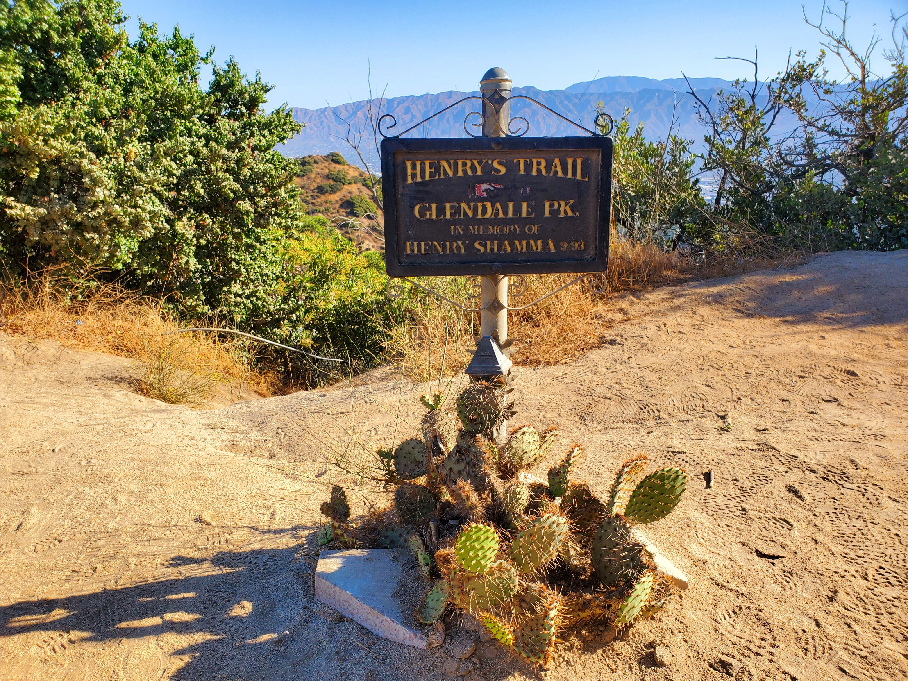
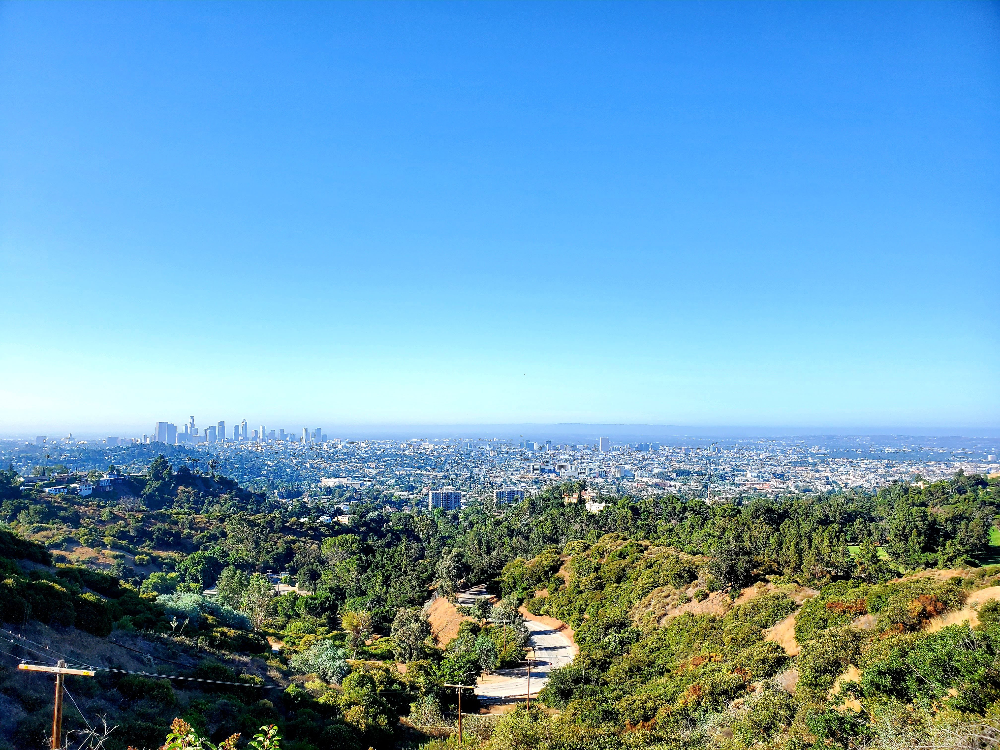
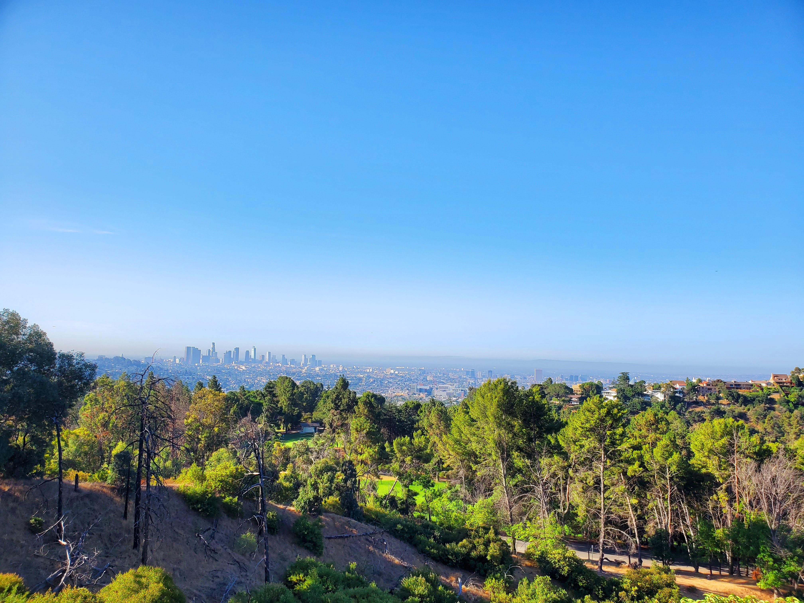
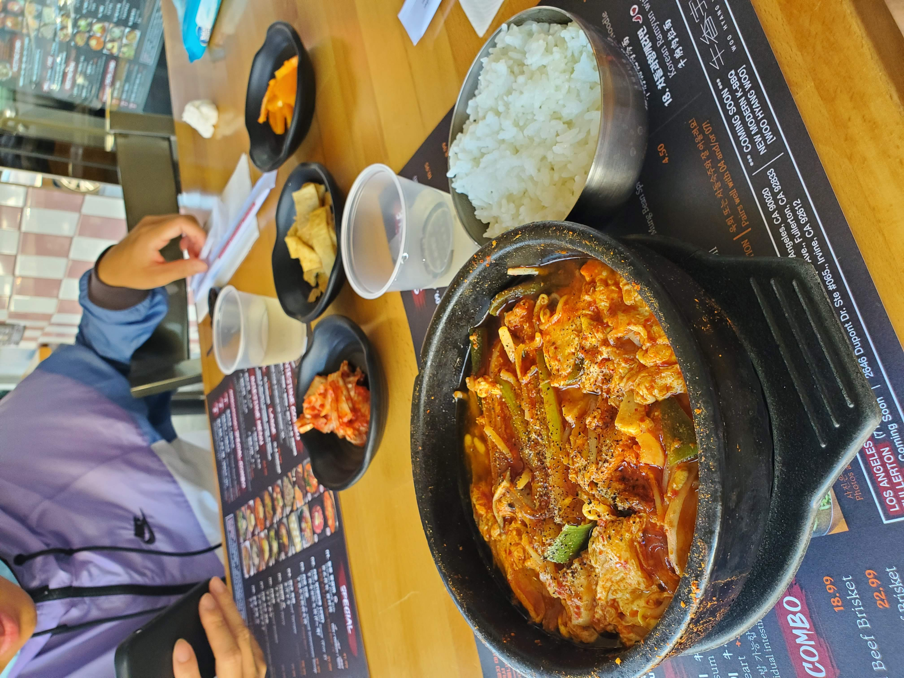

Hello friends, trying to add an update with new posts. Another chill hike and weekend at [Glendale Peak Trail](https://www.alltrails.com/trail/us/california/glendale-peak-trail).

Contrary to other hikes that I did, I would consider this hike to be somewhat chill since it was 3.6 miles in length with 833 ft elevation gain.

As expected, there were more people in this hike compared to the other hikes that I did since it is near Griffith Park. However, that didn't discourage me from going since the view is awesome.

<table><tr>
    <td>  </td>
    <td>  </td>
    <td>  </td>
    <td>  </td>
</tr></table>

After soaking in all of the views and air, my friends and I headed to [Chadolpoong](https://www.yelp.com/biz/chadolpoong-los-angeles-2) in Koreatown to pump back the calories we have burned.

In case you are wondering, yes the restaurant is open for to-go orders and outside dining. The owner was nice enough to talk to us and gave us a free drink - ahem I mean soft drink.

That concludes the adventure and until next time, **Чао**!
