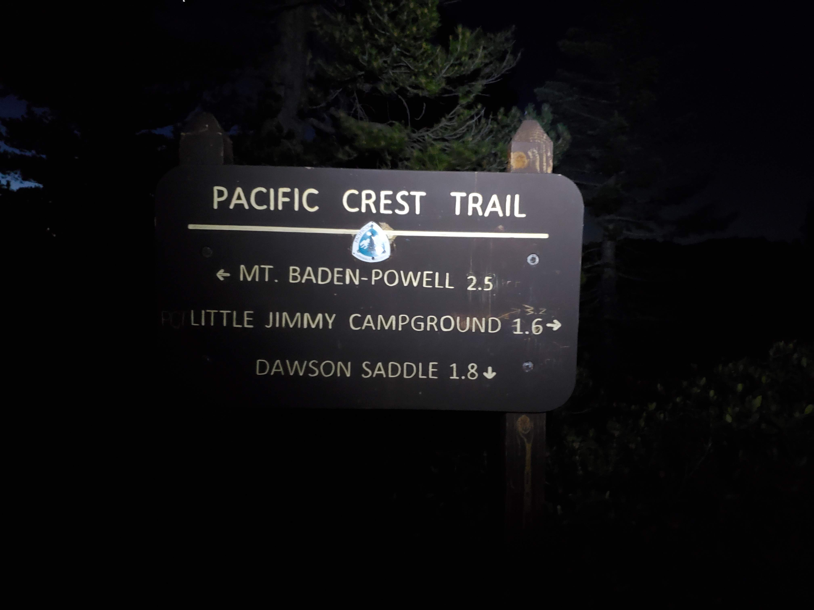

Hello friends, another update here (still has many posts to add but eventually I will get there). Let's get down to the business, shall we?

My ex-roommates and I decided to go on this hike at [Mt. Baden-Powell](https://www.alltrails.com/trail/us/california/mt-baden-powell-from-dawson-saddle) from Dawson Saddle. According to Alltrails, it is 9.9 miles out and back with 2,696 ft. elevation gain.

There are several peaks such as Throop Peak and Burnham Peak that you can check out along the hike. We started our hike around 3:00AM because the goal is to catch the sunrise but also arrive home on time for work (I am crazy but boy it was worth it).

We hiked with headlamp on since it was pitch dark and we saw the Pacific Crest Trail after hiking for a while.

If you do come to this hike, I do recommend to bring the following:
* Headlamp (if you hike in the early morning)
* Plenty of water (I mean it!!)
* Hiking poles (you can do it without but it is nice support)

Here are the pictures of sunrise slowly settling in from the pitch dark sky to bright sky.

<table><tr>
    <td>  </td>
    <td>  </td>
    <td>  </td>
    <td>  </td>
</tr></table>

The last part of the hike to the Mt. Baden Powell summit was not easy due to the sudden elevation gain. With these kinds of views at the summit, anyone will forget the pain that they had to endure to get up there.

<table><tr>
    <td>  </td>
    <td>  </td>
</tr></table>

I hope you enjoy reading this post because this is easily one of the best hikes that I did in Los Angeles. Unfortunately, it will be closed until April 2022 due to the Bobcat Fire. I truly hope you will check out this place if it opens up again.

That concludes the adventure and until next time, **ցտեսություն**!
