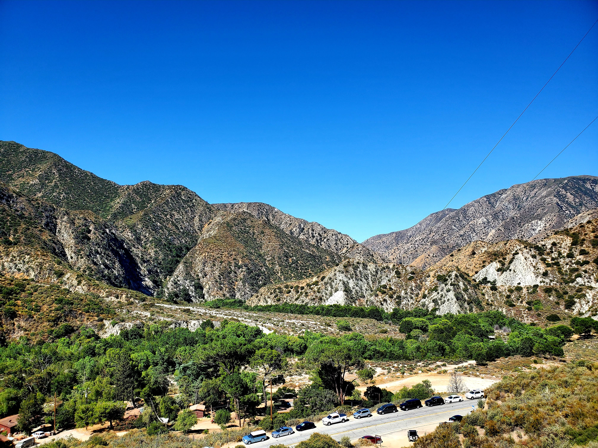
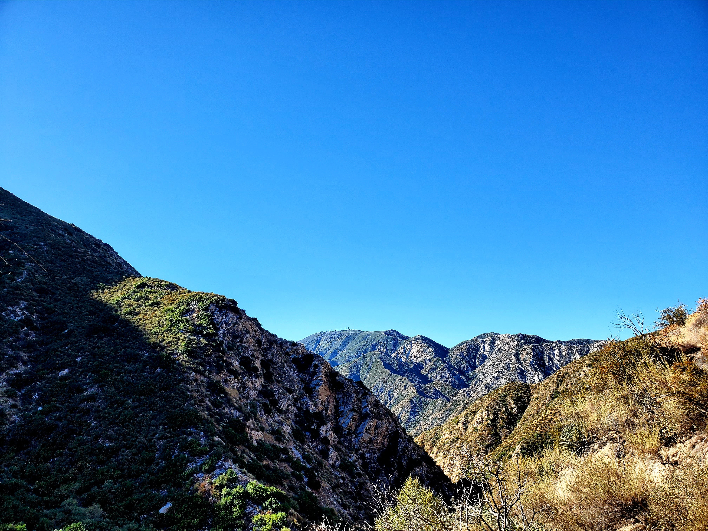
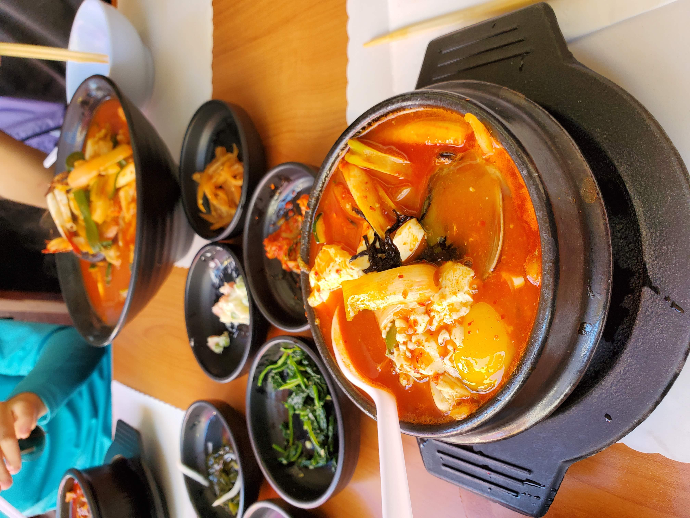
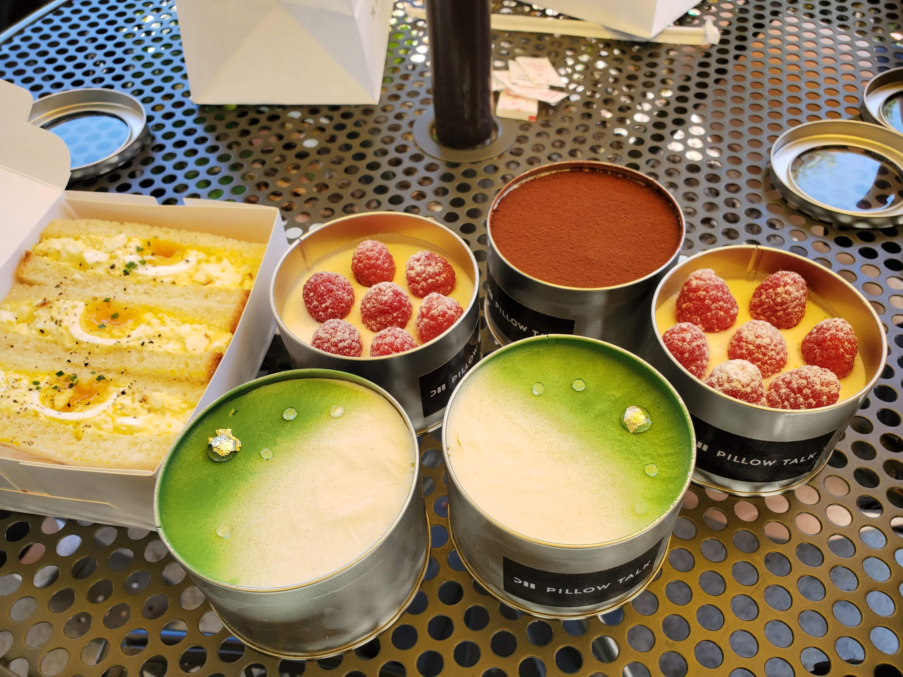

Woohoo! The school for this semester is over and I finally can start updating the blog again.

This hike was done back in mid July at [Trail Canyon Falls](https://www.alltrails.com/trail/us/california/trail-canyon-falls) in Angeles National Forest. There are many trails in this national forest to explore - I highly recommend going on any long hike around this area.

According to Alltrails, it is 4.8 miles out and back with 1,053 ft. elevation gain. The viewpoint is certainly the trails canyon falls.

At the beginning of the trails, we were greeted with an awesome view of the canyons and the street as seen below.

Throughout the hike, you will see all of the canyons surrounding you from a different angle which was refreshing. To some, it might be boring but isn't it awesome how the canyon/mountain can be structured the way it looks?

After some struggles, we arrived at the waterfall. To our surprise - it was too dry of a waterfall for our taste…

However, we made up for it at a Korean restaurant near Koreatown called [Yangji Gamjatang](https://www.yelp.com/biz/yangji-gamjatang-los-angeles-2) and follow up with dessert [Pillow Talk](https://www.yelp.com/biz/pillow-talk-pasadena-2) in Pasadena.

<table><tr>
    <td>  </td>
    <td>  </td>
</tr></table>

I highly recommend supporting the local business if you can especially during this time where Covid impacted a lot of local business.

Special mention to the dessert at Pillow Talk - It is very unique and quite famous from what I heard from my friends in the Bay area.

With that, we wrapped up the hike and ended up putting more calories into our bodies than what was burned.

That concludes the adventure and until next time, **la revedere**!
