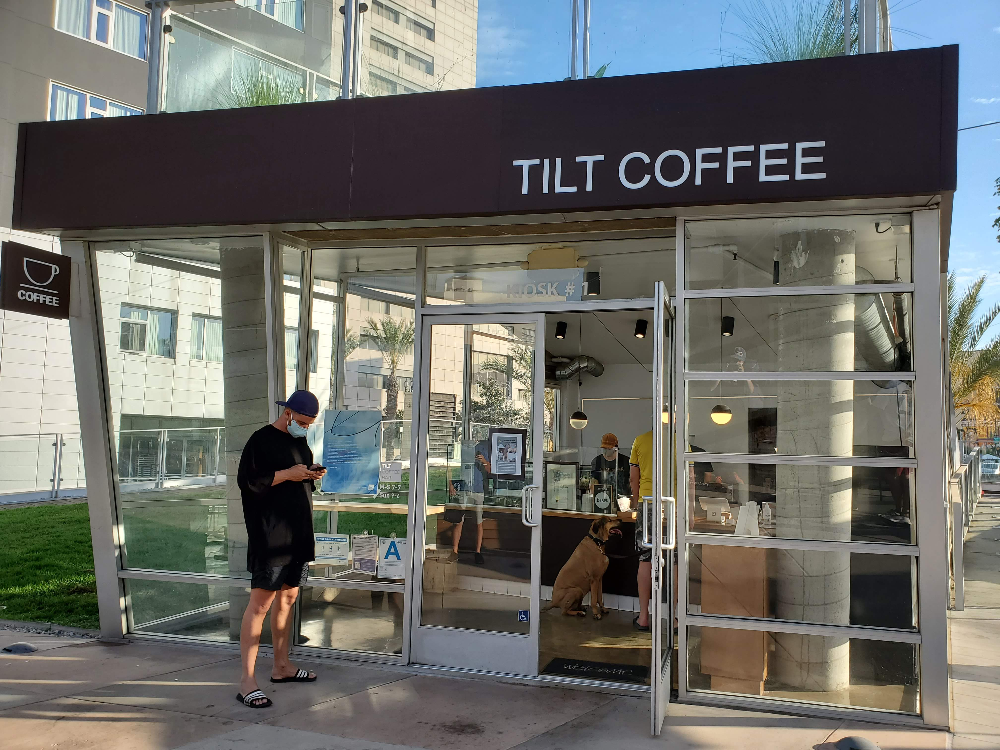
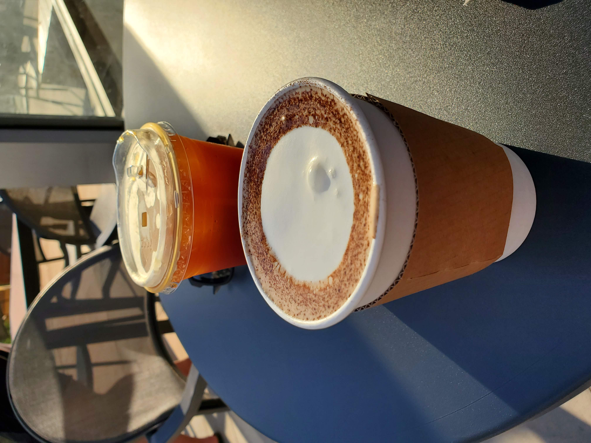
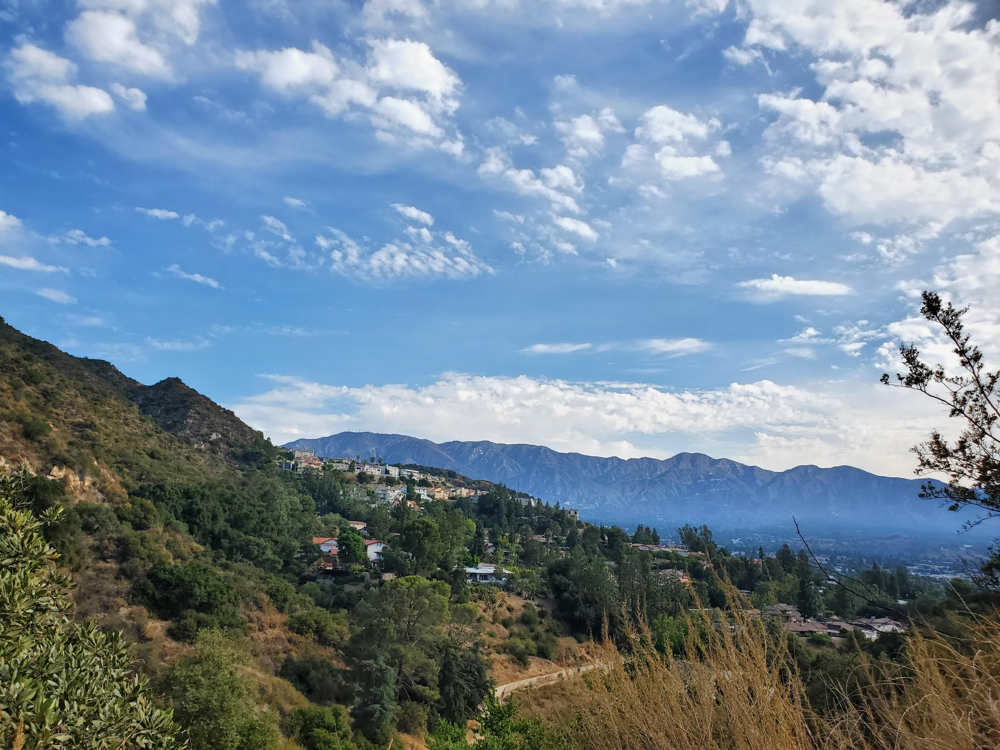
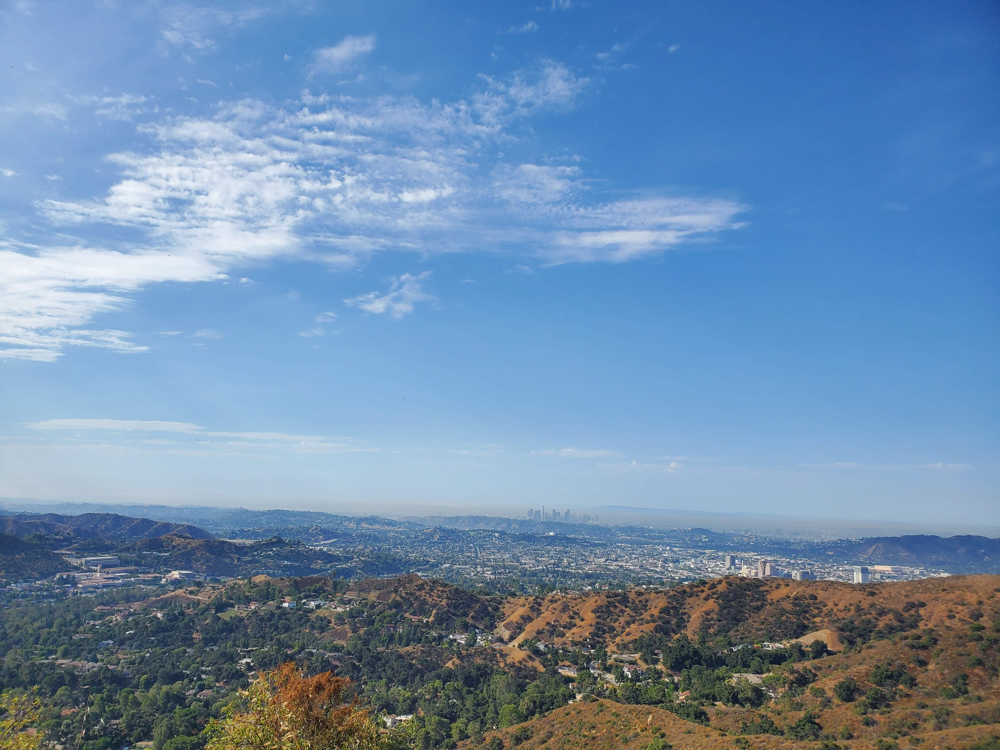
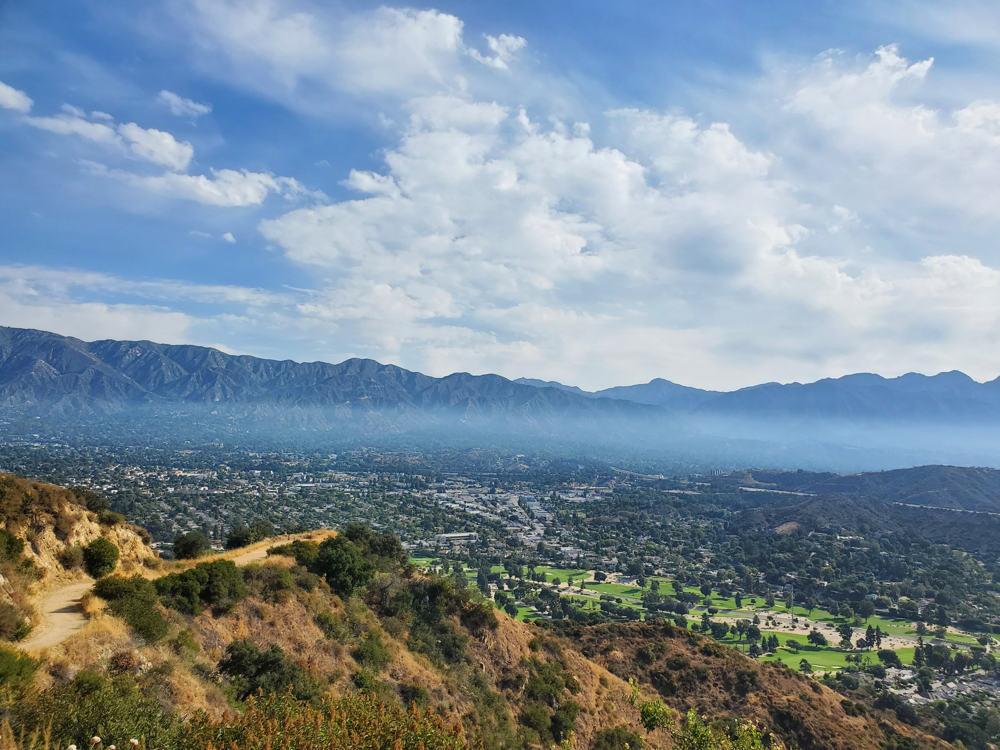
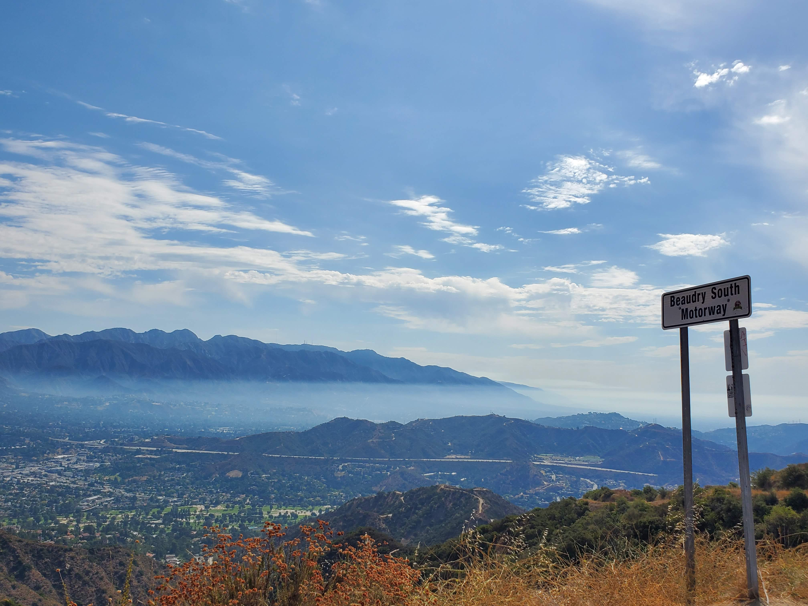
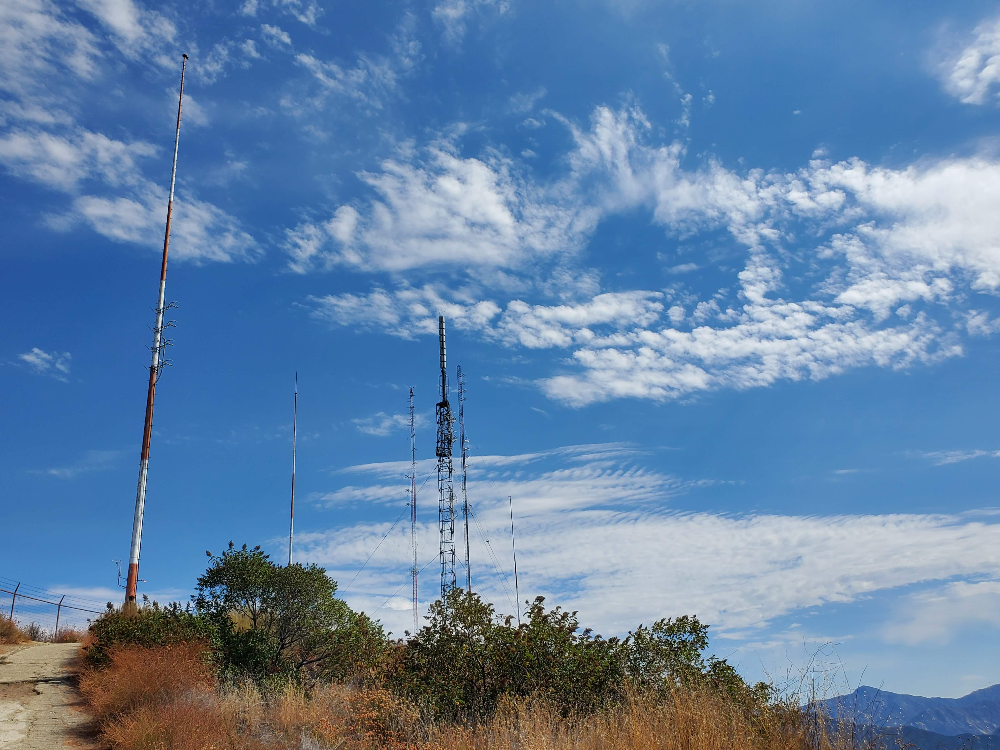
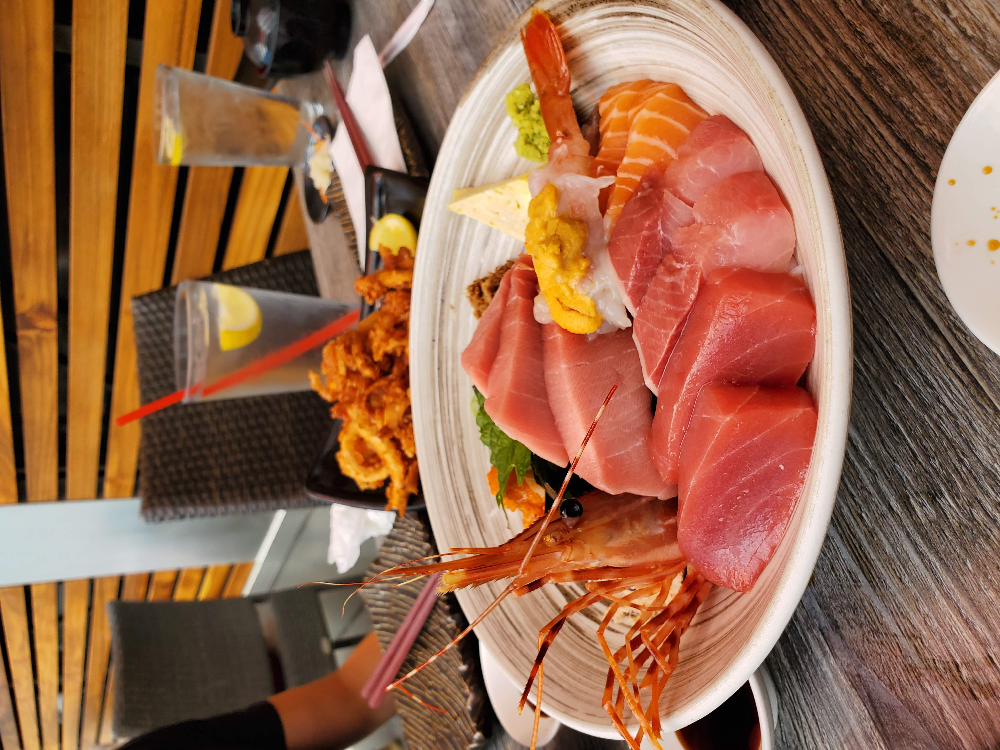
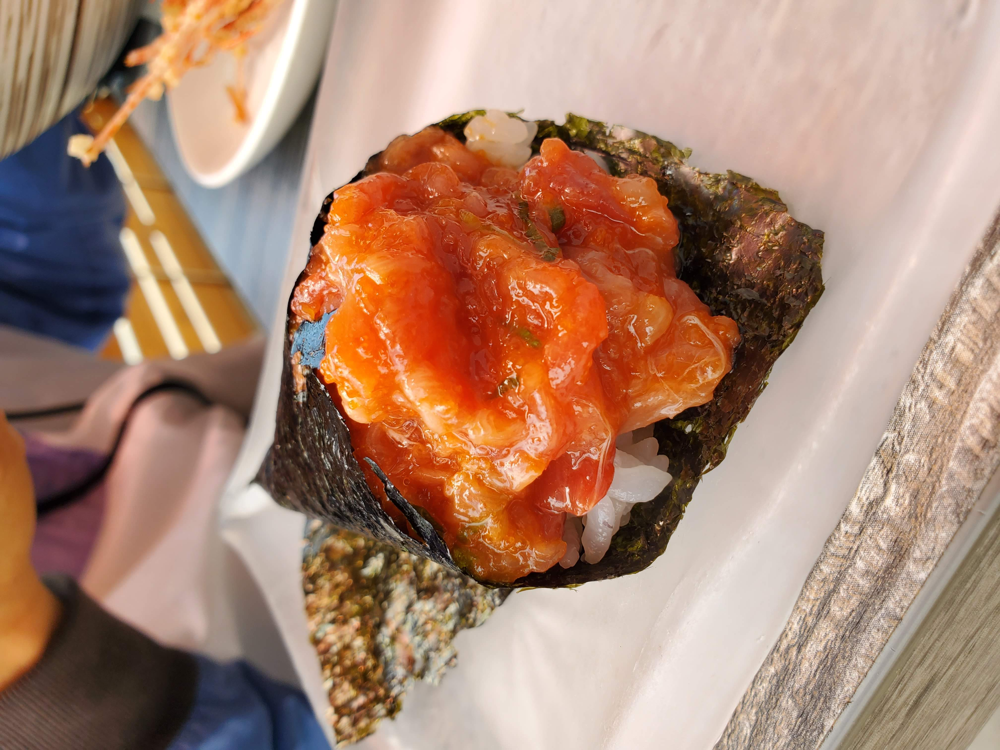
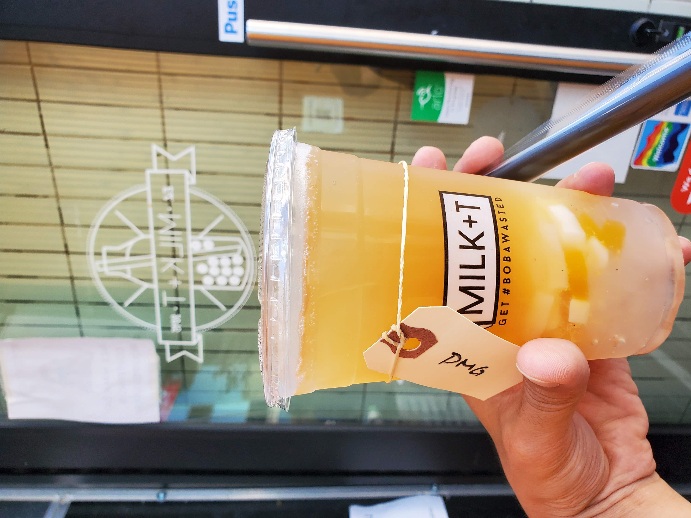

Hello! Another hike with coworkers but we turned it up a notch to hike at [Beaudry Loop](https://www.alltrails.com/trail/us/california/beaudry-loop). The length is 5.5 miles with 1515ft elevation gain and this place has little to no cover.

Before the hike, we pump some fuel into our bodies at [Tilt Coffee Bar](https://www.tiltcoffeebar.com/). Make sure to get their Cloud Mocha/Latte, this place has one of the most unique and delicious drink.

<table><tr>
    <td>  </td>
    <td>  </td>
</tr></table>

Now onto the hike, it was a hot day (make sure to check the weather, apply a lot of sunscreens, and bring lots of water). Although the elevation gain is relatively high compared to the length of the mile, the view along the way was mesmerizing.

<table><tr>
    <td>  </td>
    <td>  </td>
    <td>  </td>
</tr></table>

Throughout the hike, we can see the view of the mountain and the city which was a nice mix. Is this place used to be a motorway? It has a satellite structure too which was pretty cool. It was so hot that we take a break whenever a shade is spotted.

<table><tr>
    <td>  </td>
    <td>  </td>
</tr></table>

With a long and arduous hike, we had to award ourselves with delicacy at [Ootoro](https://www.yelp.com/biz/ootoro-little-tokyo-los-angeles). Time to have some sushi!

<table><tr>
    <td>  </td>
    <td>  </td>
</tr></table>

If you visit Ootoro, I highly recommend getting anything that is fatty tuna related and I love spicy tuna hand roll.

We can't just end our adventure there so we topped it off with a fruit tea at a boba shop called [Milk + Tea](https://www.yelp.com/biz/milk-t-los-angeles-3). The cool thing about this place is that you can get unlimited topping and you get to keep the cup.

With that, we concluded our hike. Until next time!
