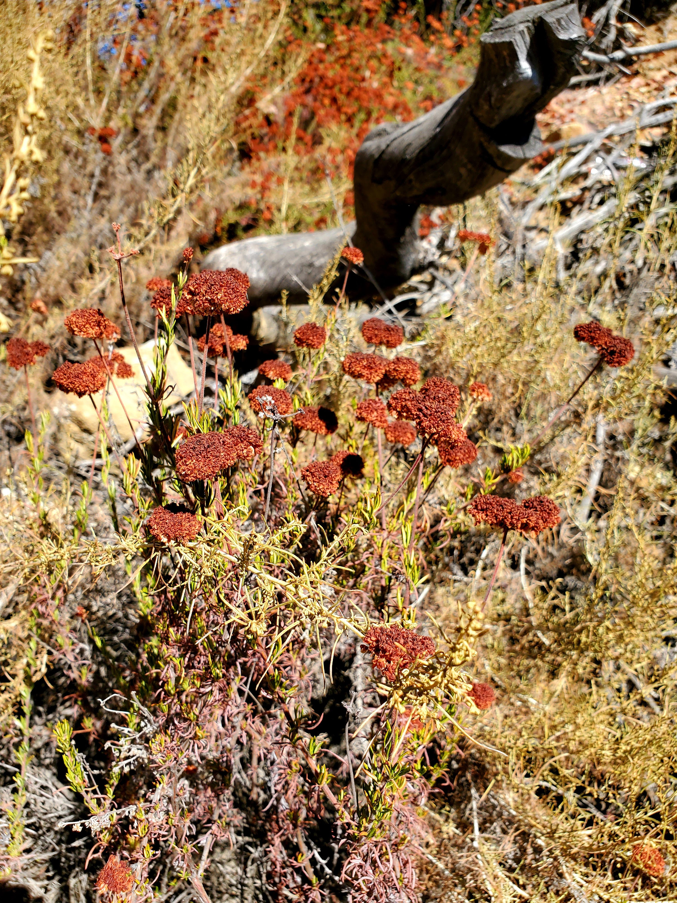

Hello again! This is the second hike in a week (see the hike the day before at [Runyon Canyon](https://dsboba.github.io/runyon-canyon/)).

The hike is at the Santa Monica mountain area at Topanga state park called [Caballero Canyon](https://www.alltrails.com/trail/us/california/caballero-canyon-trail). The length of the hike is 5.1 miles with 977ft elevation gain.

I love to hike around Malibu and Santa Monica mountain area because the view is the best. It wouldn't be a canyon hike without pictures of the canyon right?

<table><tr>
    <td>  </td>
    <td>  </td>
    <td>  </td>
</tr></table>

Everything is picture-worthy here - even the flower looks so cool!

<table><tr>
    <td>  </td>
    <td>  </td>
</tr></table>

Looping back from the hike - I spotted the terrain of the lake, green, and houses that was amazing. When I say that the hike around here has a nice view, I wasn't kidding.

Here is the sign at the end of the hike.

We finished it off by visiting a local acai store called [Ubatuba](https://ubatubaacai.com/). Something healthy once in a while is good and it was super refreshing during a hot day.

With that, we conclude the hike for this week. Bye for now!
