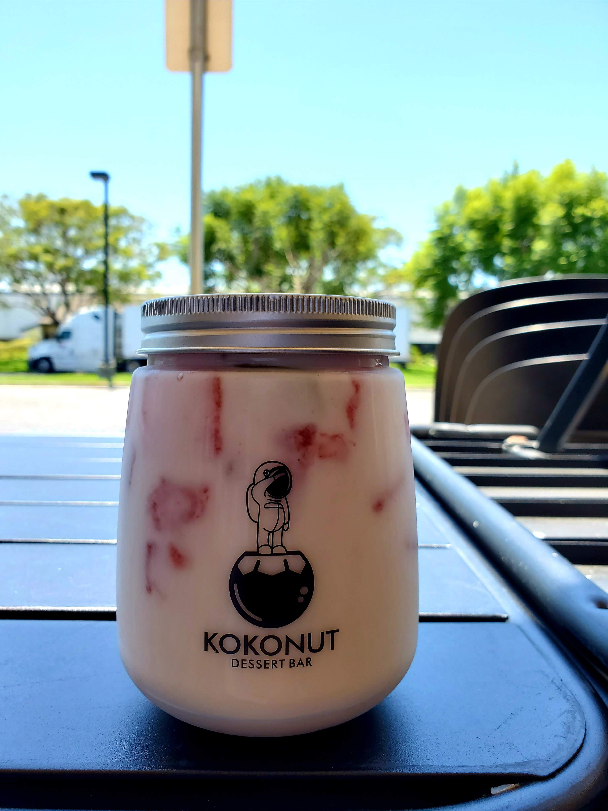

Hello! On the last day of 2020, I plan to get all of my posts up today (a lot of matcha drink to keep me awake to finish the task).

Another hike in July at [Elmoro Canyon Loop Trail](https://www.alltrails.com/trail/us/california/el-moro-canyon-loop-trail) in Crystal Cove state park near Laguna Beach, California.

I heard that this state park is famous and many hikes around this area have nice views.

This place is crowded and hard to find parking. On top of that, the parking costs $15/day.

We hiked on a cloudy day so it was a bit hard to see the full views but grateful to go on any hike.

According to Alltrails, the length of the trail is 5 miles with 807ft elevation gain. I didn't take any pictures of coastal views because it was cloudy but I did take several interesting pictures of canyons as seen below.

<table><tr>
    <td>  </td>
    <td>  </td>
    <td>  </td>
</tr></table>

The hike was somewhat chill (maybe because I am used to hiking a longer distance). There was an interesting flower structure and an animal along the hike.

<table><tr>
    <td>  </td>
    <td>  </td>
</tr></table>

After the hike, my friend suggested this dessert place called [Kokonut Dessert Bar](https://www.yelp.com/biz/kokonut-dessert-bar-costa-mesa-2). It tasted good and definitely instagram-worthy for those who are interested, although it was somewhat pricey.

That concludes the adventure and until next time, bye for now!
