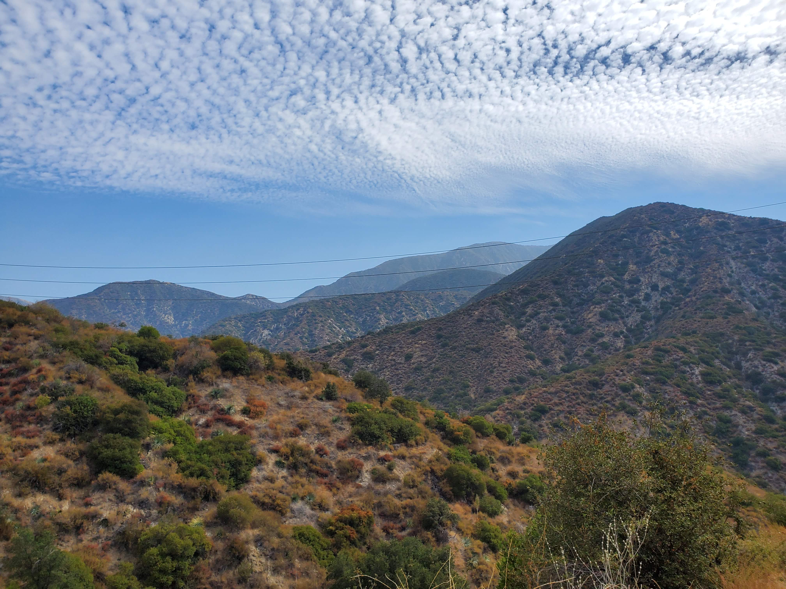
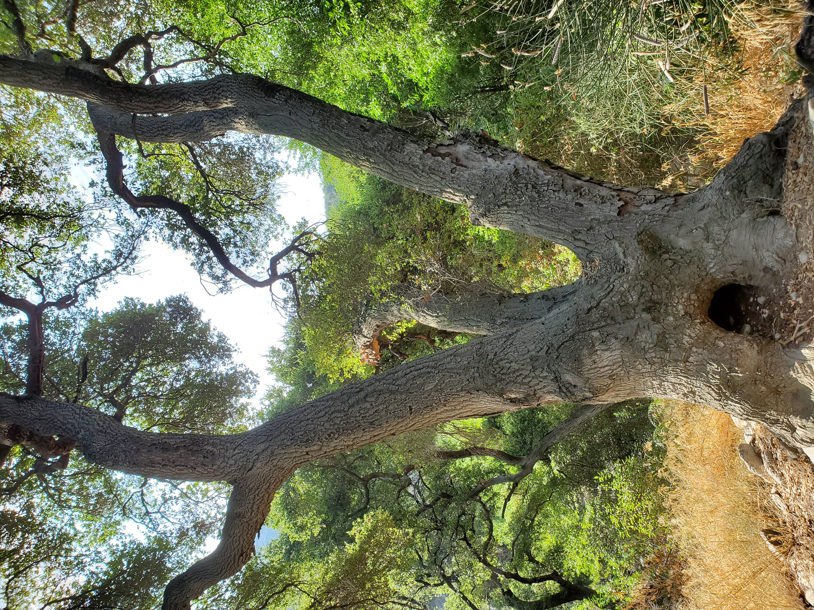
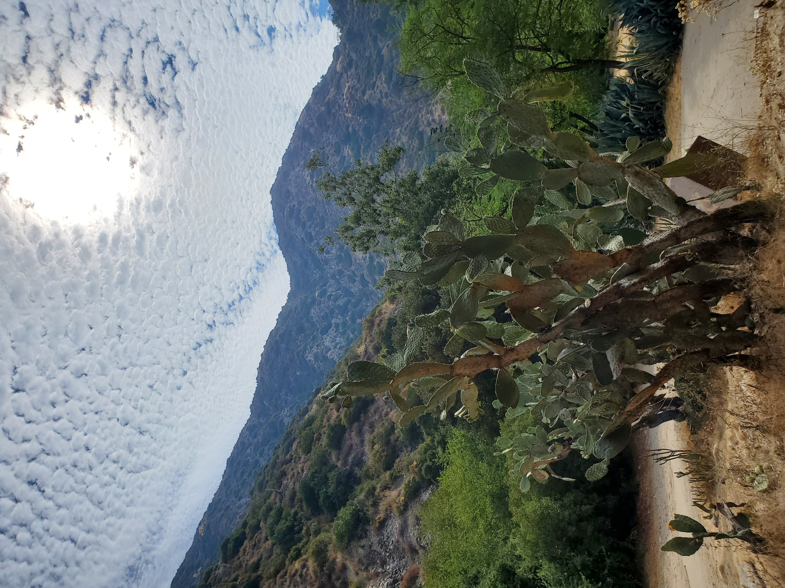
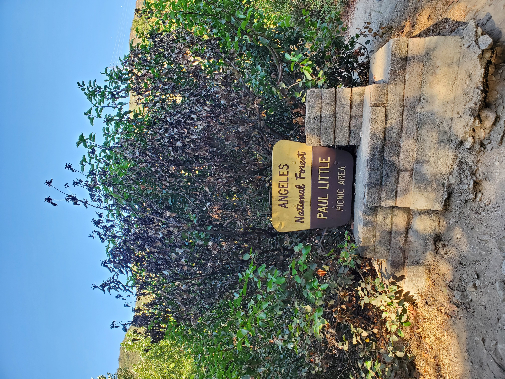
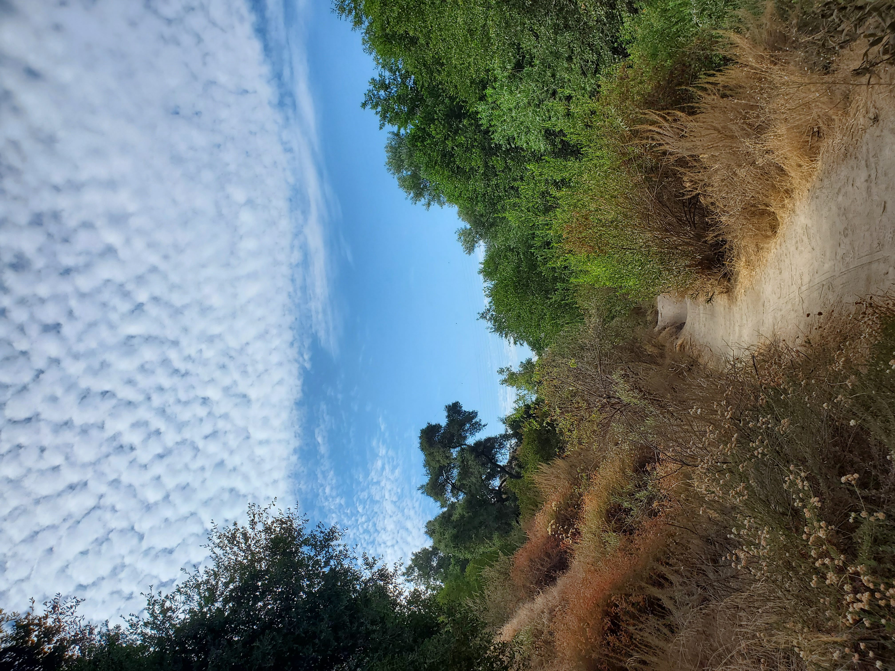
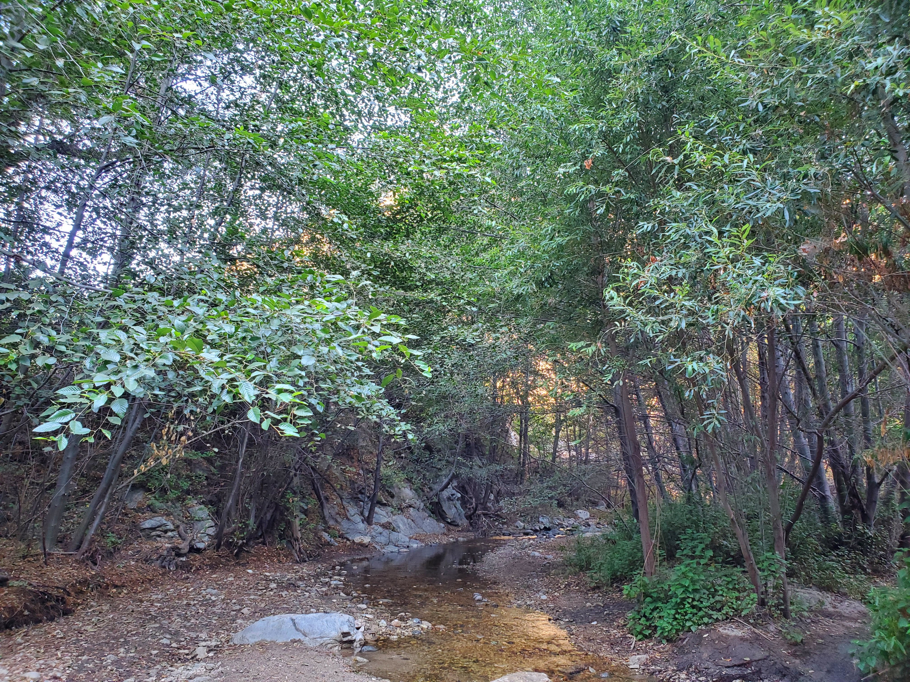
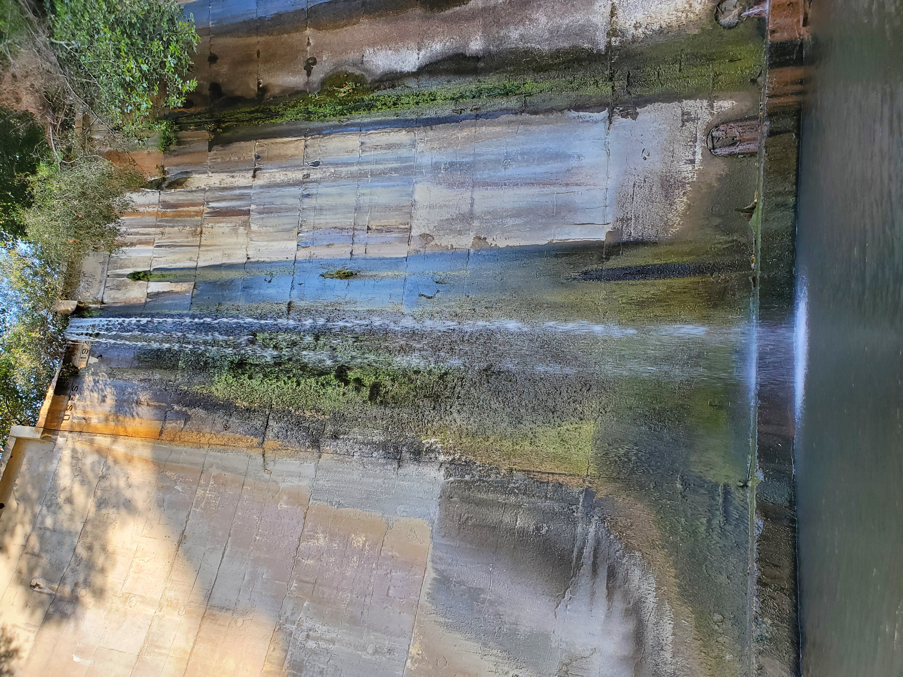
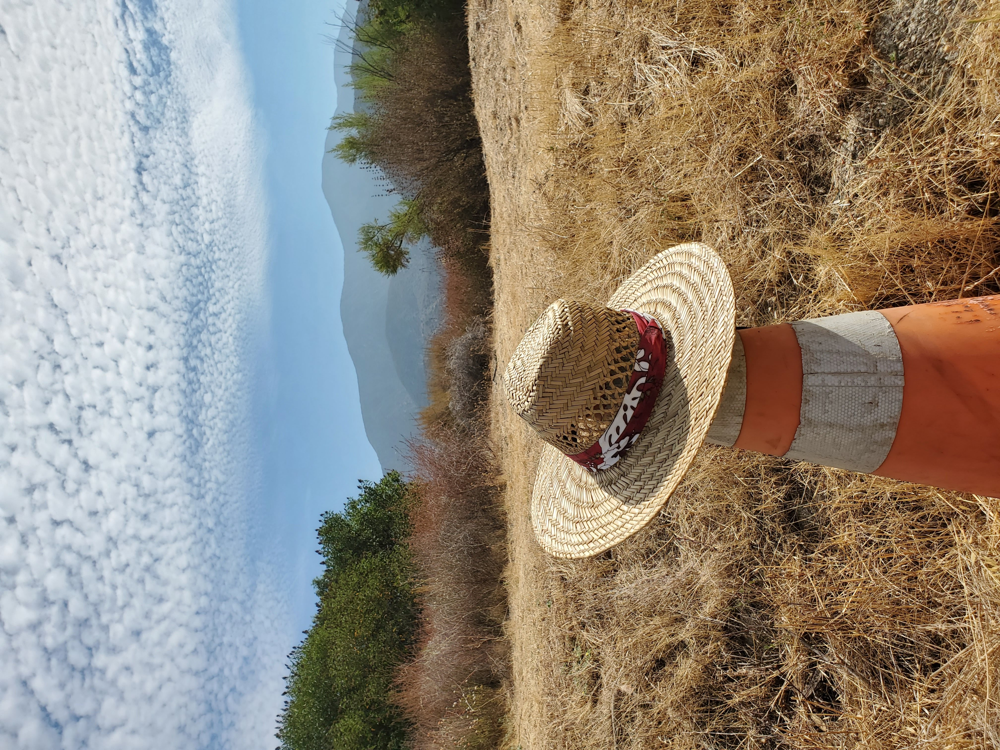
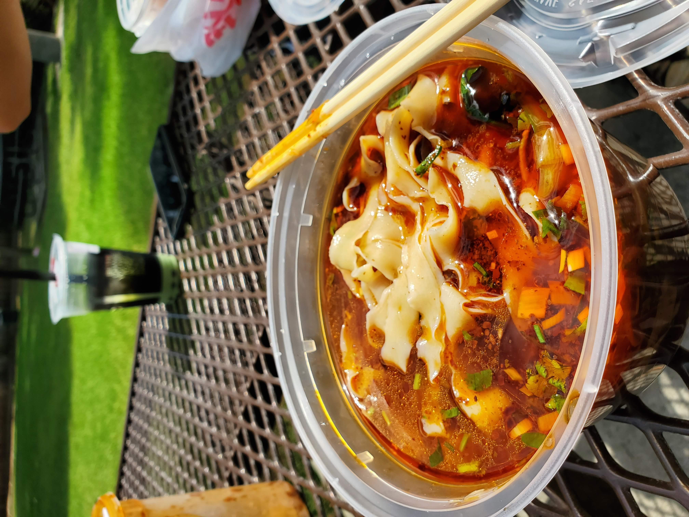

Hello again! Another hike in mid-August at [Gould Mesa](https://www.alltrails.com/trail/us/california/gould-mesa-road-angeles-crest-hwy-to-paul-little-picnic-site).

According to Alltrails, the length of the hike is 5.2 miles with 793ft elevation gain. Started the hike with the canyon view as usual.

Throughout the hike, there were interesting small trees with the clear sky as shown below.

<table><tr>
    <td>  </td>
    <td>  </td>
</tr></table>

This hike consists of many views: Canyon, a waterfall, and interesting trees structure.

<table><tr>
    <td>  </td>
    <td>  </td>
    <td>  </td>
    <td>  </td>
</tr></table>

I spotted a hat on the way hiking down as seen below.

After the hike, we ate at [Lanzhou Ramen](https://www.yelp.com/biz/1919-lanzhou-beef-noodle-arcadia-2). I highly recommend coming here because the noodle is made fresh from scratch. You can see the chef flipping the flour and made the noodle. You can choose from the thinnest to thick and wide noodles.

With that, we conclude the hike. Until next time!
