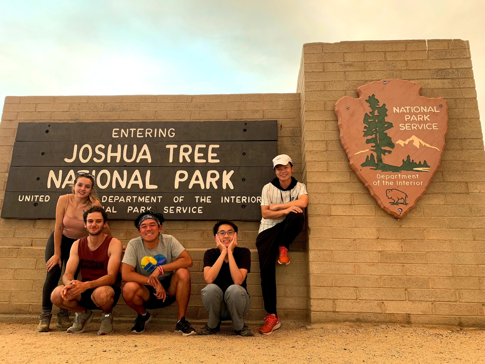

Hello again! Today we will talk about the trips that I did with my roommates at [Joshua Tree National Park](https://www.nps.gov/jotr/index.htm). It is not too far from the west side of Los Angeles (a little over 2 hours drive) but it was underrated.

We started exploring the national park by first visiting the cholla garden for sunrise. I highly recommend coming here during sunrise since it is not too hot just yet and the view is amazing. The cholla cactus hurt so be careful when exploring the area.

After exploring multiple places around the area, we decided to hike [Lost Palms Oasis Trail](https://www.alltrails.com/trail/us/california/lost-palms-trail). It was 7.2 miles out and back with 1026ft elevation gain. Note that you want to start the hike early because there was no cover and you need more water to hike at Joshua Tree since it is drier and hotter.

Along the way, it was a plain desert view and not much exciting stuff to see. After many onigiris and water, we landed at the end point and all of the views enjoyed by ourselves (I can't ask for more).

<table><tr>
    <td>  </td>
    <td>  </td>
    <td>  </td>
    <td>  </td>
</tr></table>

The interesting thing that occurred to me was that how was it possible that an oasis exists within a desert? The cool thing about this place is that you can yell to the canyon and you will hear your voice echo back to you.

You must be thinking that the 7 miles with 1000+ft elevation gain did the number to us but you were wrong. We did another hike for sunset at [Ryan Mountain Trail](https://www.alltrails.com/trail/us/california/ryan-mountain-trail). The hike length is 3 miles with 1069ft elevation again.

Funny enough, one of my roommate's name is Ryan. There was a wildfire not too far from this area so the air quality was not good.

<table><tr>
    <td>  </td>
    <td>  </td>
    <td>  </td>
</tr></table>

Notice the sun is bloody red which was insane. On the way back down, we almost got attacked by a rattlesnake but hey we are still alive to tell the story (I suppose it is a win-win? My roommates might disagree).

I didn't have a high expectation for Joshua Tree National Park going in but I do think it is worth visiting especially if you like to hike.

Of course, we wouldn't say that we visited the national park without taking the picture of the sign.

Well well, I did more than 1 hike and had a fun time here. Until next time, bye for now!
