Hello! I am excited to update this post for my trip to 3 national parks ([Death Valley](https://www.nps.gov/deva/index.htm), [Sequoia](https://www.nps.gov/seki/index.htm), and [Kings Canyon](https://www.nps.gov/seki/index.htm)).

The first destination is sand dunes at Death Valley national park. As you can see, I am exposed to many canyons from all of the hikes but sand dunes feel so different.

Believe it or not, the sand is so soft that I was walking barefoot and sometimes with a sandal.

We arrived there at sunrise which is a prime time to see the sunrise from beneath the sand dunes.

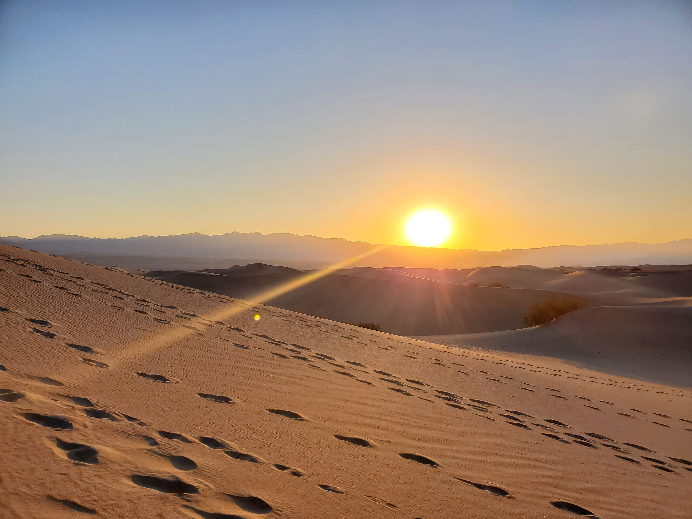

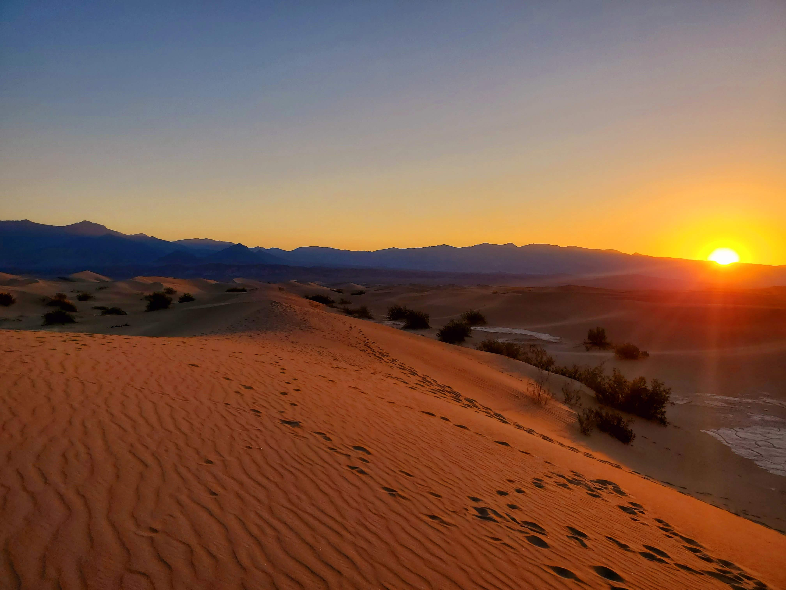

From there, we move on to the next viewpoint at Death Valley which is Zabriskie Point. The landscape is so unique and it is composed of sediments from Furnace Creek Lake which dried up 5 million years ago.

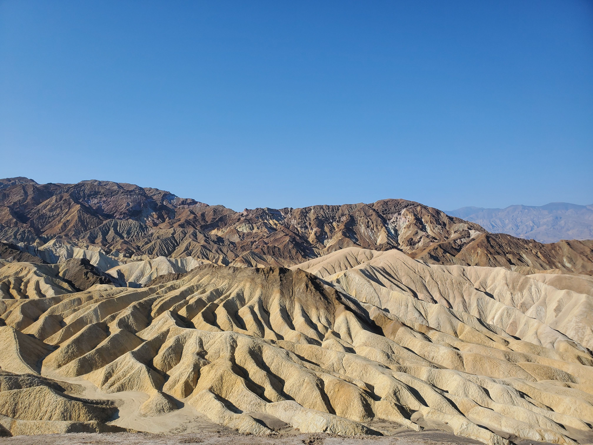

Next up, we visited Badwater Basin and is the lowest point in North America and the US with a depth of 282 ft below sea level.

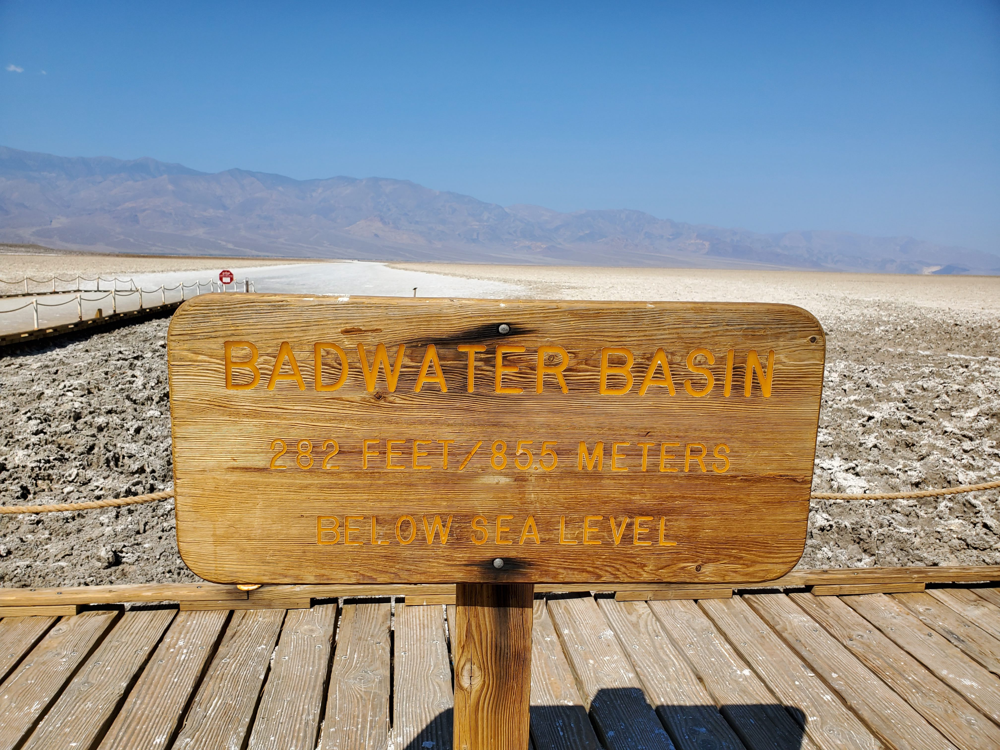

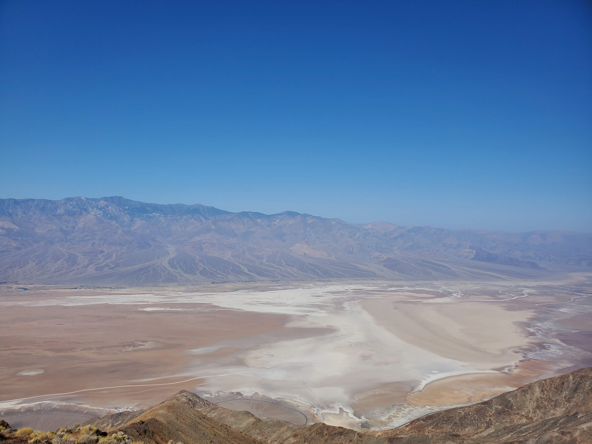

The pathway filled with salt. Did I taste the salt? Yes, I did. Does it taste like salt? Absolutely. Is it edible? Who knows - I am still alive :D.

Next up, we are hiking [Mist Falls](https://www.alltrails.com/trail/us/california/mist-falls) at Kings Canyon National Park. The length of the hike is 8.7 miles out and back with 879 ft elevation gain.
At the end of the hike, we were greeted with the cool canyon views and water to play with.

<table><tr>
    <td> 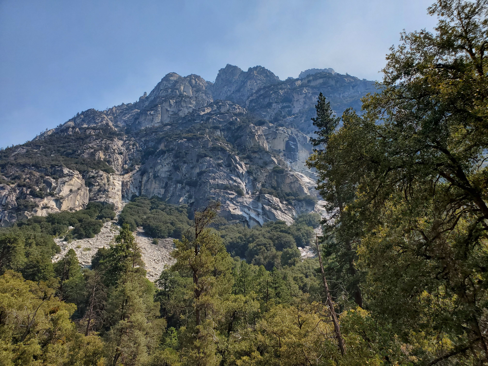 </td>
    <td> 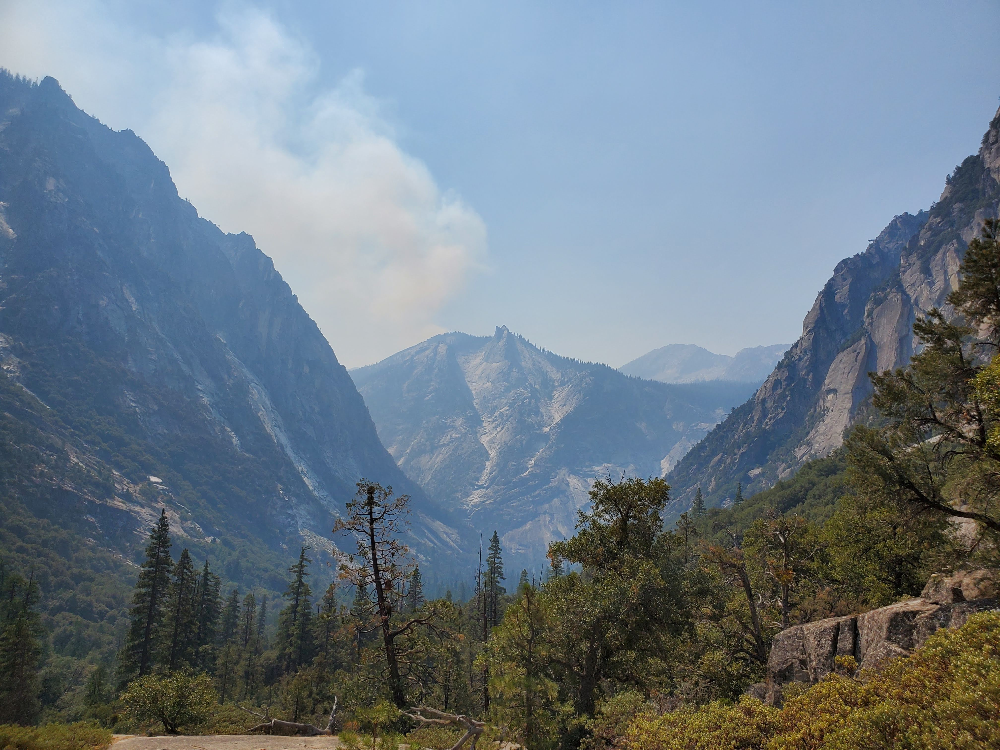 </td>
    <td> 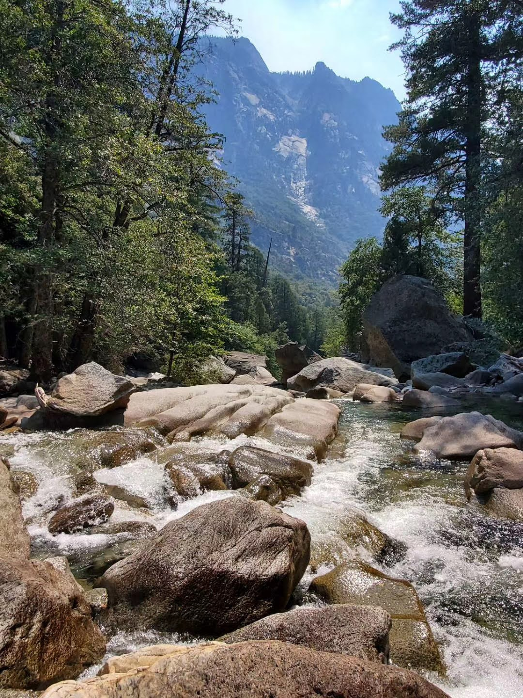 </td>
</tr></table>

Finally, onto the last national park (Sequoia). I have been to Kings Canyon and Sequoia national park last year but I got to explore Kings Canyon more this time around.

As usual, the attraction at Sequoia is [Moro Rock](https://www.alltrails.com/trail/us/california/moro-rock-trail) and [the General Sherman tree](https://www.nps.gov/seki/learn/nature/sherman.htm).

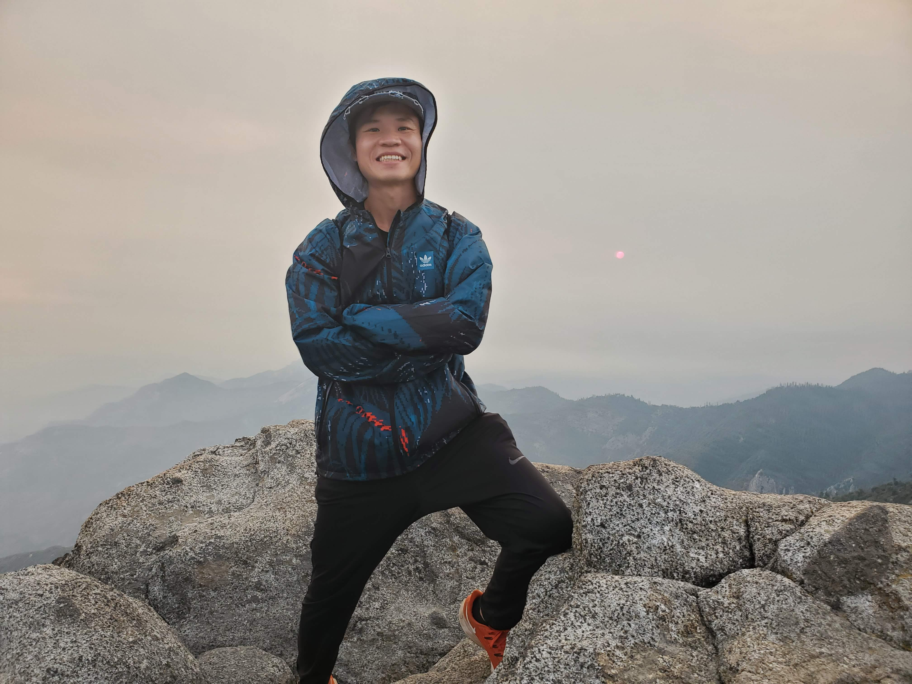

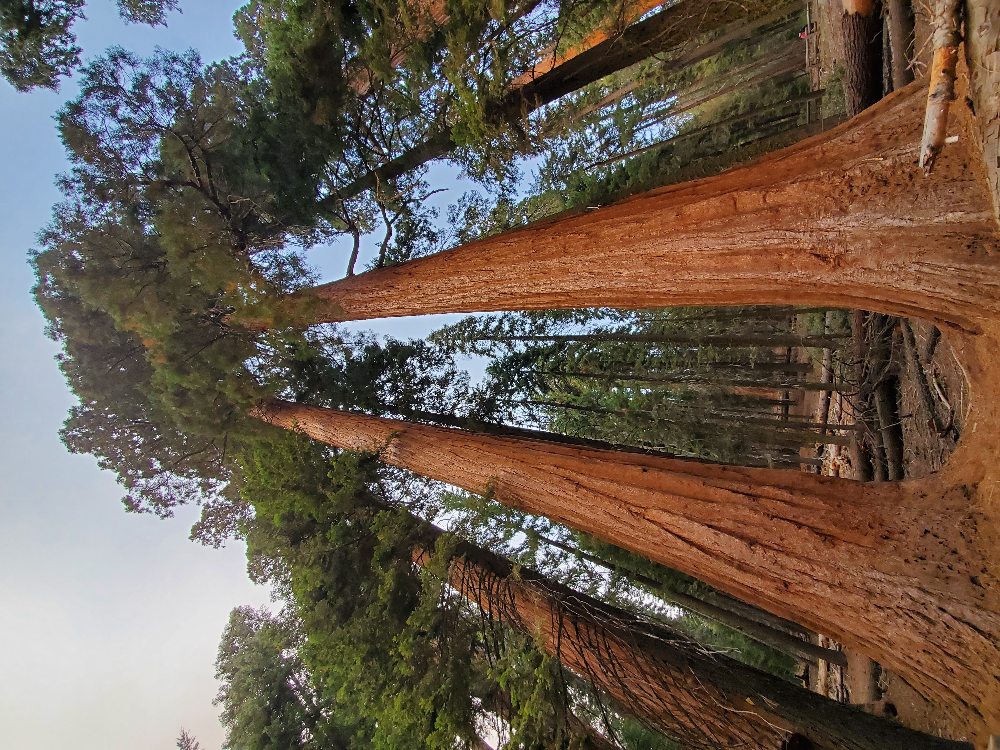

At this point, we are dead tired and on the way home. We stopped by [Three Rivers Yogurt](https://www.yelp.com/biz/three-rivers-yogurt-three-rivers) for frozen yogurt. It wasn't expensive and they give you a lot. I like their decorations at the store.

<table><tr>
    <td> 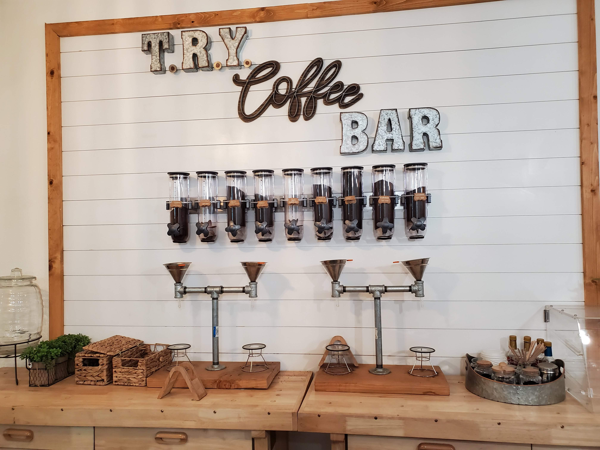 </td>
    <td> 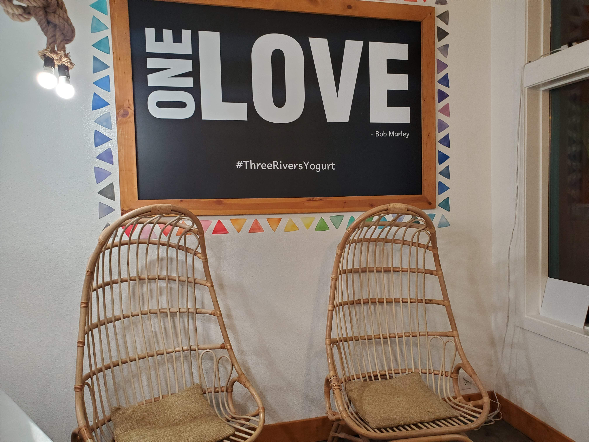 </td>
    <td> 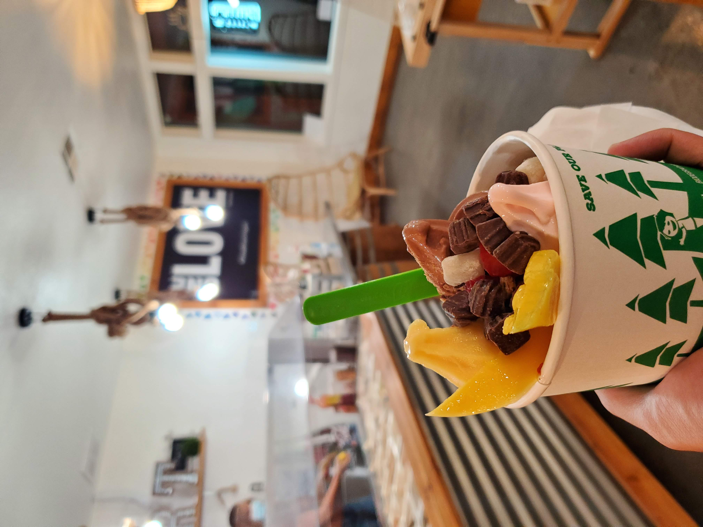 </td>
</tr></table>

With that, we conclude the adventure. Until next time!
