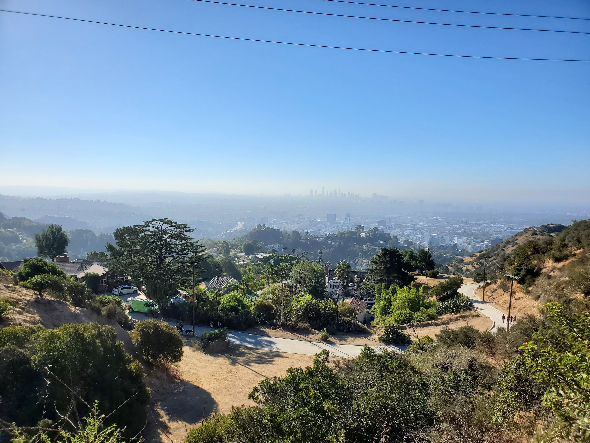
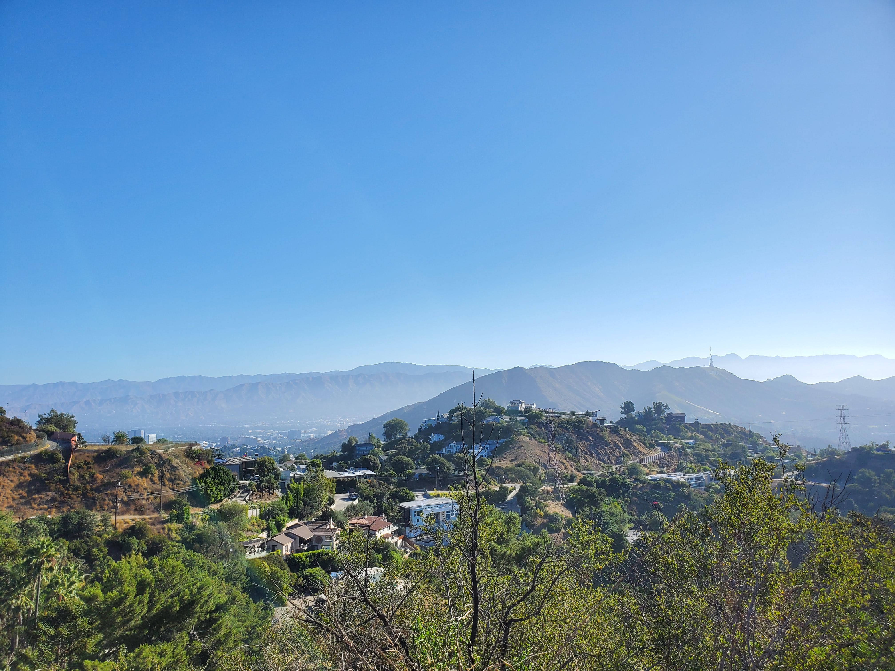
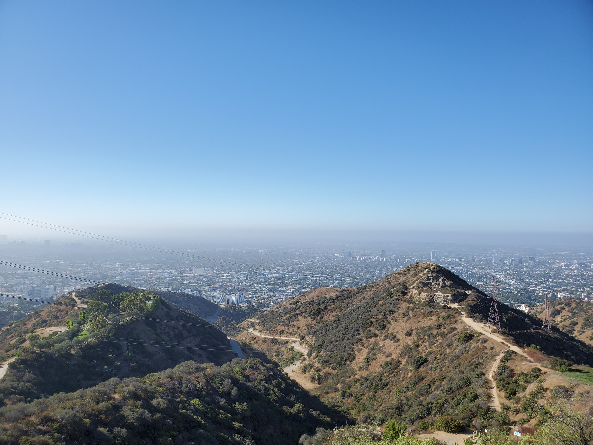
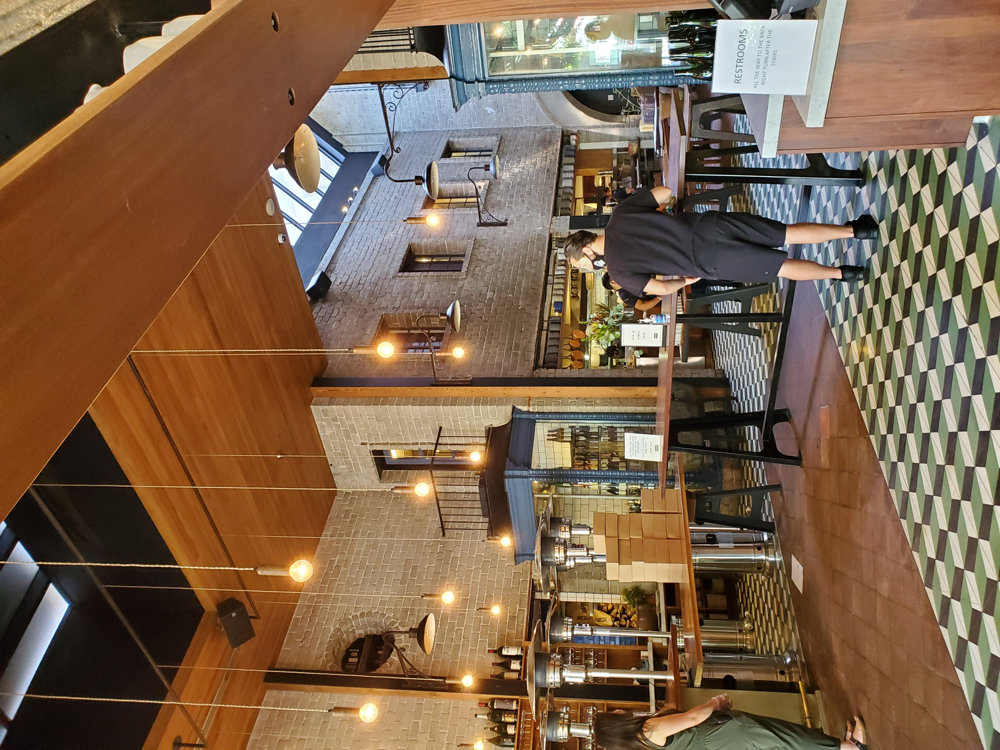
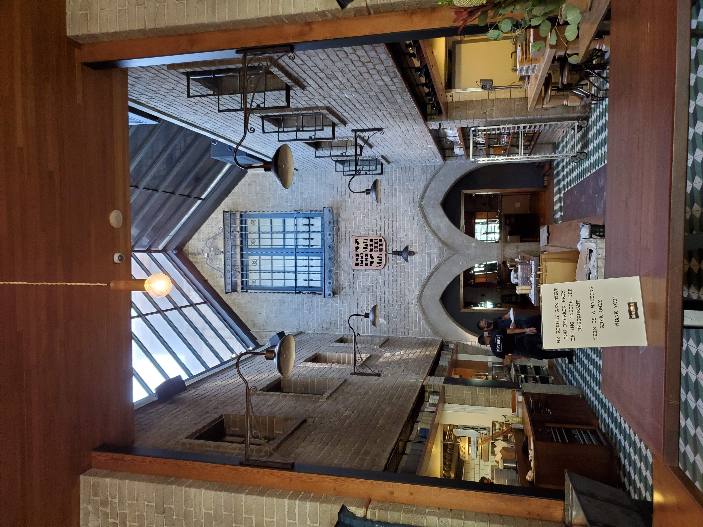
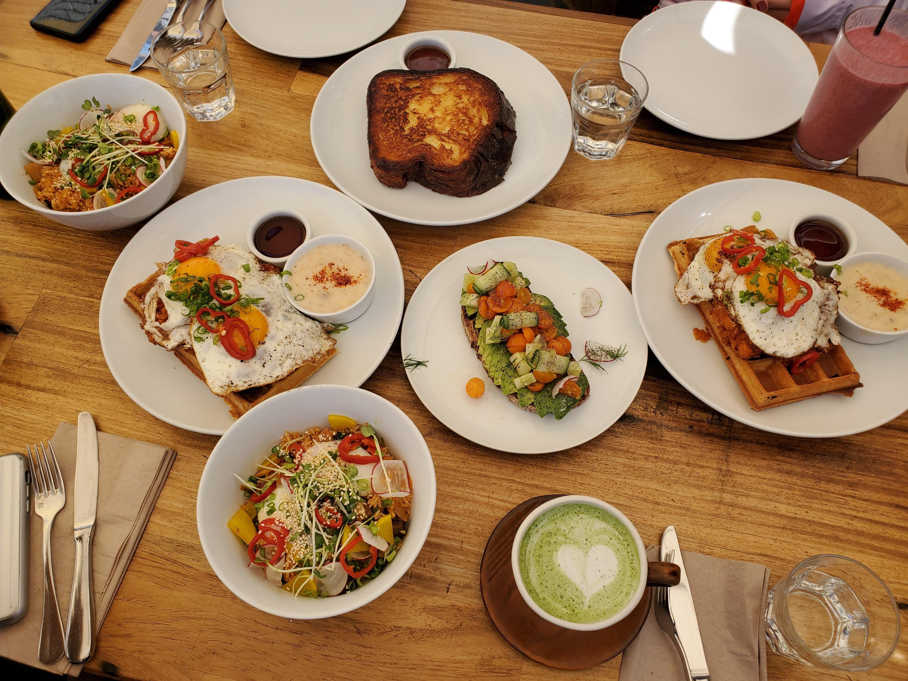

Hello! Another local hike across Hollywood to welcome a new hire at the company I am working at. The hike is called [Runyon Canyon Trail](https://www.alltrails.com/trail/us/california/runyon-canyon-trail) that is 2.7 miles with 748ft elevation gain.

First time hiking with coworkers and don't want to scare them off with 10+ miles hike :D. The hike is relatively chill and enjoying nature in the morning.

Somehow, there were places to take amazing pictures as shown below.

<table><tr>
    <td>  </td>
    <td>  </td>
    <td>  </td>
</tr></table>

Not much to say about this place but many people come here to run or to stroll. My coworkers know the in and out of food around LA so we had brunch in a restaurant called [Republique](https://www.yelp.com/biz/republique-los-angeles-6).

Was it pricey? I think so. Was it good? Absolutely. Is it worth it? I think so too. The decoration and the quality of the food are good. I highly recommend coming here if you like brunch, especially after a hike. Inside the restaurant, you can take Insta-esque pictures.

<table><tr>
    <td>  </td>
    <td>  </td>
    <td>  </td>
</tr></table>

I am not sure if the hike is enough to burn the calories consumed but it was worth it. Until next time, bye for now!
