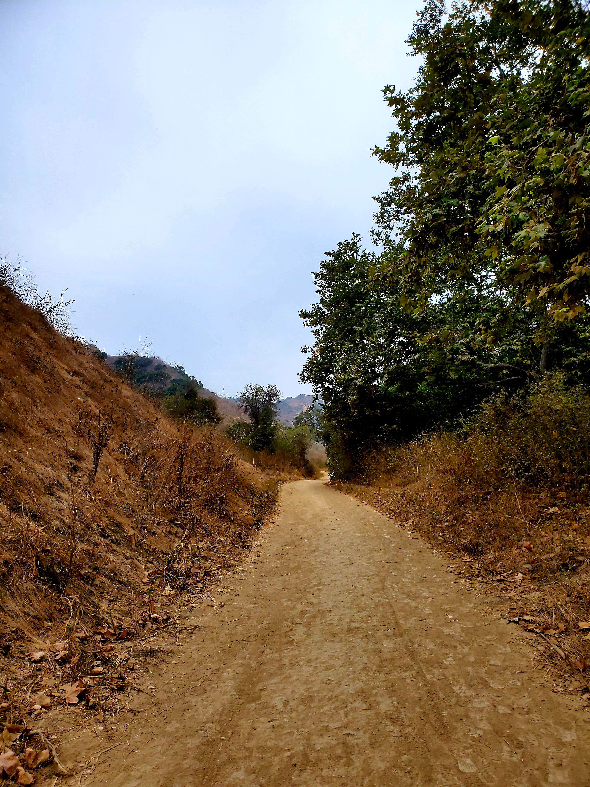
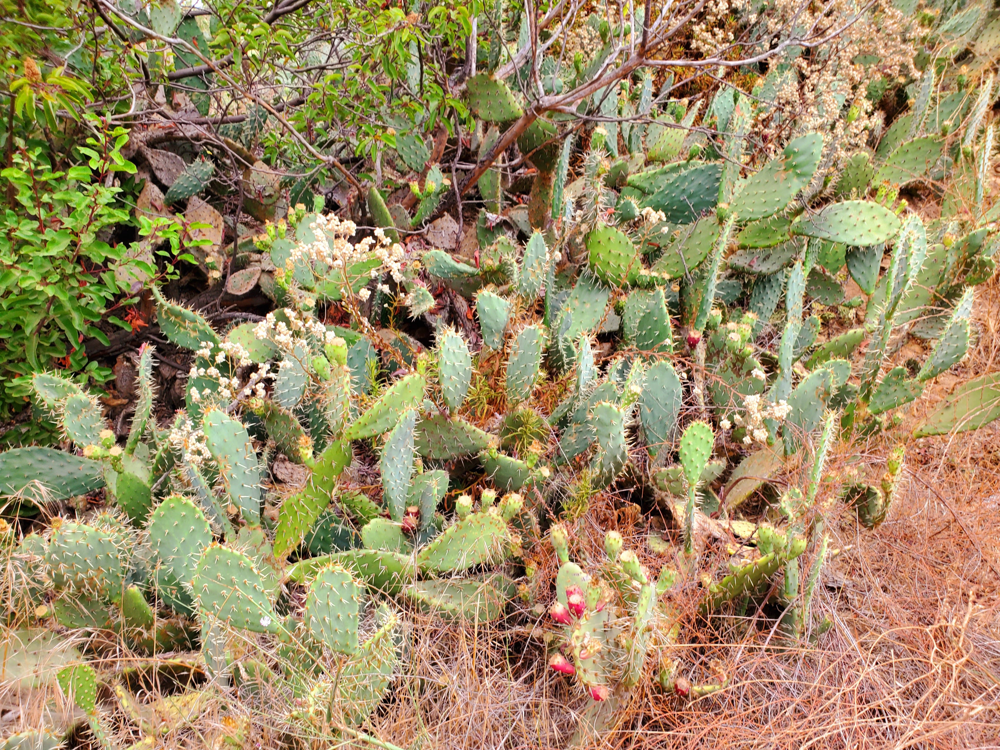
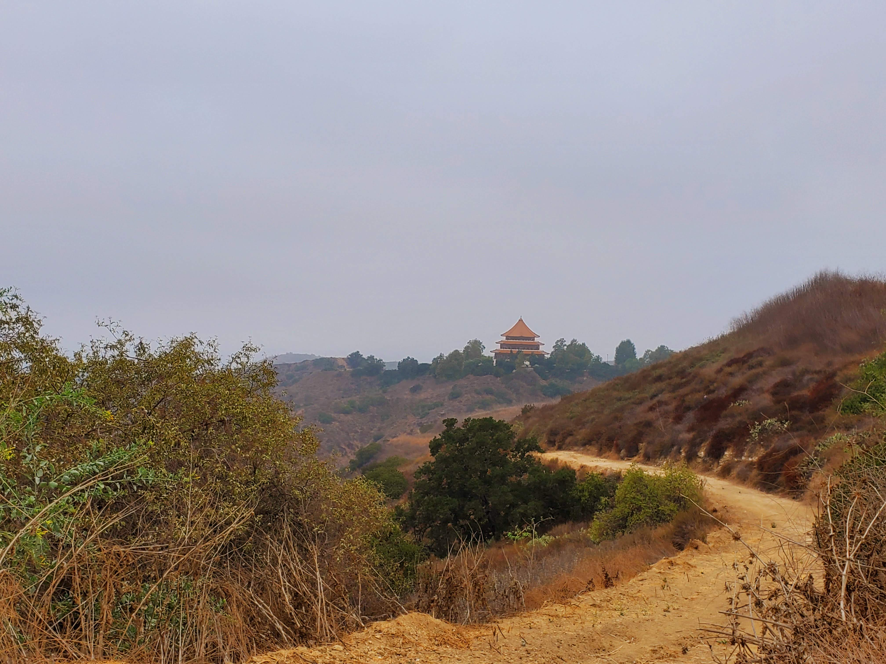
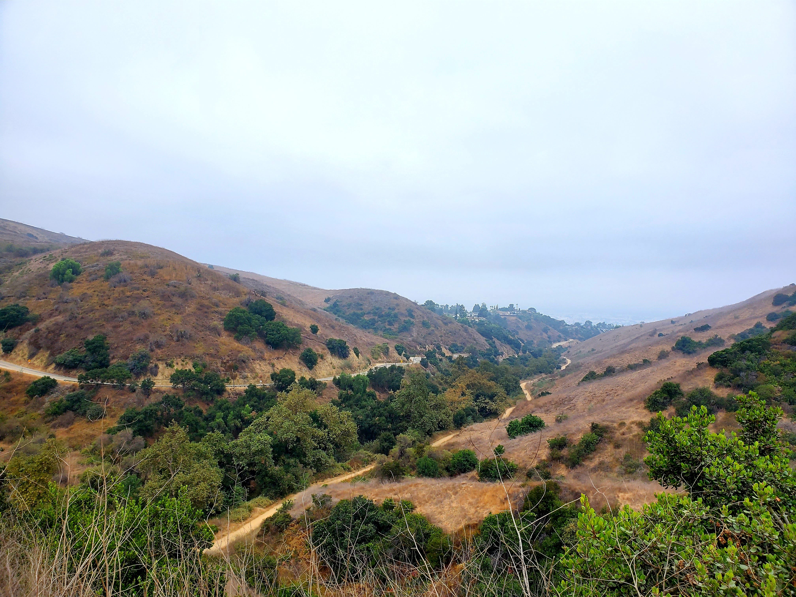
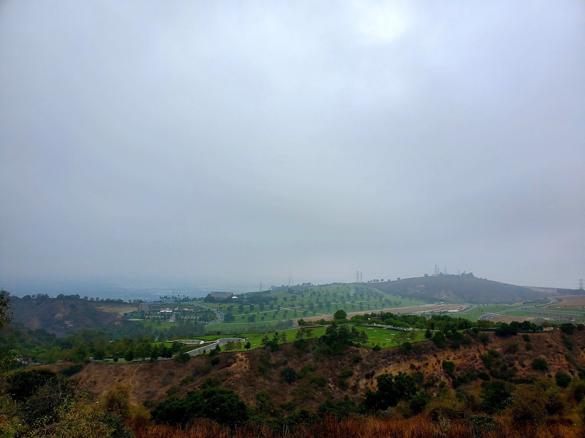
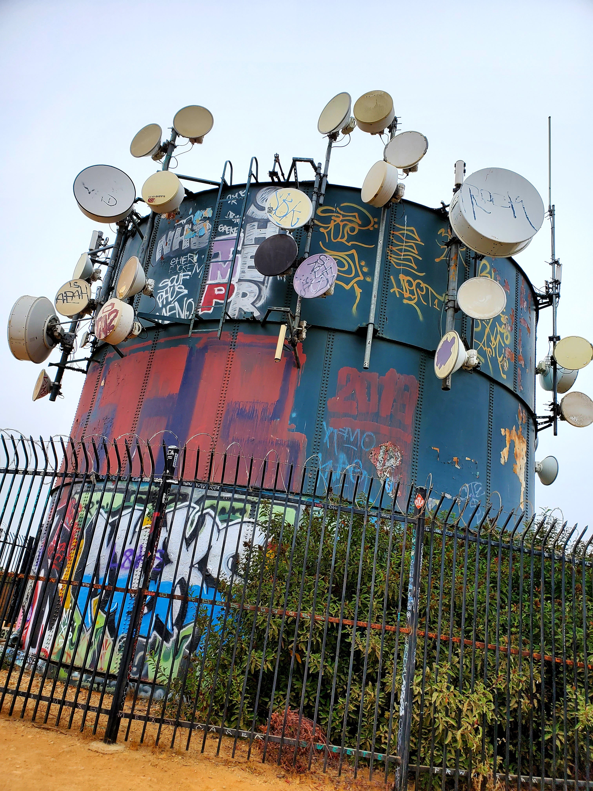
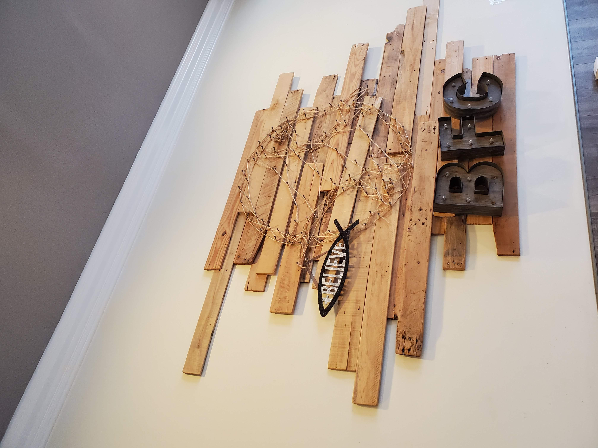
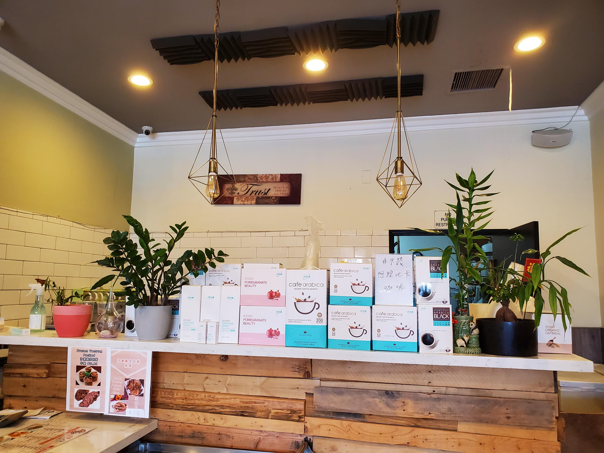
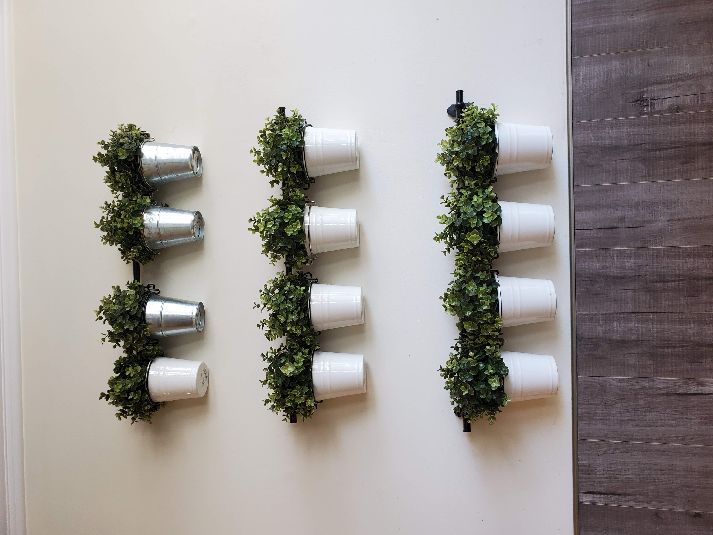
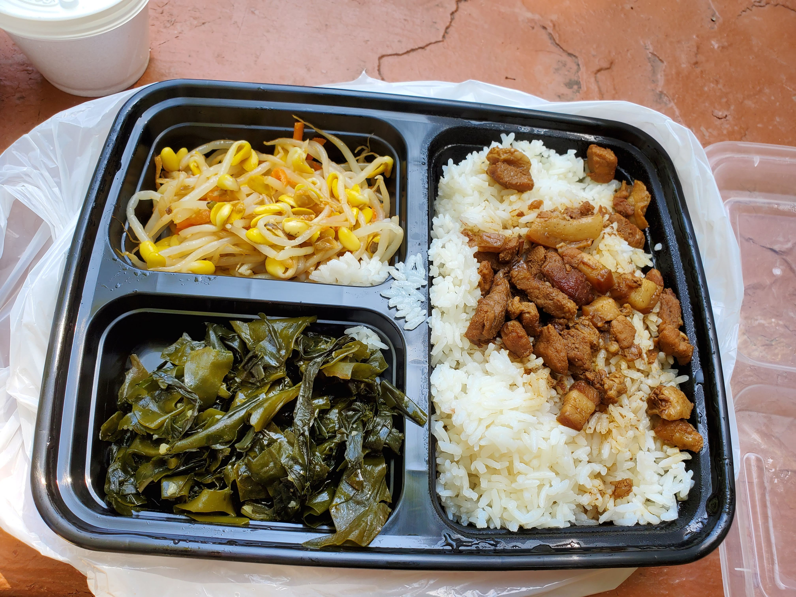

Hello! Another day another canyon hike at [Turnbull Canyon](https://www.alltrails.com/trail/us/california/turnbull-canyon-rattlesnake-ridge-and-sumac-trail-loop). How many canyon trails have I hiked this year? Sounds like every post has a canyon...

The hike is located near Whittier and the length is 4.2 miles with 748ft elevation gain.

This is the view of the trail path along the way at the beginning of the hike.

Along the way, we saw small cactus and multiple views from the top.

<table><tr>
    <td>  </td>
    <td>  </td>
    <td>  </td>
    <td>  </td>
</tr></table>

There is a temple nearby and the green space on the other side as shown in the pictures above.

What baffled me is that another big satellite on the hike.

I wonder whether this satellite is still functional or not.

After the hike, we visited a local Taiwanese cafe called [BreadFish Cafe](https://www.yelp.com/biz/breadfish-cafe-rowland-heights-rowland-heights-2). The eatery is cheap and sold many kinds of Taiwanese food.

Also, I like their indoor decorations but of course, the dine-in is closed. I managed to snap several pictures of the cafe.

<table><tr>
    <td>  </td>
    <td>  </td>
    <td>  </td>
    <td>  </td>
</tr></table>

With that we conclude the hike for this week, see you in next post!
